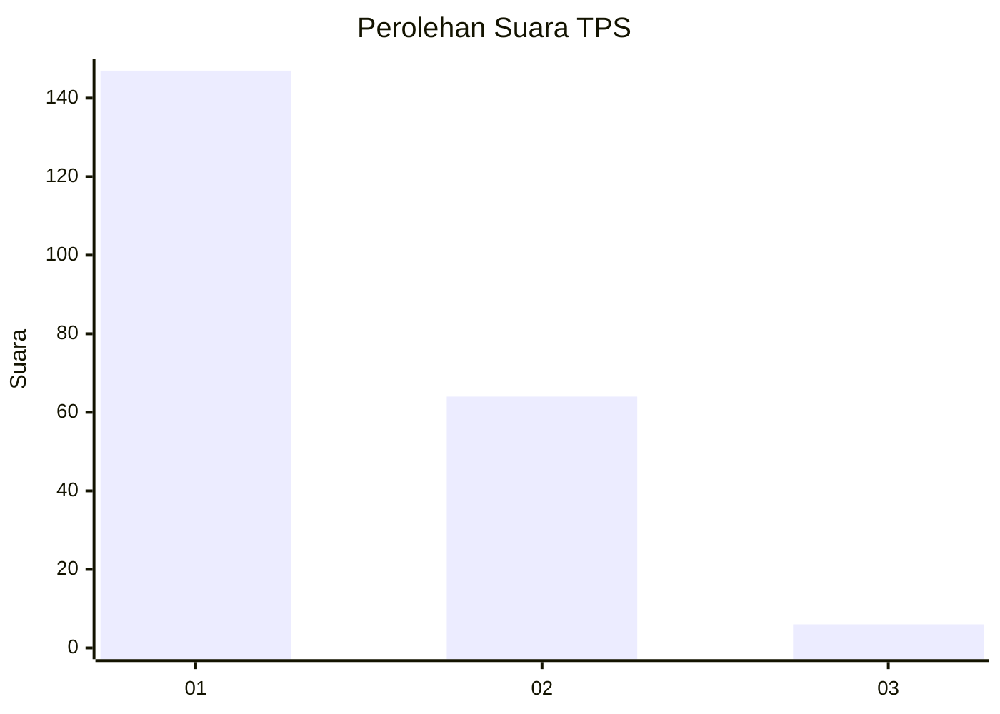
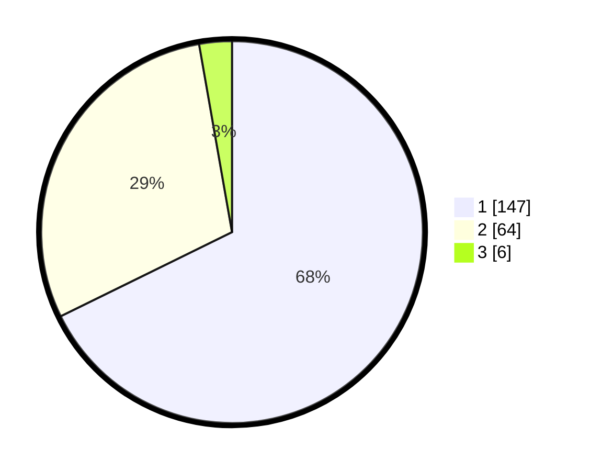

# Hasil

## Grafik

## Tabel

| No. | Nama Paslon    | Suara | Suara (raw) | Persentase |
|:--- |:-------------- | -----:| -----------:| ----------:|
| 1   | ANIES MUHAIMIN | 147   | [147][p-1]  | 67,74      |
| 2   | PRABOWO GIBRAN | 64    | [64][p-2]   | 29,49      |
| 3   | GANJAR MAHFUD  | 6     | [6][p-3]    | 2,76       |

[p-1]: https://github.com/gigit-pemilu/pemilu-2024/blob/main/pilpres/hitung-suara/sub/12-sumatera-utara/sub/05-langkat/sub/07-stabat/sub/2008-pantai-gemi/sub/020-tps/sub/paslon-1.txt
[p-2]: https://github.com/gigit-pemilu/pemilu-2024/blob/main/pilpres/hitung-suara/sub/12-sumatera-utara/sub/05-langkat/sub/07-stabat/sub/2008-pantai-gemi/sub/020-tps/sub/paslon-2.txt
[p-3]: https://github.com/gigit-pemilu/pemilu-2024/blob/main/pilpres/hitung-suara/sub/12-sumatera-utara/sub/05-langkat/sub/07-stabat/sub/2008-pantai-gemi/sub/020-tps/sub/paslon-3.txt

## Foto C Plano

https://sirekap-obj-formc.kpu.go.id/aba5/pemilu/ppwp/12/05/07/20/08/1205072008020-20240215-010122--8c6e1936-ac5b-4597-a3b6-7189956d01d0.jpg

https://sirekap-obj-formc.kpu.go.id/aba5/pemilu/ppwp/12/05/07/20/08/1205072008020-20240215-010307--ba0e98c6-4e89-4dc2-9ce4-39436ee7ffe5.jpg

https://sirekap-obj-formc.kpu.go.id/aba5/pemilu/ppwp/12/05/07/20/08/1205072008020-20240215-010521--b93db1b2-d813-4fa0-8893-b442a05e5c0d.jpg

## Metadata

| Key        | Value               |
| ---------- | ------------------- |
| Time Stamp | 2024-02-16 16:25:10 |

