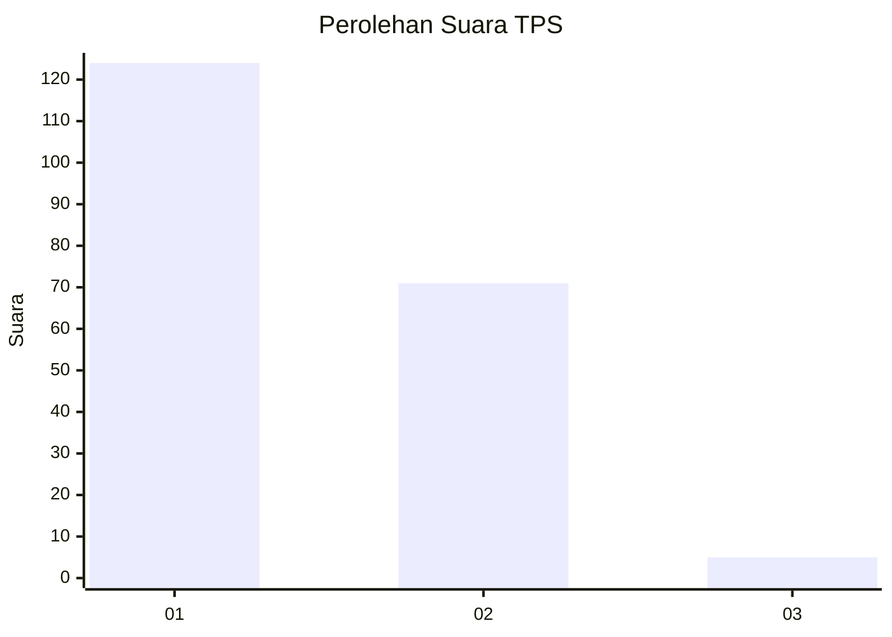
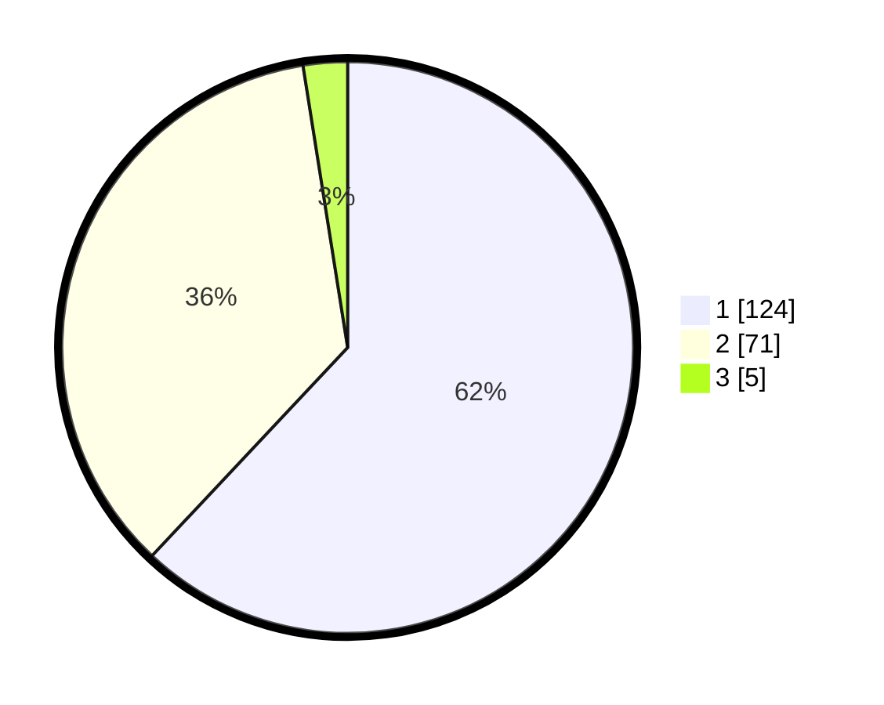

# Hasil

## Grafik

## Tabel

| No. | Nama Paslon    | Suara | Suara (raw) | Persentase |
|:--- |:-------------- | -----:| -----------:| ----------:|
| 1   | ANIES MUHAIMIN | 124   | [124][p-1]  | 62,00      |
| 2   | PRABOWO GIBRAN | 71    | [71][p-2]   | 35,50      |
| 3   | GANJAR MAHFUD  | 5     | [5][p-3]    | 2,50       |

[p-1]: https://github.com/gigit-pemilu/pemilu-2024/blob/main/pilpres/hitung-suara/sub/12-sumatera-utara/sub/05-langkat/sub/07-stabat/sub/2009-ara-condong/sub/002-tps/sub/paslon-1.txt
[p-2]: https://github.com/gigit-pemilu/pemilu-2024/blob/main/pilpres/hitung-suara/sub/12-sumatera-utara/sub/05-langkat/sub/07-stabat/sub/2009-ara-condong/sub/002-tps/sub/paslon-2.txt
[p-3]: https://github.com/gigit-pemilu/pemilu-2024/blob/main/pilpres/hitung-suara/sub/12-sumatera-utara/sub/05-langkat/sub/07-stabat/sub/2009-ara-condong/sub/002-tps/sub/paslon-3.txt

## Foto C Plano

https://sirekap-obj-formc.kpu.go.id/4bd1/pemilu/ppwp/12/05/07/20/09/1205072009002-20240214-155249--51b51e45-ff72-4d0b-bd18-431279a160a7.jpg

https://sirekap-obj-formc.kpu.go.id/4bd1/pemilu/ppwp/12/05/07/20/09/1205072009002-20240214-155506--e25dc397-95f6-4a8e-b525-8a63bcedf852.jpg

https://sirekap-obj-formc.kpu.go.id/4bd1/pemilu/ppwp/12/05/07/20/09/1205072009002-20240214-155636--875fbfae-b2d6-4b22-a55d-673c5c52b4cd.jpg

## Metadata

| Key        | Value               |
| ---------- | ------------------- |
| Time Stamp | 2024-02-15 07:00:44 |

