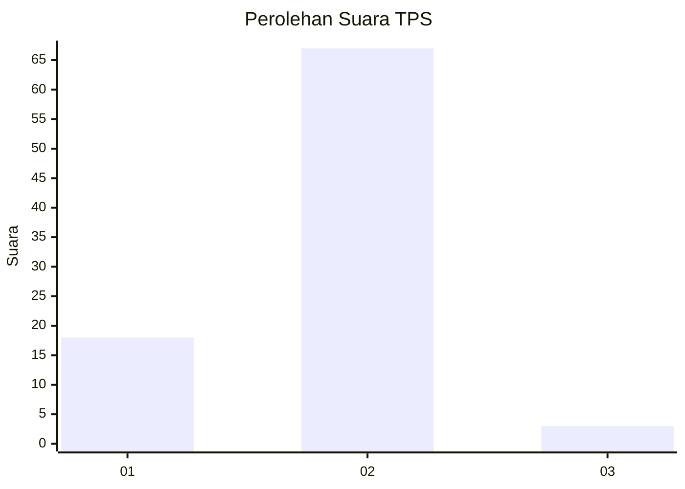

# Hasil

## Grafik

## Tabel

| No. | Nama Paslon    | Suara | Suara (raw) | Persentase |
|:--- |:-------------- | -----:| -----------:| ----------:|
| 1   | ANIES MUHAIMIN | 18    | [18][p-1]   | 20,45      |
| 2   | PRABOWO GIBRAN | 67    | [67][p-2]   | 76,14      |
| 3   | GANJAR MAHFUD  | 3     | [3][p-3]    | 3,41       |

[p-1]: https://github.com/gigit-pemilu/pemilu-2024/blob/main/pilpres/hitung-suara/sub/12-sumatera-utara/sub/05-langkat/sub/08-wampu/sub/2011-paya-tusam/sub/005-tps/sub/paslon-1.txt
[p-2]: https://github.com/gigit-pemilu/pemilu-2024/blob/main/pilpres/hitung-suara/sub/12-sumatera-utara/sub/05-langkat/sub/08-wampu/sub/2011-paya-tusam/sub/005-tps/sub/paslon-2.txt
[p-3]: https://github.com/gigit-pemilu/pemilu-2024/blob/main/pilpres/hitung-suara/sub/12-sumatera-utara/sub/05-langkat/sub/08-wampu/sub/2011-paya-tusam/sub/005-tps/sub/paslon-3.txt

## Foto C Plano

https://sirekap-obj-formc.kpu.go.id/5ac2/pemilu/ppwp/12/05/08/20/11/1205082011005-20240215-002316--4fa4bba2-9450-4fd6-a100-f7ca4a33d48a.jpg

https://sirekap-obj-formc.kpu.go.id/5ac2/pemilu/ppwp/12/05/08/20/11/1205082011005-20240215-002816--fcb87e70-a9ad-48d4-8014-b9fed4f6f5d1.jpg

https://sirekap-obj-formc.kpu.go.id/5ac2/pemilu/ppwp/12/05/08/20/11/1205082011005-20240215-003058--97d9e63d-3d85-410b-acdd-a0dc3465e4f1.jpg

## Metadata

| Key        | Value               |
| ---------- | ------------------- |
| Time Stamp | 2024-02-22 14:00:00 |

