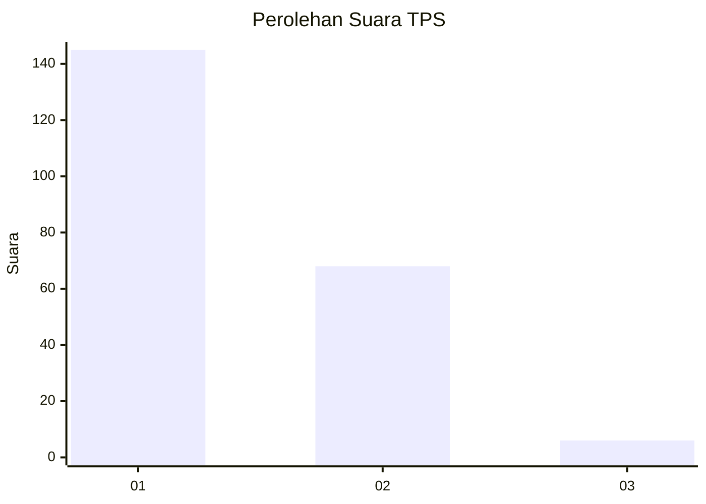
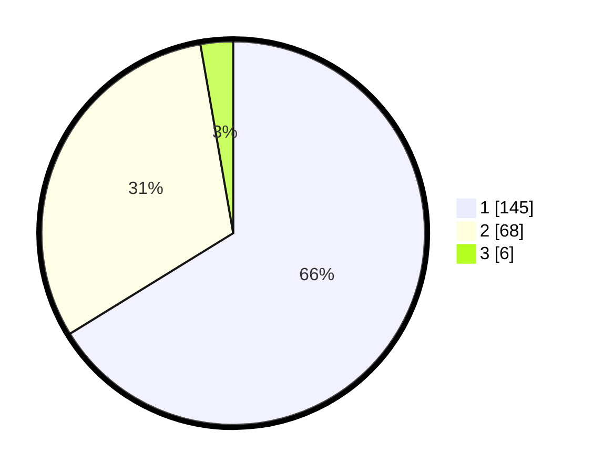

# Hasil

## Grafik

## Tabel

| No. | Nama Paslon    | Suara | Suara (raw) | Persentase |
|:--- |:-------------- | -----:| -----------:| ----------:|
| 1   | ANIES MUHAIMIN | 145   | [145][p-1]  | 66,21      |
| 2   | PRABOWO GIBRAN | 68    | [68][p-2]   | 31,05      |
| 3   | GANJAR MAHFUD  | 6     | [6][p-3]    | 2,74       |

[p-1]: https://github.com/gigit-pemilu/pemilu-2024-12-sumatera-utara/blob/main/pilpres/hitung-suara/sub/12-sumatera-utara/sub/05-langkat/sub/09-secanggang/sub/1004-hinai-kiri/sub/004-tps/sub/paslon-1.txt
[p-2]: https://github.com/gigit-pemilu/pemilu-2024-12-sumatera-utara/blob/main/pilpres/hitung-suara/sub/12-sumatera-utara/sub/05-langkat/sub/09-secanggang/sub/1004-hinai-kiri/sub/004-tps/sub/paslon-2.txt
[p-3]: https://github.com/gigit-pemilu/pemilu-2024-12-sumatera-utara/blob/main/pilpres/hitung-suara/sub/12-sumatera-utara/sub/05-langkat/sub/09-secanggang/sub/1004-hinai-kiri/sub/004-tps/sub/paslon-3.txt

## Foto C Plano

https://sirekap-obj-formc.kpu.go.id/a377/pemilu/ppwp/12/05/09/10/04/1205091004004-20240214-195459--3afd3b18-509e-4247-a674-eadf0c4d6db0.jpg

https://sirekap-obj-formc.kpu.go.id/a377/pemilu/ppwp/12/05/09/10/04/1205091004004-20240222-175057--7cfd68ad-dc81-48a4-bc19-c4d9ee95ba95.jpg

https://sirekap-obj-formc.kpu.go.id/a377/pemilu/ppwp/12/05/09/10/04/1205091004004-20240222-175056--e6d2f99f-3ffd-4f08-b6d9-0b3bb674e17b.jpg

## Metadata

| Key        | Value               |
| ---------- | ------------------- |
| Time Stamp | 2024-02-24 22:31:28 |

