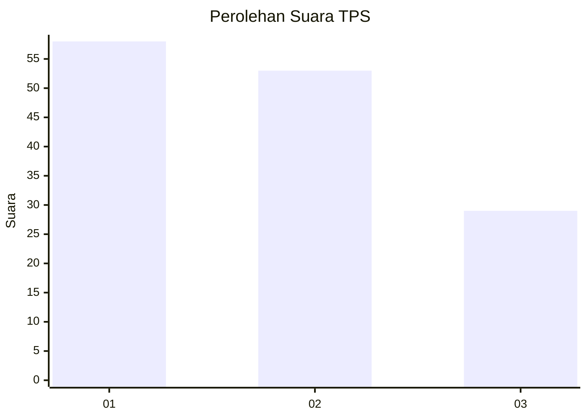
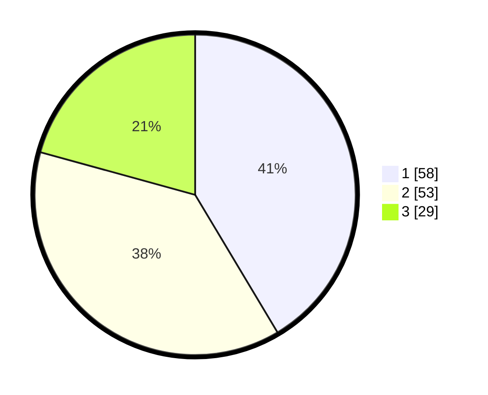

# Hasil

## Grafik

## Tabel

| No. | Nama Paslon    | Suara | Suara (raw) | Persentase |
|:--- |:-------------- | -----:| -----------:| ----------:|
| 1   | ANIES MUHAIMIN | 58    | [58][p-1]   | 41,43      |
| 2   | PRABOWO GIBRAN | 53    | [53][p-2]   | 37,86      |
| 3   | GANJAR MAHFUD  | 29    | [29][p-3]   | 20,71      |

[p-1]: https://github.com/gigit-pemilu/pemilu-2024/blob/main/pilpres/hitung-suara/sub/12-sumatera-utara/sub/05-langkat/sub/09-secanggang/sub/2013-perkotaan/sub/007-tps/sub/paslon-1.txt
[p-2]: https://github.com/gigit-pemilu/pemilu-2024/blob/main/pilpres/hitung-suara/sub/12-sumatera-utara/sub/05-langkat/sub/09-secanggang/sub/2013-perkotaan/sub/007-tps/sub/paslon-2.txt
[p-3]: https://github.com/gigit-pemilu/pemilu-2024/blob/main/pilpres/hitung-suara/sub/12-sumatera-utara/sub/05-langkat/sub/09-secanggang/sub/2013-perkotaan/sub/007-tps/sub/paslon-3.txt

## Foto C Plano

https://sirekap-obj-formc.kpu.go.id/e215/pemilu/ppwp/12/05/09/20/13/1205092013007-20240221-155948--81e212f9-eaf2-402a-ab0d-ca66301d3a1d.jpg

https://sirekap-obj-formc.kpu.go.id/e215/pemilu/ppwp/12/05/09/20/13/1205092013007-20240221-160109--bd1507b5-f1db-4a77-b69e-1e51631389a3.jpg

https://sirekap-obj-formc.kpu.go.id/e215/pemilu/ppwp/12/05/09/20/13/1205092013007-20240221-160540--744ad838-dd03-4d74-b6fd-29ff55f38c83.jpg

## Metadata

| Key        | Value               |
| ---------- | ------------------- |
| Time Stamp | 2024-02-21 17:00:00 |

## DATA PEMILIH TETAP

Jumlah pemilih dalam DPT: **274**.
 * L: **548**.
 * P: **835**.

## DATA PENGGUNA HAK PILIH

Jumlah pengguna hak pilih dalam DPT: **223**.
 * L: **346**.
 * P: **542**.

Jumlah pengguna hak pilih dalam DPTb: **802**.
 * L: **84**.
 * P: **801**.

Jumlah pengguna hak pilih dalam DPK: **200**.
 * L: **380**.
 * P: **700**.

Jumlah pengguna hak pilih: **242**.
 * L: **513**.
 * P: **425**.

## JUMLAH SUARA SAH DAN TIDAK SAH

JUMLAH SELURUH SUARA SAH: **555**.

JUMLAH SUARA TIDAK SAH: **2**.

JUMLAH SELURUH SUARA SAH DAN SUARA TIDAK SAH: **242**.

