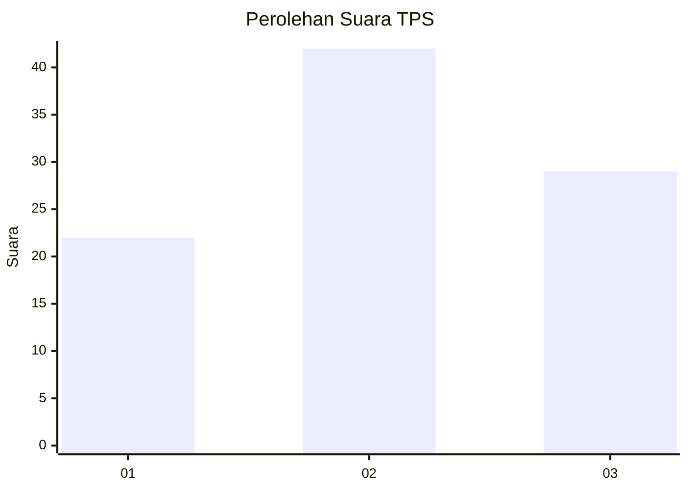
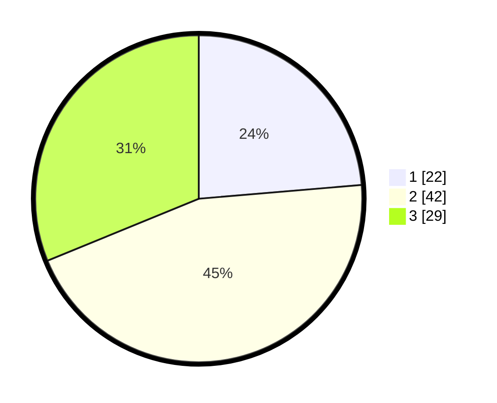

# Hasil

## Grafik

## Tabel

| No. | Nama Paslon    | Suara | Suara (raw) | Persentase |
|:--- |:-------------- | -----:| -----------:| ----------:|
| 1   | ANIES MUHAIMIN | 22    | [22][p-1]   | 23,66      |
| 2   | PRABOWO GIBRAN | 42    | [42][p-2]   | 45,16      |
| 3   | GANJAR MAHFUD  | 29    | [29][p-3]   | 31,18      |

[p-1]: https://github.com/gigit-pemilu/pemilu-2024-12-sumatera-utara/blob/main/pilpres/hitung-suara/sub/12-sumatera-utara/sub/05-langkat/sub/11-tanjung-pura/sub/1005-pekan-tanjung-pura/sub/001-tps/sub/paslon-1.txt
[p-2]: https://github.com/gigit-pemilu/pemilu-2024-12-sumatera-utara/blob/main/pilpres/hitung-suara/sub/12-sumatera-utara/sub/05-langkat/sub/11-tanjung-pura/sub/1005-pekan-tanjung-pura/sub/001-tps/sub/paslon-2.txt
[p-3]: https://github.com/gigit-pemilu/pemilu-2024-12-sumatera-utara/blob/main/pilpres/hitung-suara/sub/12-sumatera-utara/sub/05-langkat/sub/11-tanjung-pura/sub/1005-pekan-tanjung-pura/sub/001-tps/sub/paslon-3.txt

## Foto C Plano

https://sirekap-obj-formc.kpu.go.id/8be8/pemilu/ppwp/12/05/11/10/05/1205111005001-20240222-225845--abbd1644-3355-4e61-ad68-faaff474c25d.jpg

https://sirekap-obj-formc.kpu.go.id/8be8/pemilu/ppwp/12/05/11/10/05/1205111005001-20240222-230159--cff8b920-8673-4624-8ee9-d2538a9ebdd8.jpg

https://sirekap-obj-formc.kpu.go.id/8be8/pemilu/ppwp/12/05/11/10/05/1205111005001-20240222-230510--ea469104-9242-4ca8-bcdc-7bdc27127804.jpg

## Metadata

| Key        | Value               |
| ---------- | ------------------- |
| Time Stamp | 2024-02-24 22:31:28 |

## DATA PEMILIH TETAP

Jumlah pemilih dalam DPT: **186**.
 * L: **88**.
 * P: **98**.

## DATA PENGGUNA HAK PILIH

Jumlah pengguna hak pilih dalam DPT: **92**.
 * L: **47**.
 * P: **45**.

Jumlah pengguna hak pilih dalam DPTb: **0**.
 * L: **0**.
 * P: **0**.

Jumlah pengguna hak pilih dalam DPK: **2**.
 * L: **1**.
 * P: **1**.

Jumlah pengguna hak pilih: **94**.
 * L: **48**.
 * P: **46**.

## JUMLAH SUARA SAH DAN TIDAK SAH

JUMLAH SELURUH SUARA SAH: **93**.

JUMLAH SUARA TIDAK SAH: **1**.

JUMLAH SELURUH SUARA SAH DAN SUARA TIDAK SAH: **94**.

