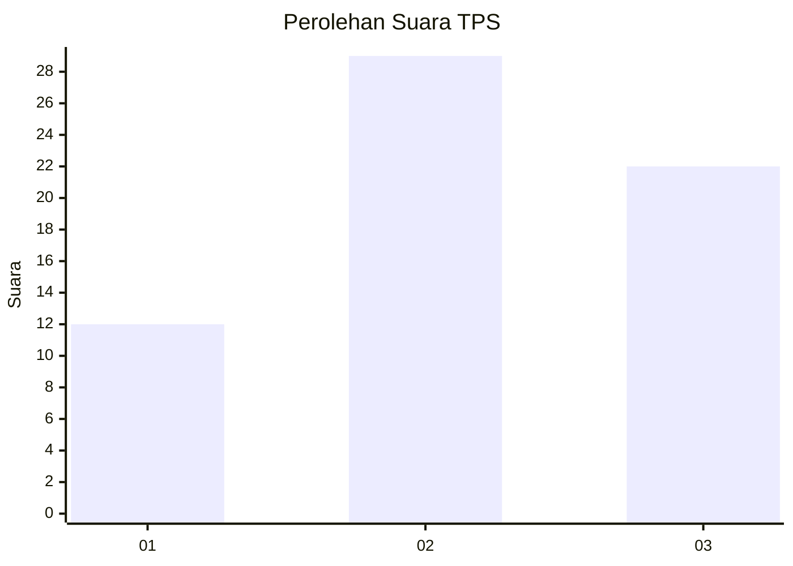
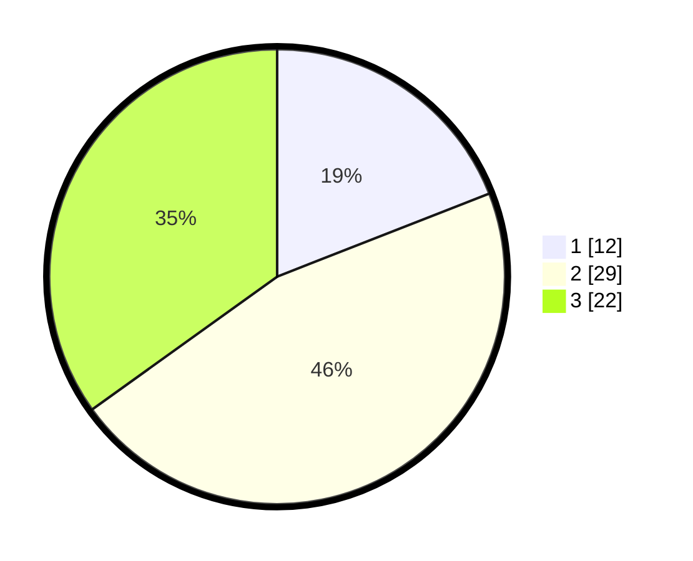

# Hasil

## Grafik

## Tabel

| No. | Nama Paslon    | Suara | Suara (raw) | Persentase |
|:--- |:-------------- | -----:| -----------:| ----------:|
| 1   | ANIES MUHAIMIN | 12    | [12][p-1]   | 19,05      |
| 2   | PRABOWO GIBRAN | 29    | [29][p-2]   | 46,03      |
| 3   | GANJAR MAHFUD  | 22    | [22][p-3]   | 34,92      |

[p-1]: https://github.com/gigit-pemilu/pemilu-2024-12-sumatera-utara/blob/main/pilpres/hitung-suara/sub/12-sumatera-utara/sub/05-langkat/sub/11-tanjung-pura/sub/1005-pekan-tanjung-pura/sub/003-tps/sub/paslon-1.txt
[p-2]: https://github.com/gigit-pemilu/pemilu-2024-12-sumatera-utara/blob/main/pilpres/hitung-suara/sub/12-sumatera-utara/sub/05-langkat/sub/11-tanjung-pura/sub/1005-pekan-tanjung-pura/sub/003-tps/sub/paslon-2.txt
[p-3]: https://github.com/gigit-pemilu/pemilu-2024-12-sumatera-utara/blob/main/pilpres/hitung-suara/sub/12-sumatera-utara/sub/05-langkat/sub/11-tanjung-pura/sub/1005-pekan-tanjung-pura/sub/003-tps/sub/paslon-3.txt

## Foto C Plano

https://sirekap-obj-formc.kpu.go.id/cc48/pemilu/ppwp/12/05/11/10/05/1205111005003-20240223-112122--d0b495e4-ca0a-46f9-a850-535308ed257e.jpg

https://sirekap-obj-formc.kpu.go.id/cc48/pemilu/ppwp/12/05/11/10/05/1205111005003-20240223-112124--42313555-c764-45c1-891f-bb03896cf0fe.jpg

https://sirekap-obj-formc.kpu.go.id/cc48/pemilu/ppwp/12/05/11/10/05/1205111005003-20240223-112123--b5fac186-bc5a-4e06-8c42-99b2689e7813.jpg

## Metadata

| Key        | Value               |
| ---------- | ------------------- |
| Time Stamp | 2024-02-24 22:31:28 |

## DATA PEMILIH TETAP

Jumlah pemilih dalam DPT: **156**.
 * L: **71**.
 * P: **85**.

## DATA PENGGUNA HAK PILIH

Jumlah pengguna hak pilih dalam DPT: **63**.
 * L: **25**.
 * P: **38**.

Jumlah pengguna hak pilih dalam DPTb: **1**.
 * L: **0**.
 * P: **1**.

Jumlah pengguna hak pilih dalam DPK: **4**.
 * L: **1**.
 * P: **3**.

Jumlah pengguna hak pilih: **68**.
 * L: **26**.
 * P: **42**.

## JUMLAH SUARA SAH DAN TIDAK SAH

JUMLAH SELURUH SUARA SAH: **63**.

JUMLAH SUARA TIDAK SAH: **5**.

JUMLAH SELURUH SUARA SAH DAN SUARA TIDAK SAH: **68**.

