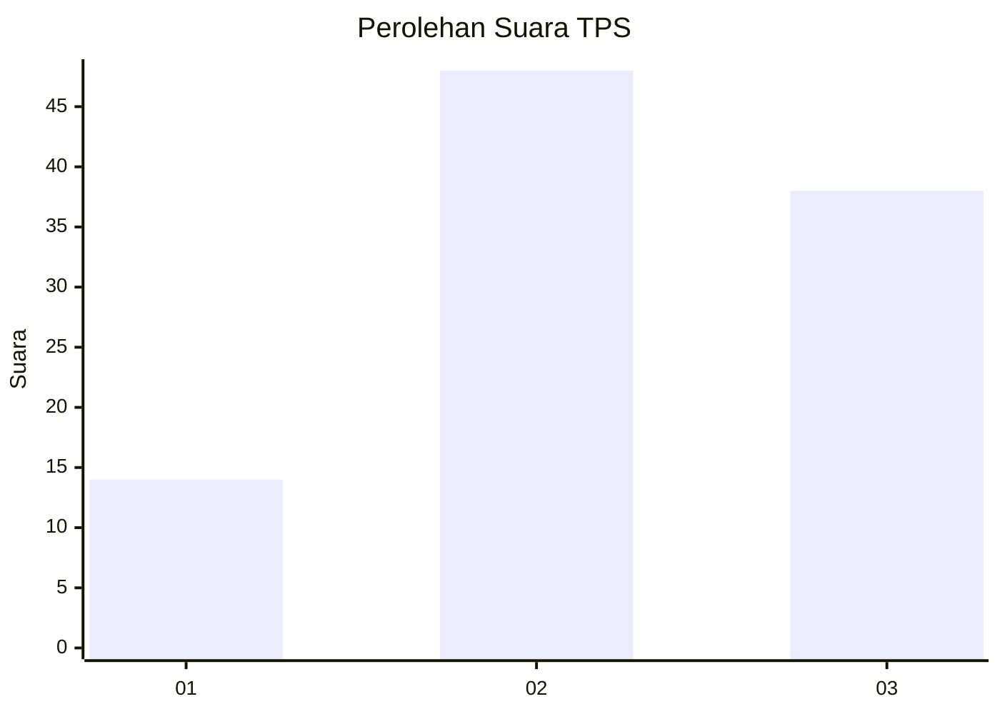
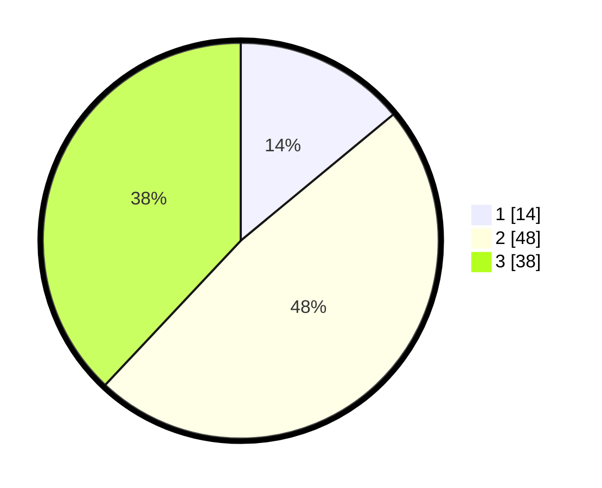

# Hasil

## Grafik

## Tabel

| No. | Nama Paslon    | Suara | Suara (raw) | Persentase |
|:--- |:-------------- | -----:| -----------:| ----------:|
| 1   | ANIES MUHAIMIN | 14    | [14][p-1]   | 14,00      |
| 2   | PRABOWO GIBRAN | 48    | [48][p-2]   | 48,00      |
| 3   | GANJAR MAHFUD  | 38    | [38][p-3]   | 38,00      |

[p-1]: https://github.com/gigit-pemilu/pemilu-2024-12-sumatera-utara/blob/main/pilpres/hitung-suara/sub/12-sumatera-utara/sub/05-langkat/sub/11-tanjung-pura/sub/1005-pekan-tanjung-pura/sub/004-tps/sub/paslon-1.txt
[p-2]: https://github.com/gigit-pemilu/pemilu-2024-12-sumatera-utara/blob/main/pilpres/hitung-suara/sub/12-sumatera-utara/sub/05-langkat/sub/11-tanjung-pura/sub/1005-pekan-tanjung-pura/sub/004-tps/sub/paslon-2.txt
[p-3]: https://github.com/gigit-pemilu/pemilu-2024-12-sumatera-utara/blob/main/pilpres/hitung-suara/sub/12-sumatera-utara/sub/05-langkat/sub/11-tanjung-pura/sub/1005-pekan-tanjung-pura/sub/004-tps/sub/paslon-3.txt

## Foto C Plano

https://sirekap-obj-formc.kpu.go.id/b4db/pemilu/ppwp/12/05/11/10/05/1205111005004-20240222-225757--a3303ccd-f5b3-46f3-aeed-85cba3b9e1ee.jpg

https://sirekap-obj-formc.kpu.go.id/b4db/pemilu/ppwp/12/05/11/10/05/1205111005004-20240222-230153--0364dcf0-db01-43e7-a457-2e50af2bbce7.jpg

https://sirekap-obj-formc.kpu.go.id/b4db/pemilu/ppwp/12/05/11/10/05/1205111005004-20240222-230354--f44f0454-e96a-453b-a7eb-22f52b4b1b11.jpg

## Metadata

| Key        | Value               |
| ---------- | ------------------- |
| Time Stamp | 2024-02-24 22:31:28 |

## DATA PEMILIH TETAP

Jumlah pemilih dalam DPT: **150**.
 * L: **64**.
 * P: **86**.

## DATA PENGGUNA HAK PILIH

Jumlah pengguna hak pilih dalam DPT: **99**.
 * L: **45**.
 * P: **54**.

Jumlah pengguna hak pilih dalam DPTb: **0**.
 * L: **0**.
 * P: **0**.

Jumlah pengguna hak pilih dalam DPK: **3**.
 * L: **2**.
 * P: **1**.

Jumlah pengguna hak pilih: **102**.
 * L: **47**.
 * P: **55**.

## JUMLAH SUARA SAH DAN TIDAK SAH

JUMLAH SELURUH SUARA SAH: **100**.

JUMLAH SUARA TIDAK SAH: **2**.

JUMLAH SELURUH SUARA SAH DAN SUARA TIDAK SAH: **102**.

