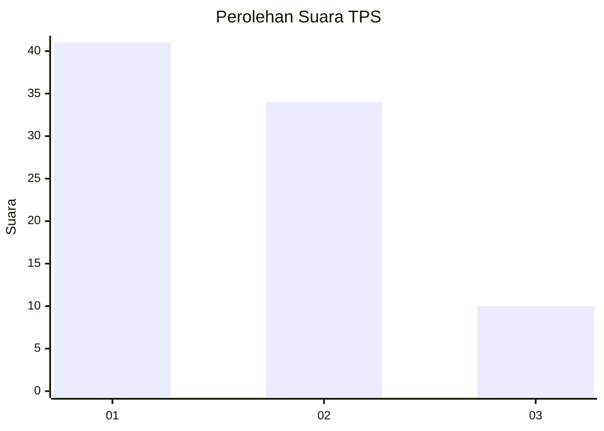
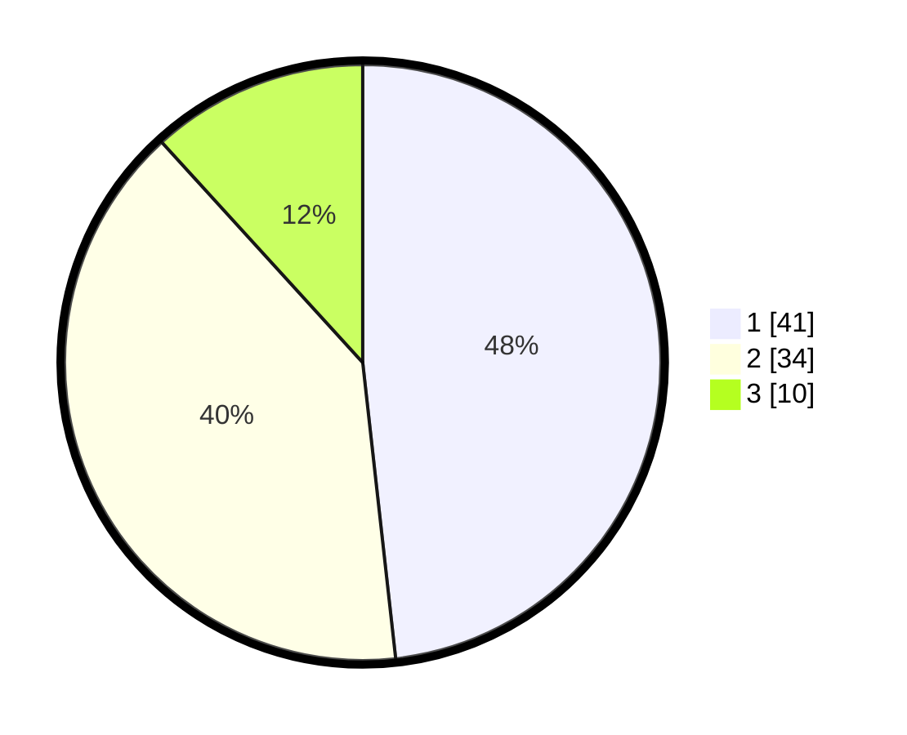

# Hasil

## Grafik

## Tabel

| No. | Nama Paslon    | Suara | Suara (raw) | Persentase |
|:--- |:-------------- | -----:| -----------:| ----------:|
| 1   | ANIES MUHAIMIN | 41    | [41][p-1]   | 48,24      |
| 2   | PRABOWO GIBRAN | 34    | [34][p-2]   | 40,00      |
| 3   | GANJAR MAHFUD  | 10    | [10][p-3]   | 11,76      |

[p-1]: https://github.com/gigit-pemilu/pemilu-2024/blob/main/pilpres/hitung-suara/sub/12-sumatera-utara/sub/05-langkat/sub/11-tanjung-pura/sub/1005-pekan-tanjung-pura/sub/005-tps/sub/paslon-1.txt
[p-2]: https://github.com/gigit-pemilu/pemilu-2024/blob/main/pilpres/hitung-suara/sub/12-sumatera-utara/sub/05-langkat/sub/11-tanjung-pura/sub/1005-pekan-tanjung-pura/sub/005-tps/sub/paslon-2.txt
[p-3]: https://github.com/gigit-pemilu/pemilu-2024/blob/main/pilpres/hitung-suara/sub/12-sumatera-utara/sub/05-langkat/sub/11-tanjung-pura/sub/1005-pekan-tanjung-pura/sub/005-tps/sub/paslon-3.txt

## Foto C Plano

https://sirekap-obj-formc.kpu.go.id/ba67/pemilu/ppwp/12/05/11/10/05/1205111005005-20240222-223302--7de76903-020f-4b86-8e2d-5196ae45f977.jpg

https://sirekap-obj-formc.kpu.go.id/ba67/pemilu/ppwp/12/05/11/10/05/1205111005005-20240222-223353--84b1ef9a-c01b-4aaf-89a8-5877356ee829.jpg

https://sirekap-obj-formc.kpu.go.id/ba67/pemilu/ppwp/12/05/11/10/05/1205111005005-20240222-223445--3eadf9c9-aead-42b4-bd02-eb3c58e0f267.jpg

## Metadata

| Key        | Value               |
| ---------- | ------------------- |
| Time Stamp | 2024-02-24 22:31:28 |

## DATA PEMILIH TETAP

Jumlah pemilih dalam DPT: **141**.
 * L: **67**.
 * P: **74**.

## DATA PENGGUNA HAK PILIH

Jumlah pengguna hak pilih dalam DPT: **81**.
 * L: **36**.
 * P: **45**.

Jumlah pengguna hak pilih dalam DPTb: **2**.
 * L: **1**.
 * P: **1**.

Jumlah pengguna hak pilih dalam DPK: **4**.
 * L: **3**.
 * P: **1**.

Jumlah pengguna hak pilih: **87**.
 * L: **40**.
 * P: **47**.

## JUMLAH SUARA SAH DAN TIDAK SAH

JUMLAH SELURUH SUARA SAH: **85**.

JUMLAH SUARA TIDAK SAH: **2**.

JUMLAH SELURUH SUARA SAH DAN SUARA TIDAK SAH: **87**.

