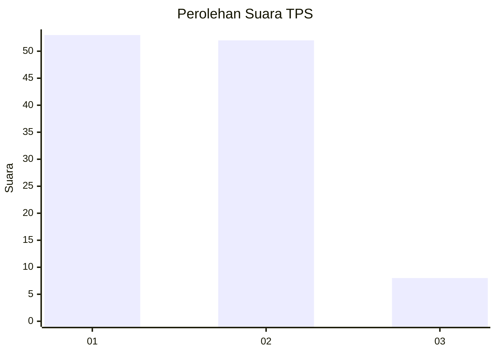
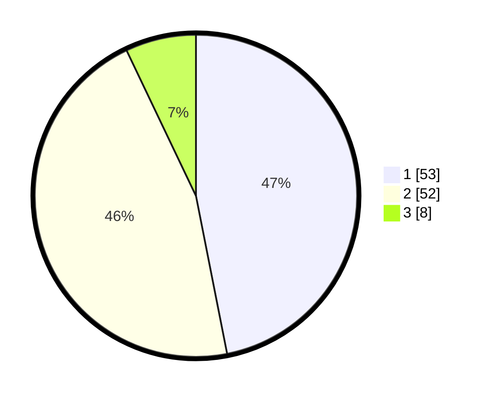

# Hasil

## Grafik

## Tabel

| No. | Nama Paslon    | Suara | Suara (raw) | Persentase |
|:--- |:-------------- | -----:| -----------:| ----------:|
| 1   | ANIES MUHAIMIN | 53    | [53][p-1]   | 46,90      |
| 2   | PRABOWO GIBRAN | 52    | [52][p-2]   | 46,02      |
| 3   | GANJAR MAHFUD  | 8     | [8][p-3]    | 7,08       |

[p-1]: https://github.com/gigit-pemilu/pemilu-2024/blob/main/pilpres/hitung-suara/sub/12-sumatera-utara/sub/05-langkat/sub/11-tanjung-pura/sub/2015-bubun/sub/009-tps/sub/paslon-1.txt
[p-2]: https://github.com/gigit-pemilu/pemilu-2024/blob/main/pilpres/hitung-suara/sub/12-sumatera-utara/sub/05-langkat/sub/11-tanjung-pura/sub/2015-bubun/sub/009-tps/sub/paslon-2.txt
[p-3]: https://github.com/gigit-pemilu/pemilu-2024/blob/main/pilpres/hitung-suara/sub/12-sumatera-utara/sub/05-langkat/sub/11-tanjung-pura/sub/2015-bubun/sub/009-tps/sub/paslon-3.txt

## Foto C Plano

https://sirekap-obj-formc.kpu.go.id/86a8/pemilu/ppwp/12/05/11/20/15/1205112015009-20240223-122316--04719861-041b-4e14-8239-41032c712939.jpg

https://sirekap-obj-formc.kpu.go.id/86a8/pemilu/ppwp/12/05/11/20/15/1205112015009-20240215-003028--6d5a0f1a-71e9-4df3-be5d-84a8a4d846f0.jpg

https://sirekap-obj-formc.kpu.go.id/86a8/pemilu/ppwp/12/05/11/20/15/1205112015009-20240215-003408--a3ec3fd6-f0f3-4913-81f2-cd9082897052.jpg

## Metadata

| Key        | Value               |
| ---------- | ------------------- |
| Time Stamp | 2024-02-24 22:31:28 |

