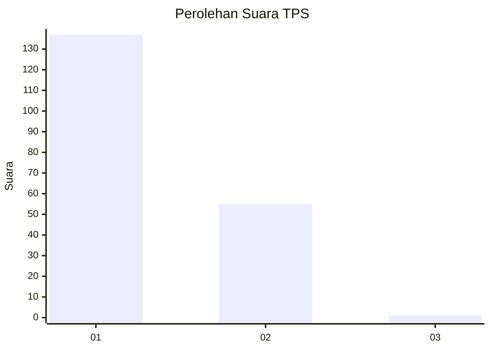
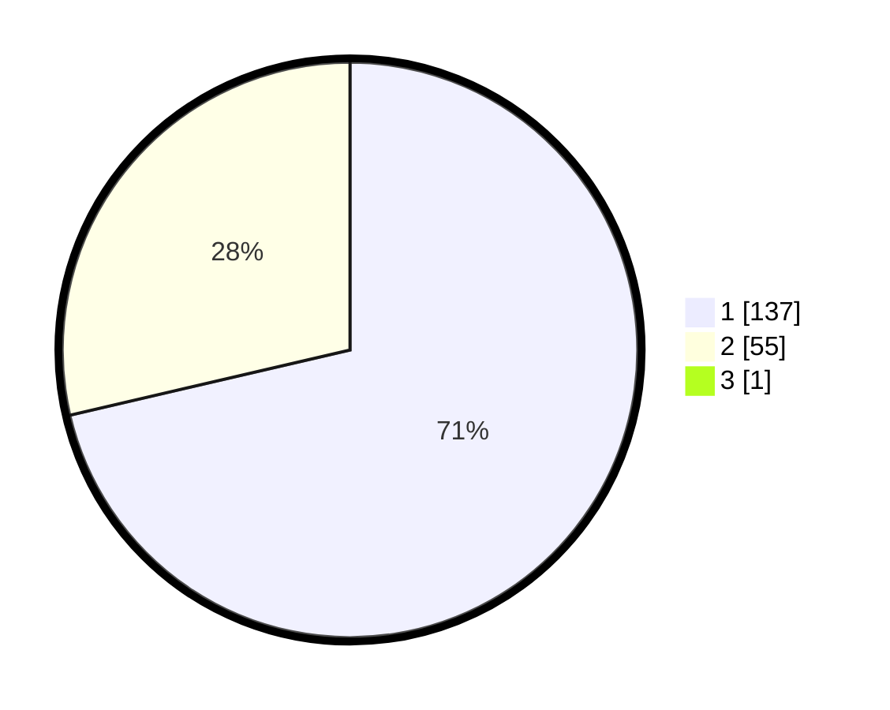

# Hasil

## Grafik

## Tabel

| No. | Nama Paslon    | Suara | Suara (raw) | Persentase |
|:--- |:-------------- | -----:| -----------:| ----------:|
| 1   | ANIES MUHAIMIN | 137   | [137][p-1]  | 70,98      |
| 2   | PRABOWO GIBRAN | 55    | [55][p-2]   | 28,50      |
| 3   | GANJAR MAHFUD  | 1     | [1][p-3]    | 0,52       |

[p-1]: https://github.com/gigit-pemilu/pemilu-2024/blob/main/pilpres/hitung-suara/sub/12-sumatera-utara/sub/05-langkat/sub/11-tanjung-pura/sub/2019-pematang-cengal-barat/sub/002-tps/sub/paslon-1.txt
[p-2]: https://github.com/gigit-pemilu/pemilu-2024/blob/main/pilpres/hitung-suara/sub/12-sumatera-utara/sub/05-langkat/sub/11-tanjung-pura/sub/2019-pematang-cengal-barat/sub/002-tps/sub/paslon-2.txt
[p-3]: https://github.com/gigit-pemilu/pemilu-2024/blob/main/pilpres/hitung-suara/sub/12-sumatera-utara/sub/05-langkat/sub/11-tanjung-pura/sub/2019-pematang-cengal-barat/sub/002-tps/sub/paslon-3.txt

## Foto C Plano

https://sirekap-obj-formc.kpu.go.id/614b/pemilu/ppwp/12/05/11/20/19/1205112019002-20240214-193949--27acad5b-4d44-40df-97b5-2fb2db92371a.jpg

https://sirekap-obj-formc.kpu.go.id/614b/pemilu/ppwp/12/05/11/20/19/1205112019002-20240214-193958--47191b19-2d63-4f23-8ecf-424f58f07db0.jpg

https://sirekap-obj-formc.kpu.go.id/614b/pemilu/ppwp/12/05/11/20/19/1205112019002-20240214-204617--380637a9-f062-4515-a336-10ebcc558a4f.jpg

## Metadata

| Key        | Value               |
| ---------- | ------------------- |
| Time Stamp | 2024-02-15 09:00:24 |

