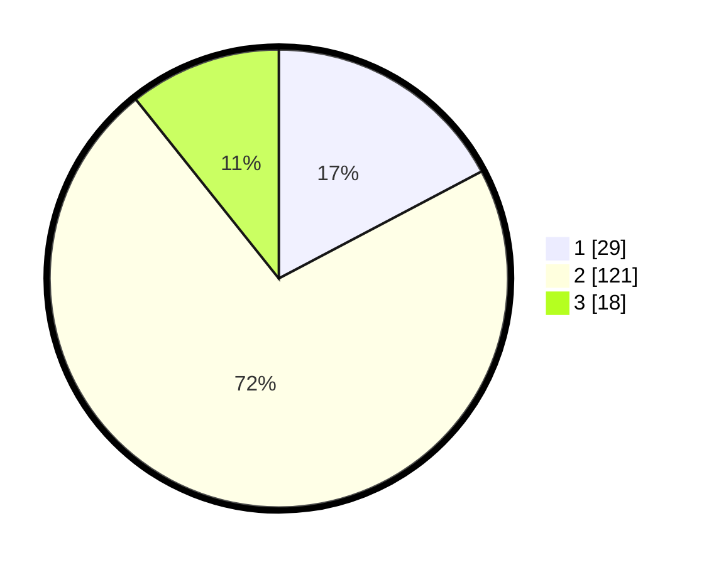

# Hasil

## Grafik

## Tabel

| No. | Nama Paslon    | Suara | Suara (raw) | Persentase |
|:--- |:-------------- | -----:| -----------:| ----------:|
| 1   | ANIES MUHAIMIN | 29    | [29][p-1]   | 17,26      |
| 2   | PRABOWO GIBRAN | 121   | [121][p-2]  | 72,02      |
| 3   | GANJAR MAHFUD  | 18    | [18][p-3]   | 10,71      |

[p-1]: https://github.com/gigit-pemilu/pemilu-2024/blob/main/pilpres/hitung-suara/sub/12-sumatera-utara/sub/05-langkat/sub/13-gebang/sub/2002-paluh-manis/sub/001-tps/sub/paslon-1.txt
[p-2]: https://github.com/gigit-pemilu/pemilu-2024/blob/main/pilpres/hitung-suara/sub/12-sumatera-utara/sub/05-langkat/sub/13-gebang/sub/2002-paluh-manis/sub/001-tps/sub/paslon-2.txt
[p-3]: https://github.com/gigit-pemilu/pemilu-2024/blob/main/pilpres/hitung-suara/sub/12-sumatera-utara/sub/05-langkat/sub/13-gebang/sub/2002-paluh-manis/sub/001-tps/sub/paslon-3.txt

## Foto C Plano

https://sirekap-obj-formc.kpu.go.id/0aeb/pemilu/ppwp/12/05/13/20/02/1205132002001-20240214-195153--9391efa5-a09c-4328-a882-a749e7857b99.jpg

https://sirekap-obj-formc.kpu.go.id/0aeb/pemilu/ppwp/12/05/13/20/02/1205132002001-20240214-195254--c6dbb819-de2f-4dea-a8ed-754cbe733d73.jpg

https://sirekap-obj-formc.kpu.go.id/0aeb/pemilu/ppwp/12/05/13/20/02/1205132002001-20240214-195348--608f8fe5-ea8f-456b-b8bd-f142badafca2.jpg

## Metadata

| Key        | Value               |
| ---------- | ------------------- |
| Time Stamp | 2024-02-19 06:16:00 |

## DATA PEMILIH TETAP

Jumlah pemilih dalam DPT: **256**.
 * L: **620**.
 * P: **545**.

## DATA PENGGUNA HAK PILIH

Jumlah pengguna hak pilih dalam DPT: **654**.
 * L: **857**.
 * P: **843**.

Jumlah pengguna hak pilih dalam DPTb: **808**.
 * L: **46**.
 * P: **80**.

Jumlah pengguna hak pilih dalam DPK: **885**.
 * L: **884**.
 * P: **887**.

Jumlah pengguna hak pilih: **675**.
 * L: **872**.
 * P: **55**.

## JUMLAH SUARA SAH DAN TIDAK SAH

JUMLAH SELURUH SUARA SAH: **168**.

JUMLAH SUARA TIDAK SAH: **3**.

JUMLAH SELURUH SUARA SAH DAN SUARA TIDAK SAH: **171**.

