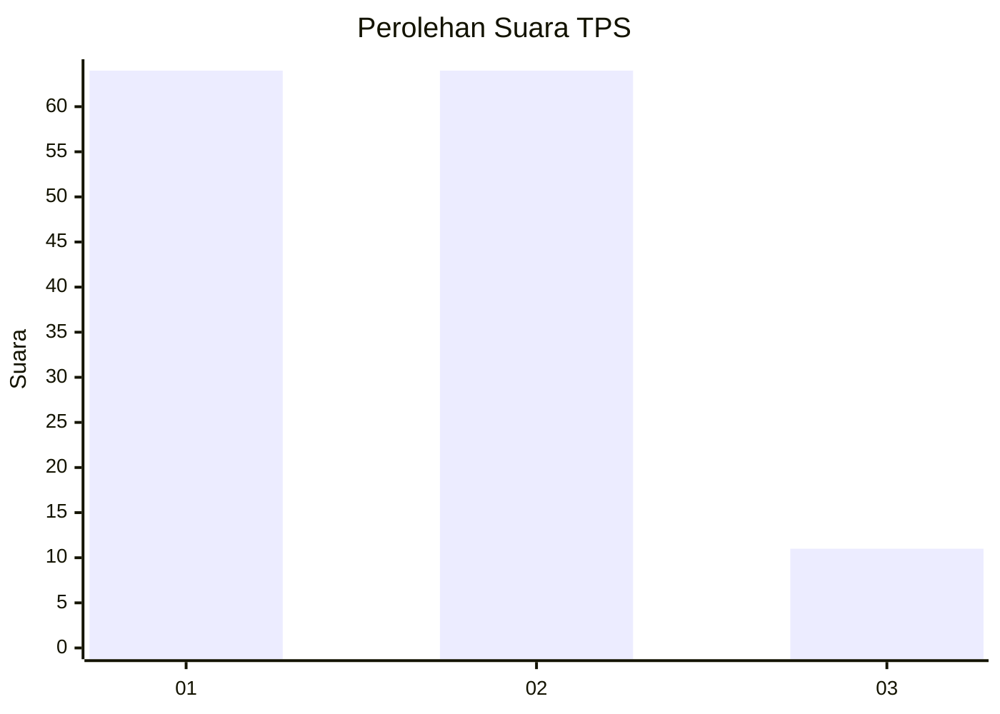
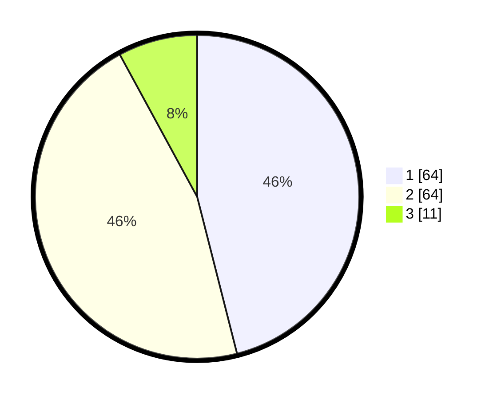

# Hasil

## Grafik

## Tabel

| No. | Nama Paslon    | Suara | Suara (raw) | Persentase |
|:--- |:-------------- | -----:| -----------:| ----------:|
| 1   | ANIES MUHAIMIN | 64    | [64][p-1]   | 46,04      |
| 2   | PRABOWO GIBRAN | 64    | [64][p-2]   | 46,04      |
| 3   | GANJAR MAHFUD  | 11    | [11][p-3]   | 7,91       |

[p-1]: https://github.com/gigit-pemilu/pemilu-2024/blob/main/pilpres/hitung-suara/sub/12-sumatera-utara/sub/05-langkat/sub/14-babalan/sub/1001-pelawi-utara/sub/005-tps/sub/paslon-1.txt
[p-2]: https://github.com/gigit-pemilu/pemilu-2024/blob/main/pilpres/hitung-suara/sub/12-sumatera-utara/sub/05-langkat/sub/14-babalan/sub/1001-pelawi-utara/sub/005-tps/sub/paslon-2.txt
[p-3]: https://github.com/gigit-pemilu/pemilu-2024/blob/main/pilpres/hitung-suara/sub/12-sumatera-utara/sub/05-langkat/sub/14-babalan/sub/1001-pelawi-utara/sub/005-tps/sub/paslon-3.txt

## Foto C Plano

https://sirekap-obj-formc.kpu.go.id/fd04/pemilu/ppwp/12/05/14/10/01/1205141001005-20240214-233635--fa685312-cd17-477e-8b24-925e97f711a2.jpg

https://sirekap-obj-formc.kpu.go.id/fd04/pemilu/ppwp/12/05/14/10/01/1205141001005-20240214-233829--d7655715-83be-4dc8-9555-b93658f2032f.jpg

https://sirekap-obj-formc.kpu.go.id/fd04/pemilu/ppwp/12/05/14/10/01/1205141001005-20240214-234123--36622a87-88c7-4d10-8fec-075ae24c7049.jpg

## Metadata

| Key        | Value               |
| ---------- | ------------------- |
| Time Stamp | 2024-02-15 17:00:25 |

