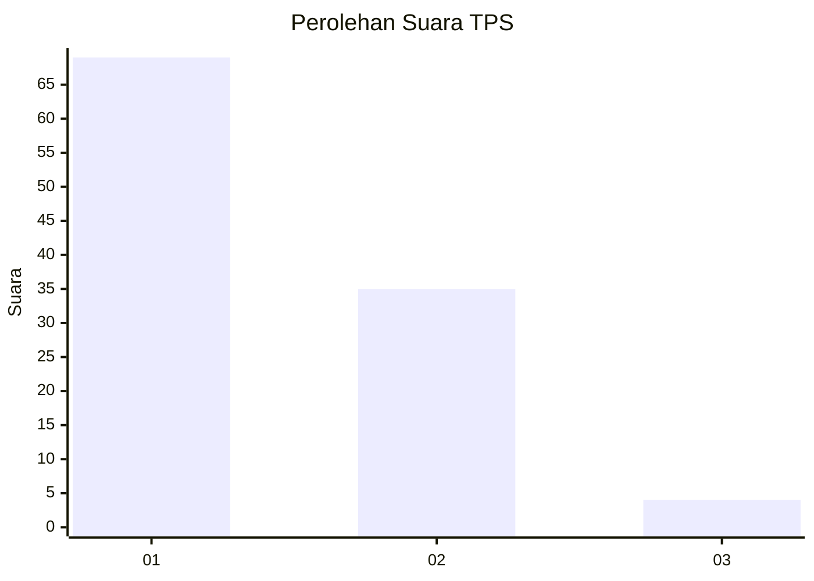
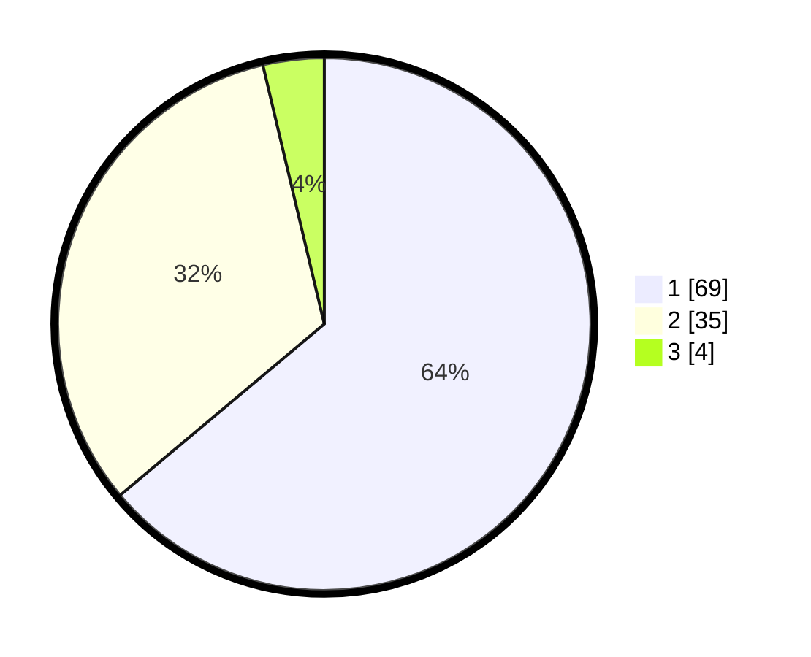

# Hasil

## Grafik

## Tabel

| No. | Nama Paslon    | Suara | Suara (raw) | Persentase |
|:--- |:-------------- | -----:| -----------:| ----------:|
| 1   | ANIES MUHAIMIN | 69    | [69][p-1]   | 63,89      |
| 2   | PRABOWO GIBRAN | 35    | [35][p-2]   | 32,41      |
| 3   | GANJAR MAHFUD  | 4     | [4][p-3]    | 3,70       |

[p-1]: https://github.com/gigit-pemilu/pemilu-2024/blob/main/pilpres/hitung-suara/sub/12-sumatera-utara/sub/05-langkat/sub/14-babalan/sub/1006-berandan-barat/sub/006-tps/sub/paslon-1.txt
[p-2]: https://github.com/gigit-pemilu/pemilu-2024/blob/main/pilpres/hitung-suara/sub/12-sumatera-utara/sub/05-langkat/sub/14-babalan/sub/1006-berandan-barat/sub/006-tps/sub/paslon-2.txt
[p-3]: https://github.com/gigit-pemilu/pemilu-2024/blob/main/pilpres/hitung-suara/sub/12-sumatera-utara/sub/05-langkat/sub/14-babalan/sub/1006-berandan-barat/sub/006-tps/sub/paslon-3.txt

## Foto C Plano

https://sirekap-obj-formc.kpu.go.id/b53c/pemilu/ppwp/12/05/14/10/06/1205141006006-20240223-172240--4f534fb3-0a34-41ca-82a9-6da13031ad80.jpg

https://sirekap-obj-formc.kpu.go.id/b53c/pemilu/ppwp/12/05/14/10/06/1205141006006-20240223-172428--1be11c53-3b13-4783-a42f-815de88c81a5.jpg

https://sirekap-obj-formc.kpu.go.id/b53c/pemilu/ppwp/12/05/14/10/06/1205141006006-20240223-172631--17ca613f-538f-4bab-847f-565db6e12e4e.jpg

## Metadata

| Key        | Value               |
| ---------- | ------------------- |
| Time Stamp | 2024-02-24 22:31:28 |

