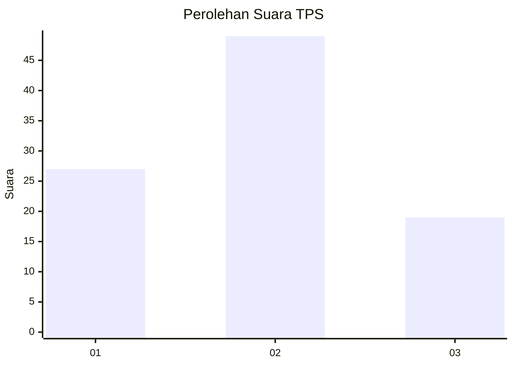
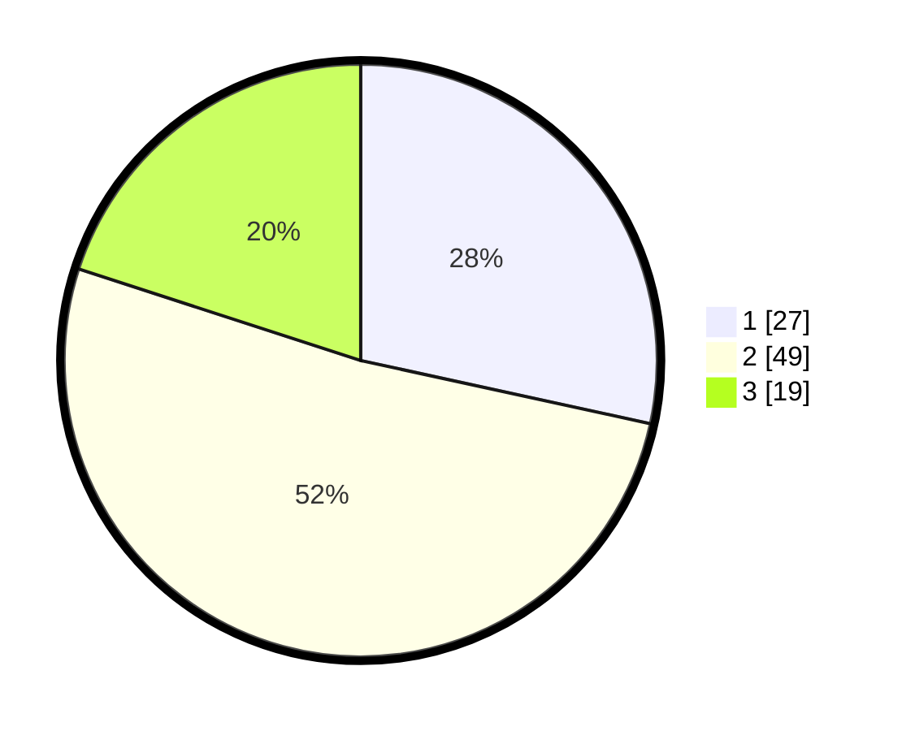

# Hasil

## Grafik

## Tabel

| No. | Nama Paslon    | Suara | Suara (raw) | Persentase |
|:--- |:-------------- | -----:| -----------:| ----------:|
| 1   | ANIES MUHAIMIN | 27    | [27][p-1]   | 28,42      |
| 2   | PRABOWO GIBRAN | 49    | [49][p-2]   | 51,58      |
| 3   | GANJAR MAHFUD  | 19    | [19][p-3]   | 20,00      |

[p-1]: https://github.com/gigit-pemilu/pemilu-2024-12-sumatera-utara/blob/main/pilpres/hitung-suara/sub/12-sumatera-utara/sub/05-langkat/sub/14-babalan/sub/1006-berandan-barat/sub/012-tps/sub/paslon-1.txt
[p-2]: https://github.com/gigit-pemilu/pemilu-2024-12-sumatera-utara/blob/main/pilpres/hitung-suara/sub/12-sumatera-utara/sub/05-langkat/sub/14-babalan/sub/1006-berandan-barat/sub/012-tps/sub/paslon-2.txt
[p-3]: https://github.com/gigit-pemilu/pemilu-2024-12-sumatera-utara/blob/main/pilpres/hitung-suara/sub/12-sumatera-utara/sub/05-langkat/sub/14-babalan/sub/1006-berandan-barat/sub/012-tps/sub/paslon-3.txt

## Foto C Plano

https://sirekap-obj-formc.kpu.go.id/22e3/pemilu/ppwp/12/05/14/10/06/1205141006012-20240214-233650--8cc1614d-7e04-4741-a0c0-ad469edb071c.jpg

https://sirekap-obj-formc.kpu.go.id/22e3/pemilu/ppwp/12/05/14/10/06/1205141006012-20240214-233827--5af0f608-5bd3-4436-93fa-44f781fde460.jpg

https://sirekap-obj-formc.kpu.go.id/22e3/pemilu/ppwp/12/05/14/10/06/1205141006012-20240214-233925--fb7fc532-7327-4c11-9f25-107862e0291a.jpg

## Metadata

| Key        | Value               |
| ---------- | ------------------- |
| Time Stamp | 2024-02-15 17:00:25 |

