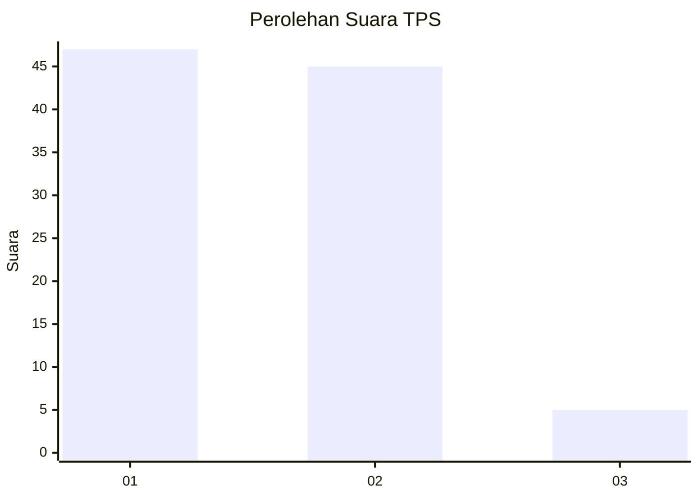
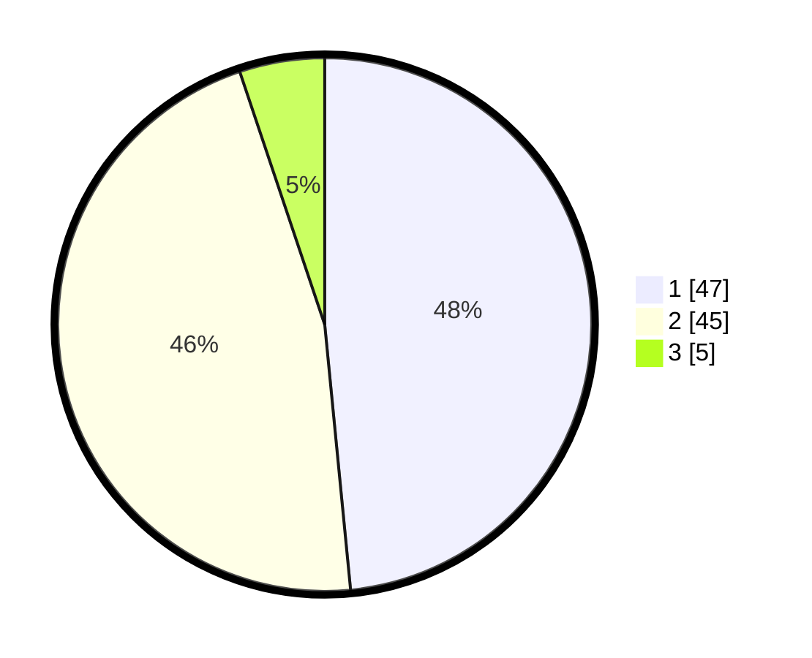

# Hasil

## Grafik

## Tabel

| No. | Nama Paslon    | Suara | Suara (raw) | Persentase |
|:--- |:-------------- | -----:| -----------:| ----------:|
| 1   | ANIES MUHAIMIN | 47    | [47][p-1]   | 48,45      |
| 2   | PRABOWO GIBRAN | 45    | [45][p-2]   | 46,39      |
| 3   | GANJAR MAHFUD  | 5     | [5][p-3]    | 5,15       |

[p-1]: https://github.com/gigit-pemilu/pemilu-2024/blob/main/pilpres/hitung-suara/sub/12-sumatera-utara/sub/05-langkat/sub/14-babalan/sub/1007-berandan-timur-baru/sub/001-tps/sub/paslon-1.txt
[p-2]: https://github.com/gigit-pemilu/pemilu-2024/blob/main/pilpres/hitung-suara/sub/12-sumatera-utara/sub/05-langkat/sub/14-babalan/sub/1007-berandan-timur-baru/sub/001-tps/sub/paslon-2.txt
[p-3]: https://github.com/gigit-pemilu/pemilu-2024/blob/main/pilpres/hitung-suara/sub/12-sumatera-utara/sub/05-langkat/sub/14-babalan/sub/1007-berandan-timur-baru/sub/001-tps/sub/paslon-3.txt

## Foto C Plano

https://sirekap-obj-formc.kpu.go.id/b5a8/pemilu/ppwp/12/05/14/10/07/1205141007001-20240214-231439--36ef6c27-c21f-4270-a9ae-2303bb571443.jpg

https://sirekap-obj-formc.kpu.go.id/b5a8/pemilu/ppwp/12/05/14/10/07/1205141007001-20240214-232116--dcf7d5bb-04a3-4fc2-a8dd-eadc9ceb634d.jpg

## Metadata

| Key        | Value               |
| ---------- | ------------------- |
| Time Stamp | 2024-02-16 01:00:27 |

