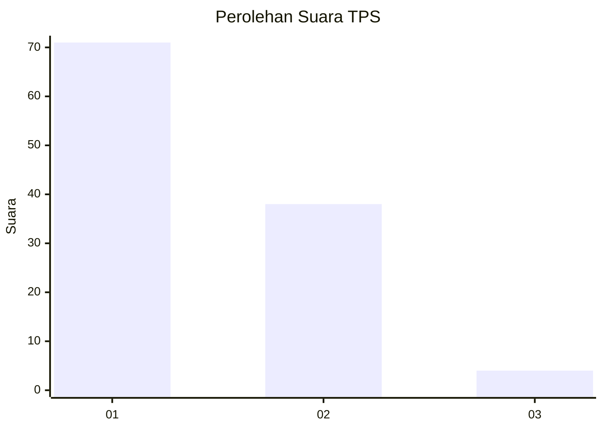
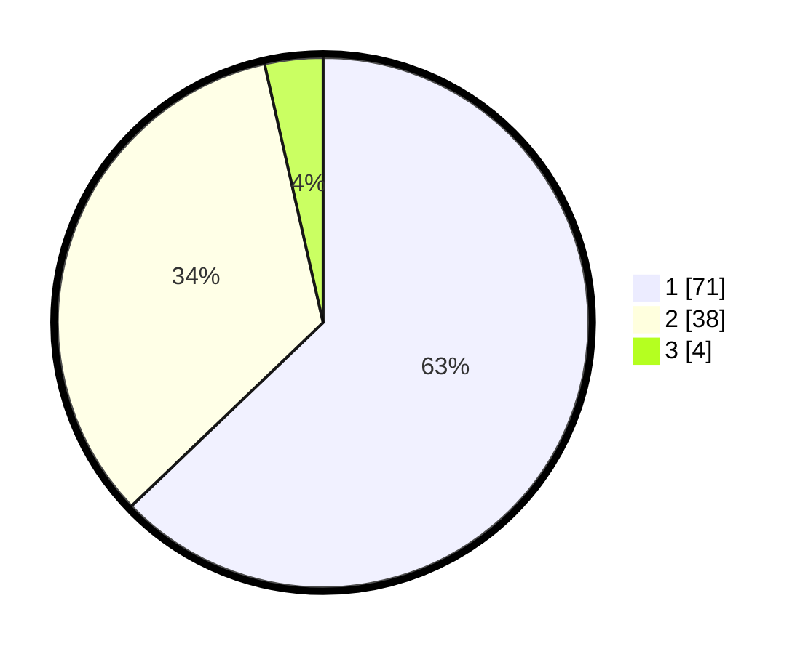

# Hasil

## Grafik

## Tabel

| No. | Nama Paslon    | Suara | Suara (raw) | Persentase |
|:--- |:-------------- | -----:| -----------:| ----------:|
| 1   | ANIES MUHAIMIN | 71    | [71][p-1]   | 62,83      |
| 2   | PRABOWO GIBRAN | 38    | [38][p-2]   | 33,63      |
| 3   | GANJAR MAHFUD  | 4     | [4][p-3]    | 3,54       |

[p-1]: https://github.com/gigit-pemilu/pemilu-2024-12-sumatera-utara/blob/main/pilpres/hitung-suara/sub/12-sumatera-utara/sub/05-langkat/sub/14-babalan/sub/1007-berandan-timur-baru/sub/011-tps/sub/paslon-1.txt
[p-2]: https://github.com/gigit-pemilu/pemilu-2024-12-sumatera-utara/blob/main/pilpres/hitung-suara/sub/12-sumatera-utara/sub/05-langkat/sub/14-babalan/sub/1007-berandan-timur-baru/sub/011-tps/sub/paslon-2.txt
[p-3]: https://github.com/gigit-pemilu/pemilu-2024-12-sumatera-utara/blob/main/pilpres/hitung-suara/sub/12-sumatera-utara/sub/05-langkat/sub/14-babalan/sub/1007-berandan-timur-baru/sub/011-tps/sub/paslon-3.txt

## Foto C Plano

https://sirekap-obj-formc.kpu.go.id/6e49/pemilu/ppwp/12/05/14/10/07/1205141007011-20240214-235317--c0571b7f-79fc-4c7e-b1e1-5bc7e13a6d2f.jpg

https://sirekap-obj-formc.kpu.go.id/6e49/pemilu/ppwp/12/05/14/10/07/1205141007011-20240215-000712--91df2170-883b-4783-8bd4-fe99c61f88c3.jpg

https://sirekap-obj-formc.kpu.go.id/6e49/pemilu/ppwp/12/05/14/10/07/1205141007011-20240215-000903--a8acf0ae-2c36-4e1f-8a69-45f344d8e674.jpg

## Metadata

| Key        | Value               |
| ---------- | ------------------- |
| Time Stamp | 2024-02-16 16:30:00 |

