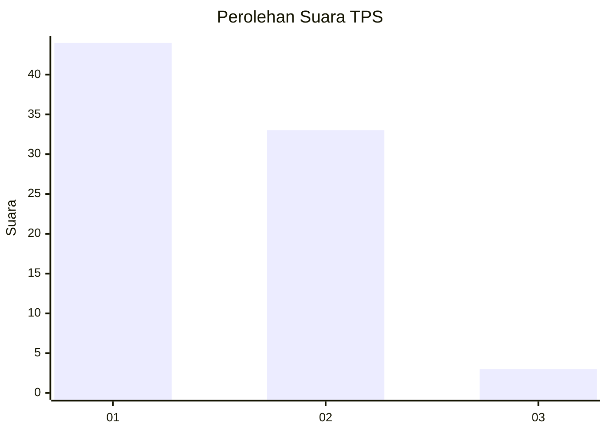
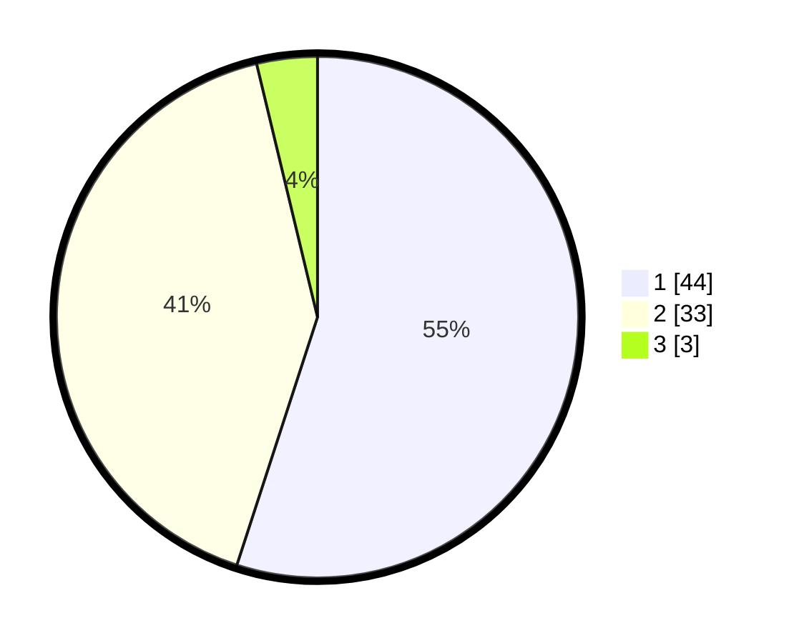

# Hasil

## Grafik

## Tabel

| No. | Nama Paslon    | Suara | Suara (raw) | Persentase |
|:--- |:-------------- | -----:| -----------:| ----------:|
| 1   | ANIES MUHAIMIN | 44    | [44][p-1]   | 55,00      |
| 2   | PRABOWO GIBRAN | 33    | [33][p-2]   | 41,25      |
| 3   | GANJAR MAHFUD  | 3     | [3][p-3]    | 3,75       |

[p-1]: https://github.com/gigit-pemilu/pemilu-2024/blob/main/pilpres/hitung-suara/sub/12-sumatera-utara/sub/05-langkat/sub/14-babalan/sub/1008-berandan-timur/sub/002-tps/sub/paslon-1.txt
[p-2]: https://github.com/gigit-pemilu/pemilu-2024/blob/main/pilpres/hitung-suara/sub/12-sumatera-utara/sub/05-langkat/sub/14-babalan/sub/1008-berandan-timur/sub/002-tps/sub/paslon-2.txt
[p-3]: https://github.com/gigit-pemilu/pemilu-2024/blob/main/pilpres/hitung-suara/sub/12-sumatera-utara/sub/05-langkat/sub/14-babalan/sub/1008-berandan-timur/sub/002-tps/sub/paslon-3.txt

## Foto C Plano

https://sirekap-obj-formc.kpu.go.id/9024/pemilu/ppwp/12/05/14/10/08/1205141008002-20240215-020303--626527c1-7033-468c-b4e6-9646912f797e.jpg

https://sirekap-obj-formc.kpu.go.id/9024/pemilu/ppwp/12/05/14/10/08/1205141008002-20240223-160349--feb89ec9-ea08-4022-9494-4a9bf165b6bf.jpg

https://sirekap-obj-formc.kpu.go.id/9024/pemilu/ppwp/12/05/14/10/08/1205141008002-20240223-160531--80b4818f-422e-4097-bdc7-8afbae318cf7.jpg

## Metadata

| Key        | Value               |
| ---------- | ------------------- |
| Time Stamp | 2024-02-24 22:31:28 |

