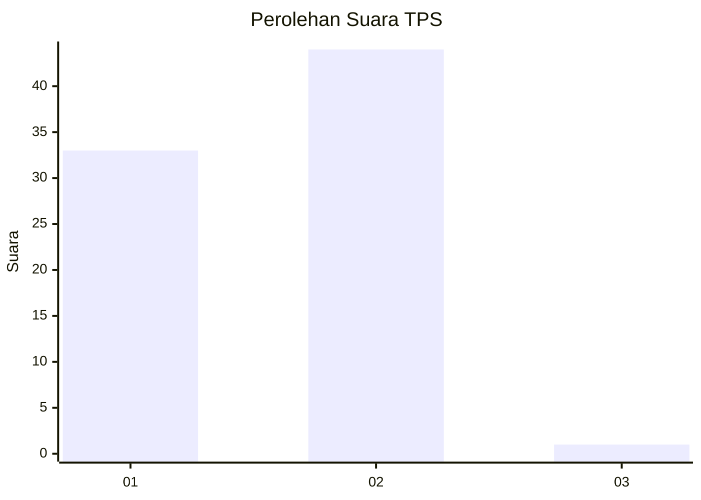
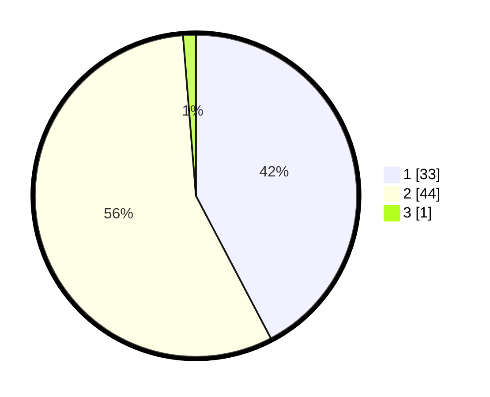

# Hasil

## Grafik

## Tabel

| No. | Nama Paslon    | Suara | Suara (raw) | Persentase |
|:--- |:-------------- | -----:| -----------:| ----------:|
| 1   | ANIES MUHAIMIN | 33    | [33][p-1]   | 42,31      |
| 2   | PRABOWO GIBRAN | 44    | [44][p-2]   | 56,41      |
| 3   | GANJAR MAHFUD  | 1     | [1][p-3]    | 1,28       |

[p-1]: https://github.com/gigit-pemilu/pemilu-2024/blob/main/pilpres/hitung-suara/sub/12-sumatera-utara/sub/05-langkat/sub/14-babalan/sub/2002-securai-utara/sub/006-tps/sub/paslon-1.txt
[p-2]: https://github.com/gigit-pemilu/pemilu-2024/blob/main/pilpres/hitung-suara/sub/12-sumatera-utara/sub/05-langkat/sub/14-babalan/sub/2002-securai-utara/sub/006-tps/sub/paslon-2.txt
[p-3]: https://github.com/gigit-pemilu/pemilu-2024/blob/main/pilpres/hitung-suara/sub/12-sumatera-utara/sub/05-langkat/sub/14-babalan/sub/2002-securai-utara/sub/006-tps/sub/paslon-3.txt

## Foto C Plano

https://sirekap-obj-formc.kpu.go.id/083e/pemilu/ppwp/12/05/14/20/02/1205142002006-20240215-071037--1516df2b-5a00-44f0-846a-8590f42113b5.jpg

https://sirekap-obj-formc.kpu.go.id/083e/pemilu/ppwp/12/05/14/20/02/1205142002006-20240215-071242--b79725d8-7fcf-45c5-83ba-a5164b4e478f.jpg

https://sirekap-obj-formc.kpu.go.id/083e/pemilu/ppwp/12/05/14/20/02/1205142002006-20240215-071522--ed91c461-f954-44e1-a293-96e90fc4666a.jpg

## Metadata

| Key        | Value               |
| ---------- | ------------------- |
| Time Stamp | 2024-02-16 21:01:00 |

