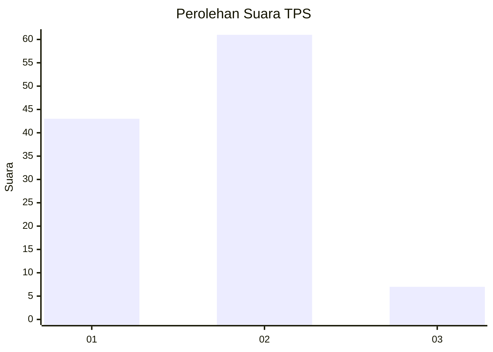
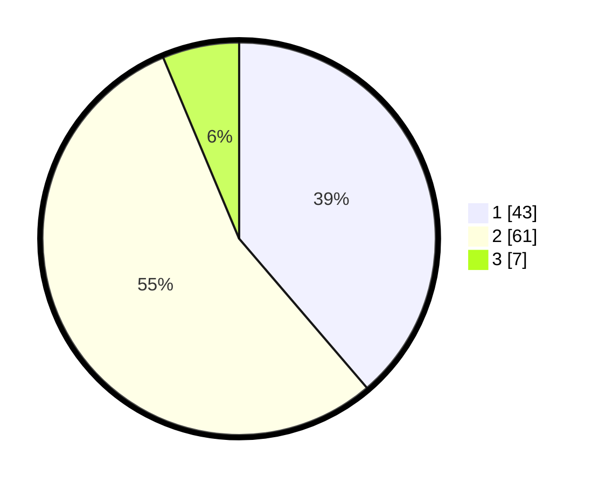

# Hasil

## Grafik

## Tabel

| No. | Nama Paslon    | Suara | Suara (raw) | Persentase |
|:--- |:-------------- | -----:| -----------:| ----------:|
| 1   | ANIES MUHAIMIN | 43    | [43][p-1]   | 38,74      |
| 2   | PRABOWO GIBRAN | 61    | [61][p-2]   | 54,95      |
| 3   | GANJAR MAHFUD  | 7     | [7][p-3]    | 6,31       |

[p-1]: https://github.com/gigit-pemilu/pemilu-2024/blob/main/pilpres/hitung-suara/sub/12-sumatera-utara/sub/05-langkat/sub/14-babalan/sub/2002-securai-utara/sub/007-tps/sub/paslon-1.txt
[p-2]: https://github.com/gigit-pemilu/pemilu-2024/blob/main/pilpres/hitung-suara/sub/12-sumatera-utara/sub/05-langkat/sub/14-babalan/sub/2002-securai-utara/sub/007-tps/sub/paslon-2.txt
[p-3]: https://github.com/gigit-pemilu/pemilu-2024/blob/main/pilpres/hitung-suara/sub/12-sumatera-utara/sub/05-langkat/sub/14-babalan/sub/2002-securai-utara/sub/007-tps/sub/paslon-3.txt

## Foto C Plano

https://sirekap-obj-formc.kpu.go.id/116f/pemilu/ppwp/12/05/14/20/02/1205142002007-20240214-233910--36ac2b35-62e0-4841-91a0-82a254d3e6ec.jpg

https://sirekap-obj-formc.kpu.go.id/116f/pemilu/ppwp/12/05/14/20/02/1205142002007-20240214-234111--734c6b0f-93e9-4475-86a2-2b17d96fcd59.jpg

https://sirekap-obj-formc.kpu.go.id/116f/pemilu/ppwp/12/05/14/20/02/1205142002007-20240214-234202--f084f708-fce0-4fff-9dd1-c118564b3bbd.jpg

## Metadata

| Key        | Value               |
| ---------- | ------------------- |
| Time Stamp | 2024-02-15 17:30:25 |

