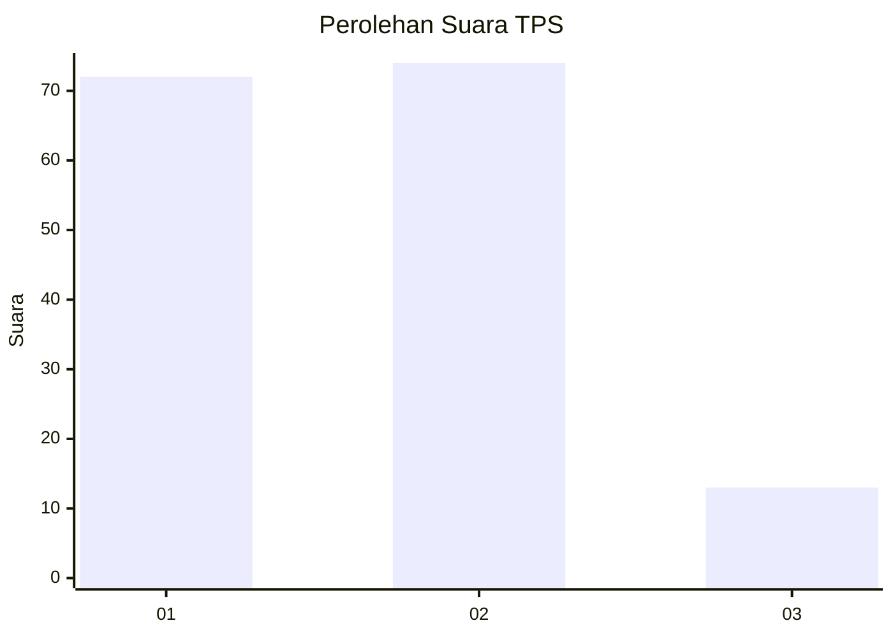
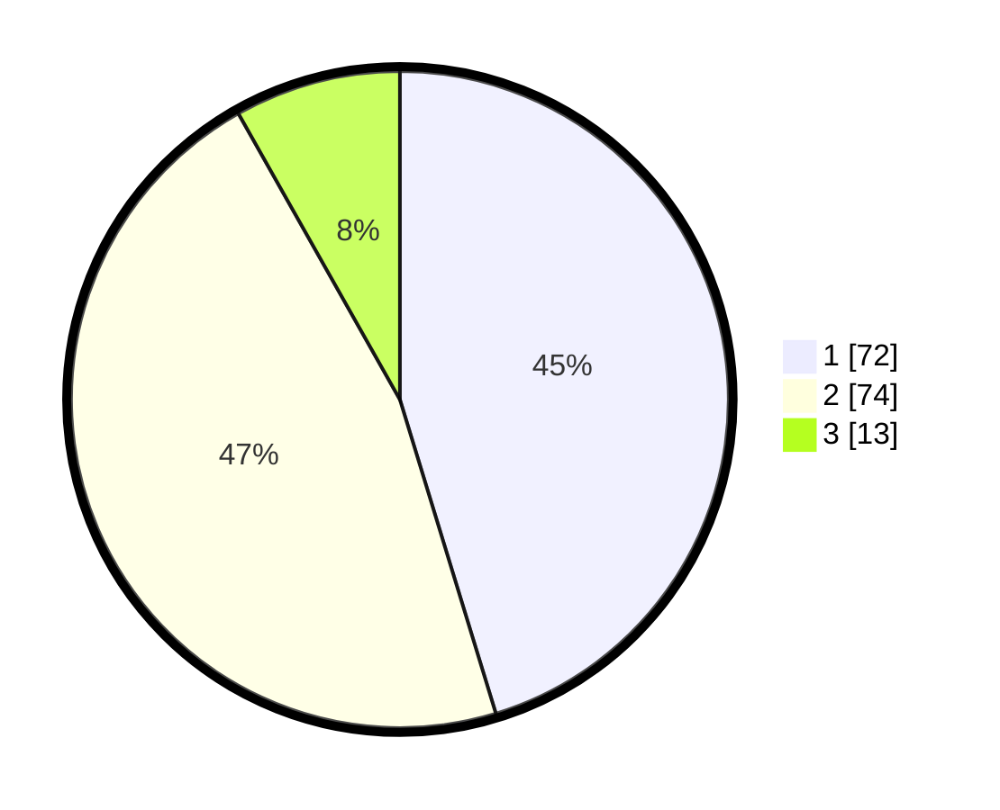

# Hasil

## Grafik

## Tabel

| No. | Nama Paslon    | Suara | Suara (raw) | Persentase |
|:--- |:-------------- | -----:| -----------:| ----------:|
| 1   | ANIES MUHAIMIN | 72    | [72][p-1]   | 45,28      |
| 2   | PRABOWO GIBRAN | 74    | [74][p-2]   | 46,54      |
| 3   | GANJAR MAHFUD  | 13    | [13][p-3]   | 8,18       |

[p-1]: https://github.com/gigit-pemilu/pemilu-2024/blob/main/pilpres/hitung-suara/sub/12-sumatera-utara/sub/05-langkat/sub/14-babalan/sub/2003-teluk-meku/sub/003-tps/sub/paslon-1.txt
[p-2]: https://github.com/gigit-pemilu/pemilu-2024/blob/main/pilpres/hitung-suara/sub/12-sumatera-utara/sub/05-langkat/sub/14-babalan/sub/2003-teluk-meku/sub/003-tps/sub/paslon-2.txt
[p-3]: https://github.com/gigit-pemilu/pemilu-2024/blob/main/pilpres/hitung-suara/sub/12-sumatera-utara/sub/05-langkat/sub/14-babalan/sub/2003-teluk-meku/sub/003-tps/sub/paslon-3.txt

## Foto C Plano

https://sirekap-obj-formc.kpu.go.id/f29d/pemilu/ppwp/12/05/14/20/03/1205142003003-20240223-164933--7b6a76d5-e5ac-4c4b-9b56-eb88a3a960d5.jpg

https://sirekap-obj-formc.kpu.go.id/f29d/pemilu/ppwp/12/05/14/20/03/1205142003003-20240223-165114--92f9674d-26f8-4489-8403-e4eec0b0ccea.jpg

https://sirekap-obj-formc.kpu.go.id/f29d/pemilu/ppwp/12/05/14/20/03/1205142003003-20240223-165216--54c98b90-f23e-4274-ad98-a525f69da85f.jpg

## Metadata

| Key        | Value               |
| ---------- | ------------------- |
| Time Stamp | 2024-02-25 22:00:00 |

