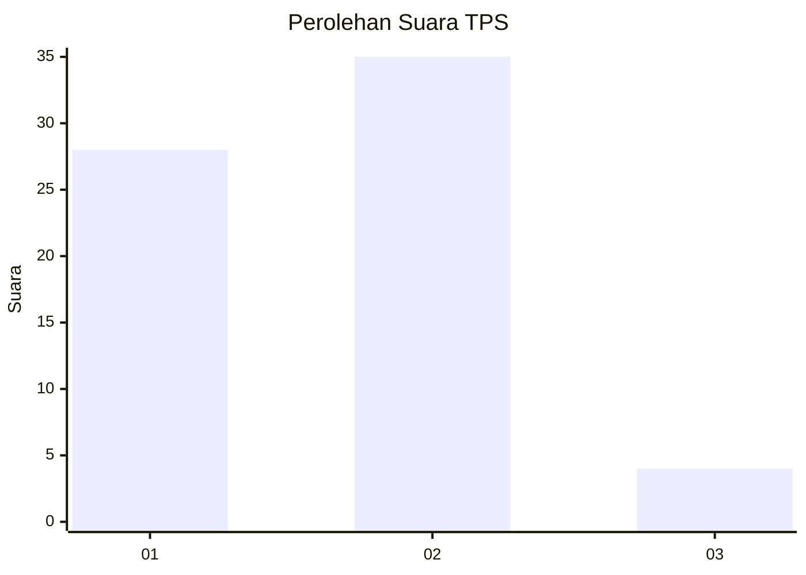
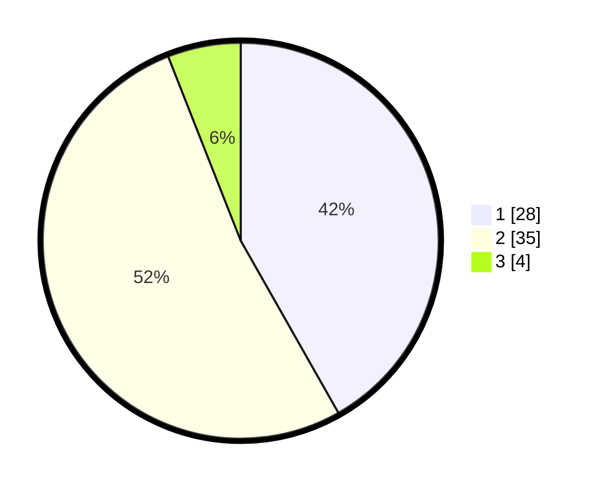

# Hasil

## Grafik

## Tabel

| No. | Nama Paslon    | Suara | Suara (raw) | Persentase |
|:--- |:-------------- | -----:| -----------:| ----------:|
| 1   | ANIES MUHAIMIN | 28    | [28][p-1]   | 41,79      |
| 2   | PRABOWO GIBRAN | 35    | [35][p-2]   | 52,24      |
| 3   | GANJAR MAHFUD  | 4     | [4][p-3]    | 5,97       |

[p-1]: https://github.com/gigit-pemilu/pemilu-2024/blob/main/pilpres/hitung-suara/sub/12-sumatera-utara/sub/05-langkat/sub/14-babalan/sub/2003-teluk-meku/sub/009-tps/sub/paslon-1.txt
[p-2]: https://github.com/gigit-pemilu/pemilu-2024/blob/main/pilpres/hitung-suara/sub/12-sumatera-utara/sub/05-langkat/sub/14-babalan/sub/2003-teluk-meku/sub/009-tps/sub/paslon-2.txt
[p-3]: https://github.com/gigit-pemilu/pemilu-2024/blob/main/pilpres/hitung-suara/sub/12-sumatera-utara/sub/05-langkat/sub/14-babalan/sub/2003-teluk-meku/sub/009-tps/sub/paslon-3.txt

## Foto C Plano

https://sirekap-obj-formc.kpu.go.id/aa8a/pemilu/ppwp/12/05/14/20/03/1205142003009-20240223-163352--c8109521-0df4-41fa-ab5c-5016a618cdff.jpg

https://sirekap-obj-formc.kpu.go.id/aa8a/pemilu/ppwp/12/05/14/20/03/1205142003009-20240223-163520--00cfd76e-94e7-4c38-9f0f-49f835624b6f.jpg

https://sirekap-obj-formc.kpu.go.id/aa8a/pemilu/ppwp/12/05/14/20/03/1205142003009-20240223-164702--784ca773-ed97-49c5-9dd0-dccf8e82741f.jpg

## Metadata

| Key        | Value               |
| ---------- | ------------------- |
| Time Stamp | 2024-02-24 22:31:28 |

