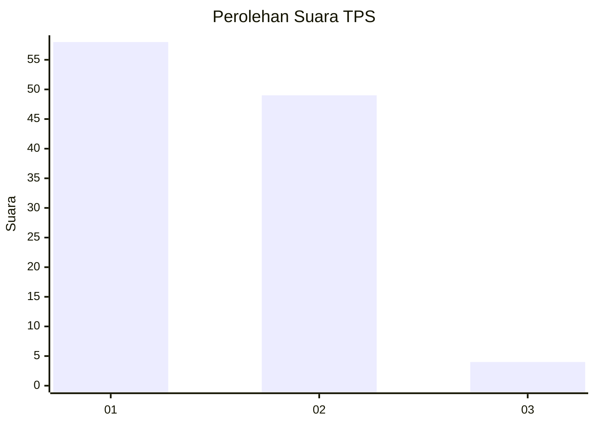
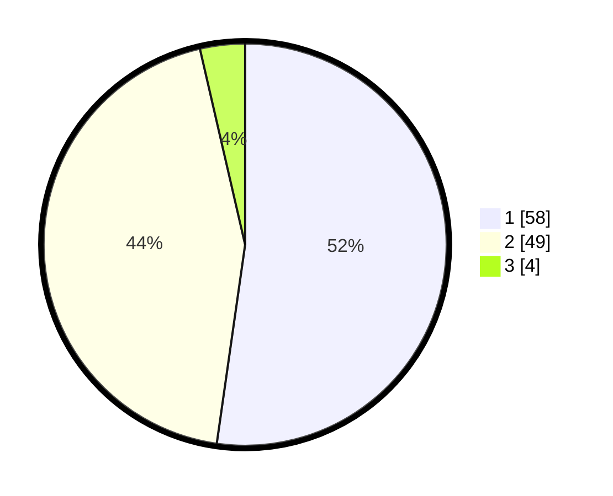

# Hasil

## Grafik

## Tabel

| No. | Nama Paslon    | Suara | Suara (raw) | Persentase |
|:--- |:-------------- | -----:| -----------:| ----------:|
| 1   | ANIES MUHAIMIN | 58    | [58][p-1]   | 52,25      |
| 2   | PRABOWO GIBRAN | 49    | [49][p-2]   | 44,14      |
| 3   | GANJAR MAHFUD  | 4     | [4][p-3]    | 3,60       |

[p-1]: https://github.com/gigit-pemilu/pemilu-2024-12-sumatera-utara/blob/main/pilpres/hitung-suara/sub/12-sumatera-utara/sub/05-langkat/sub/14-babalan/sub/2004-pelawi-selatan/sub/003-tps/sub/paslon-1.txt
[p-2]: https://github.com/gigit-pemilu/pemilu-2024-12-sumatera-utara/blob/main/pilpres/hitung-suara/sub/12-sumatera-utara/sub/05-langkat/sub/14-babalan/sub/2004-pelawi-selatan/sub/003-tps/sub/paslon-2.txt
[p-3]: https://github.com/gigit-pemilu/pemilu-2024-12-sumatera-utara/blob/main/pilpres/hitung-suara/sub/12-sumatera-utara/sub/05-langkat/sub/14-babalan/sub/2004-pelawi-selatan/sub/003-tps/sub/paslon-3.txt

## Foto C Plano

https://sirekap-obj-formc.kpu.go.id/29a9/pemilu/ppwp/12/05/14/20/04/1205142004003-20240215-102201--03e27782-9911-4b5d-a7d9-b193aebdd476.jpg

https://sirekap-obj-formc.kpu.go.id/29a9/pemilu/ppwp/12/05/14/20/04/1205142004003-20240215-102314--1bbb1338-5f98-42c2-9a25-7d905dc3495d.jpg

https://sirekap-obj-formc.kpu.go.id/29a9/pemilu/ppwp/12/05/14/20/04/1205142004003-20240215-102409--1e17cb9c-094a-4d7c-8e71-e8ebe9635170.jpg

## Metadata

| Key        | Value               |
| ---------- | ------------------- |
| Time Stamp | 2024-02-15 17:30:25 |

