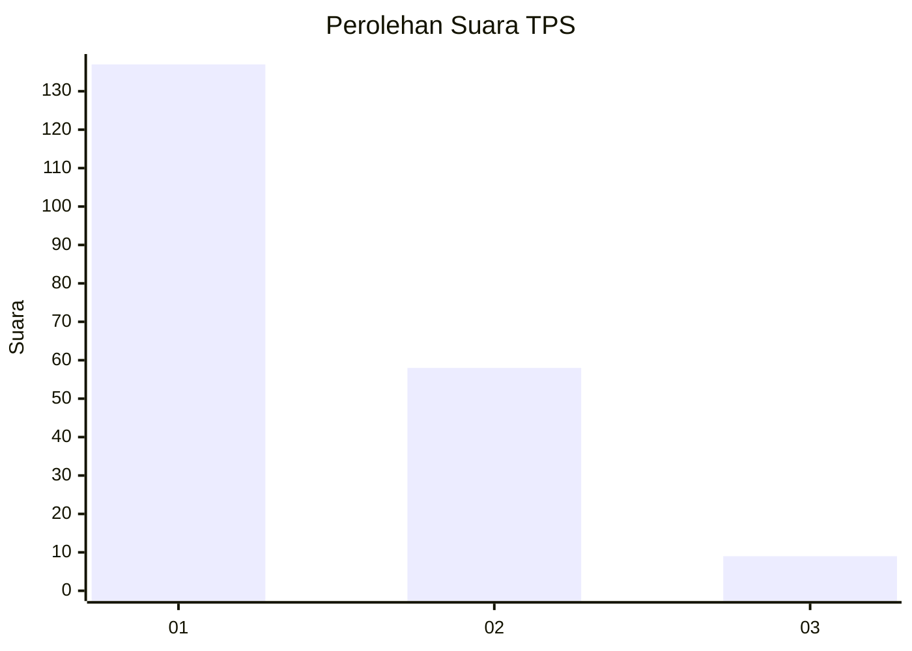
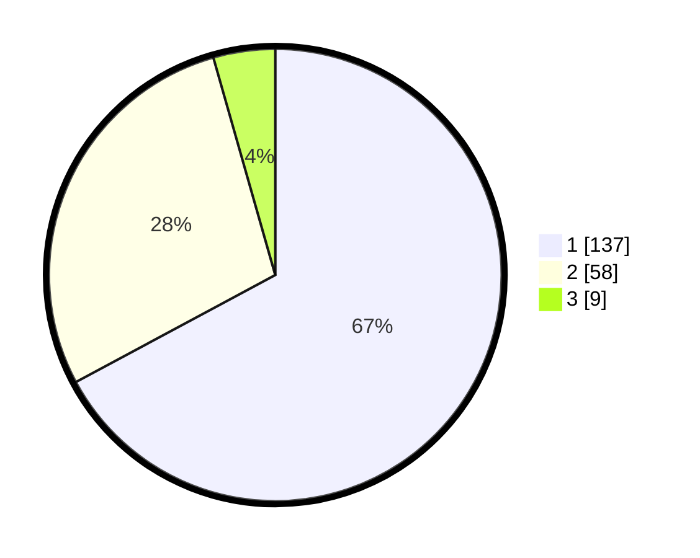

# Hasil

## Grafik

## Tabel

| No. | Nama Paslon    | Suara | Suara (raw) | Persentase |
|:--- |:-------------- | -----:| -----------:| ----------:|
| 1   | ANIES MUHAIMIN | 137   | [137][p-1]  | 67,16      |
| 2   | PRABOWO GIBRAN | 58    | [58][p-2]   | 28,43      |
| 3   | GANJAR MAHFUD  | 9     | [9][p-3]    | 4,41       |

[p-1]: https://github.com/gigit-pemilu/pemilu-2024-12-sumatera-utara/blob/main/pilpres/hitung-suara/sub/12-sumatera-utara/sub/05-langkat/sub/17-sei-lepan/sub/1002-alur-dua/sub/013-tps/sub/paslon-1.txt
[p-2]: https://github.com/gigit-pemilu/pemilu-2024-12-sumatera-utara/blob/main/pilpres/hitung-suara/sub/12-sumatera-utara/sub/05-langkat/sub/17-sei-lepan/sub/1002-alur-dua/sub/013-tps/sub/paslon-2.txt
[p-3]: https://github.com/gigit-pemilu/pemilu-2024-12-sumatera-utara/blob/main/pilpres/hitung-suara/sub/12-sumatera-utara/sub/05-langkat/sub/17-sei-lepan/sub/1002-alur-dua/sub/013-tps/sub/paslon-3.txt

## Foto C Plano

https://sirekap-obj-formc.kpu.go.id/0578/pemilu/ppwp/12/05/17/10/02/1205171002013-20240215-040054--be487232-f126-453f-95ca-1f14be81e12b.jpg

https://sirekap-obj-formc.kpu.go.id/0578/pemilu/ppwp/12/05/17/10/02/1205171002013-20240215-040104--8b05ed6b-e4f6-44e7-b8bf-c496343cf57c.jpg

https://sirekap-obj-formc.kpu.go.id/0578/pemilu/ppwp/12/05/17/10/02/1205171002013-20240215-040109--db292076-6484-4779-8aa6-8994d5e077d9.jpg

## Metadata

| Key        | Value               |
| ---------- | ------------------- |
| Time Stamp | 2024-02-15 15:00:29 |

