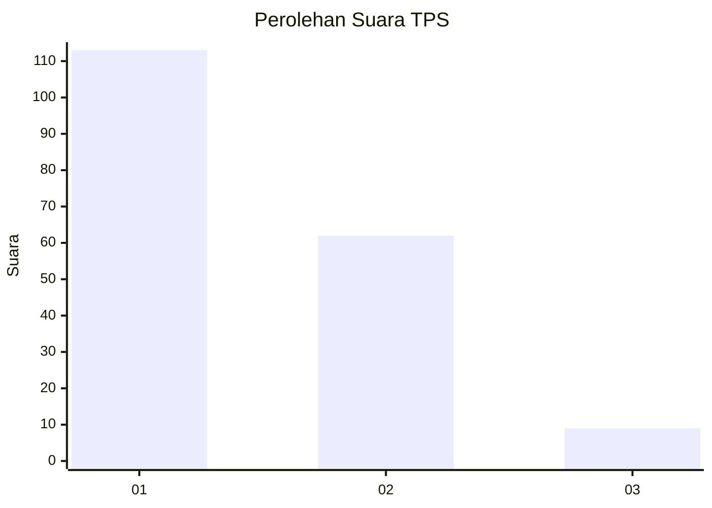
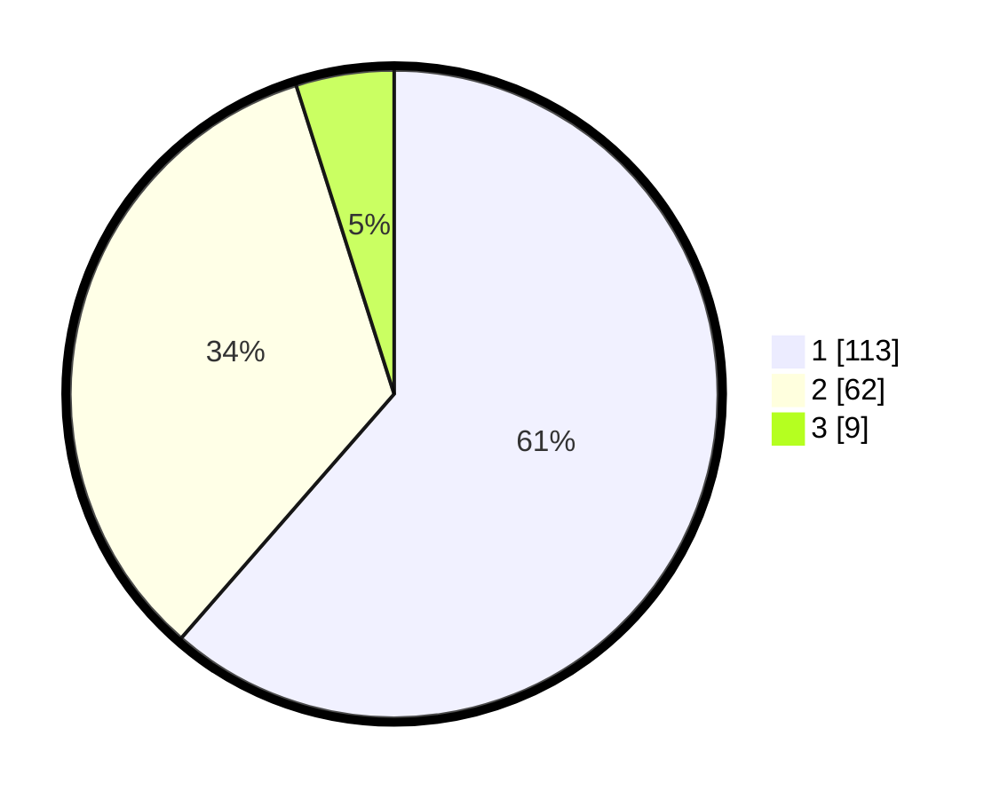

# Hasil

## Grafik

## Tabel

| No. | Nama Paslon    | Suara | Suara (raw) | Persentase |
|:--- |:-------------- | -----:| -----------:| ----------:|
| 1   | ANIES MUHAIMIN | 113   | [113][p-1]  | 61,41      |
| 2   | PRABOWO GIBRAN | 62    | [62][p-2]   | 33,70      |
| 3   | GANJAR MAHFUD  | 9     | [9][p-3]    | 4,89       |

[p-1]: https://github.com/gigit-pemilu/pemilu-2024/blob/main/pilpres/hitung-suara/sub/12-sumatera-utara/sub/05-langkat/sub/17-sei-lepan/sub/1008-alur-dua-baru/sub/002-tps/sub/paslon-1.txt
[p-2]: https://github.com/gigit-pemilu/pemilu-2024/blob/main/pilpres/hitung-suara/sub/12-sumatera-utara/sub/05-langkat/sub/17-sei-lepan/sub/1008-alur-dua-baru/sub/002-tps/sub/paslon-2.txt
[p-3]: https://github.com/gigit-pemilu/pemilu-2024/blob/main/pilpres/hitung-suara/sub/12-sumatera-utara/sub/05-langkat/sub/17-sei-lepan/sub/1008-alur-dua-baru/sub/002-tps/sub/paslon-3.txt

## Foto C Plano

https://sirekap-obj-formc.kpu.go.id/3005/pemilu/ppwp/12/05/17/10/08/1205171008002-20240215-015747--cbeb59d5-61a8-421b-8566-9deb33c70c40.jpg

https://sirekap-obj-formc.kpu.go.id/3005/pemilu/ppwp/12/05/17/10/08/1205171008002-20240215-015859--b0e9fec5-4cac-4875-b727-bb6347b59917.jpg

https://sirekap-obj-formc.kpu.go.id/3005/pemilu/ppwp/12/05/17/10/08/1205171008002-20240215-020017--fa17a57c-e0cf-4a6e-b97d-15d545d060a2.jpg

## Metadata

| Key        | Value               |
| ---------- | ------------------- |
| Time Stamp | 2024-02-16 21:01:00 |

