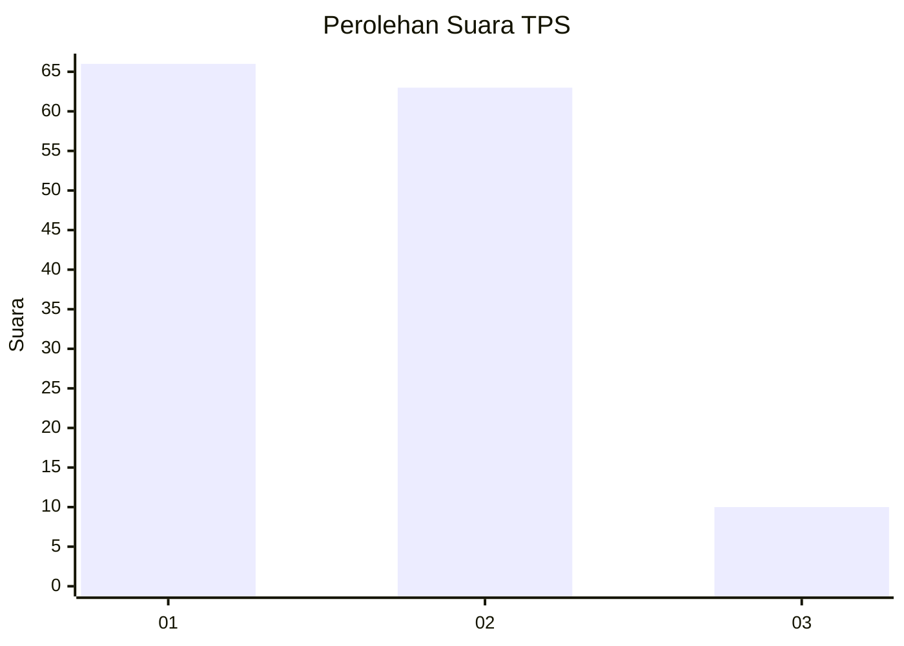
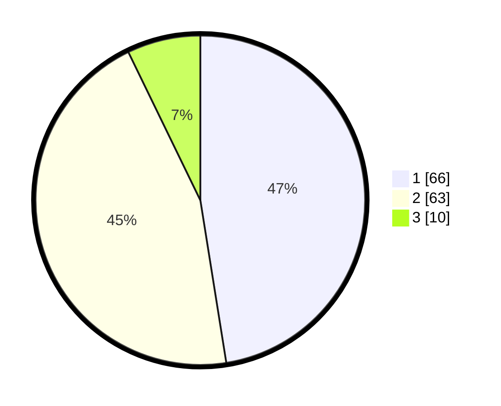

# Hasil

## Grafik

## Tabel

| No. | Nama Paslon    | Suara | Suara (raw) | Persentase |
|:--- |:-------------- | -----:| -----------:| ----------:|
| 1   | ANIES MUHAIMIN | 66    | [66][p-1]   | 47,48      |
| 2   | PRABOWO GIBRAN | 63    | [63][p-2]   | 45,32      |
| 3   | GANJAR MAHFUD  | 10    | [10][p-3]   | 7,19       |

[p-1]: https://github.com/gigit-pemilu/pemilu-2024/blob/main/pilpres/hitung-suara/sub/12-sumatera-utara/sub/05-langkat/sub/17-sei-lepan/sub/1010-sei-bilah-timur/sub/010-tps/sub/paslon-1.txt
[p-2]: https://github.com/gigit-pemilu/pemilu-2024/blob/main/pilpres/hitung-suara/sub/12-sumatera-utara/sub/05-langkat/sub/17-sei-lepan/sub/1010-sei-bilah-timur/sub/010-tps/sub/paslon-2.txt
[p-3]: https://github.com/gigit-pemilu/pemilu-2024/blob/main/pilpres/hitung-suara/sub/12-sumatera-utara/sub/05-langkat/sub/17-sei-lepan/sub/1010-sei-bilah-timur/sub/010-tps/sub/paslon-3.txt

## Foto C Plano

https://sirekap-obj-formc.kpu.go.id/7552/pemilu/ppwp/12/05/17/10/10/1205171010010-20240215-220351--b4330902-1d1f-4c1a-a8e7-8e62ff353404.jpg

https://sirekap-obj-formc.kpu.go.id/7552/pemilu/ppwp/12/05/17/10/10/1205171010010-20240215-220420--1c23d727-f8f4-45b0-855c-074d4218486b.jpg

https://sirekap-obj-formc.kpu.go.id/7552/pemilu/ppwp/12/05/17/10/10/1205171010010-20240215-220447--c4f841ea-607c-4ce2-9d75-627e08deefb3.jpg

## Metadata

| Key        | Value               |
| ---------- | ------------------- |
| Time Stamp | 2024-02-15 22:30:27 |

