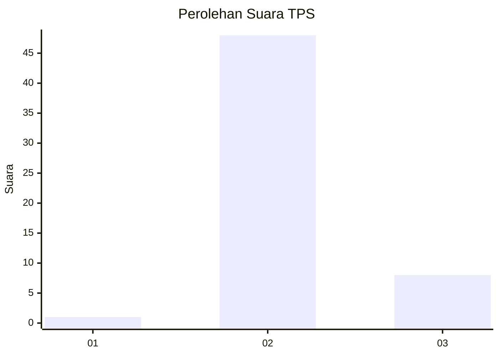
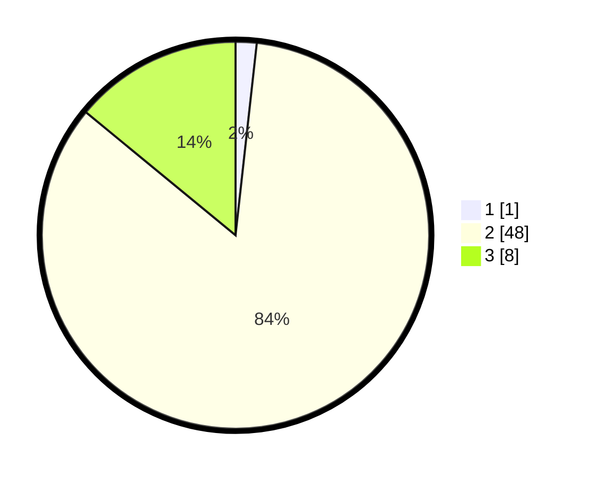

# Hasil

## Grafik

## Tabel

| No. | Nama Paslon    | Suara | Suara (raw) | Persentase |
|:--- |:-------------- | -----:| -----------:| ----------:|
| 1   | ANIES MUHAIMIN | 1     | [1][p-1]    | 1,75       |
| 2   | PRABOWO GIBRAN | 48    | [48][p-2]   | 84,21      |
| 3   | GANJAR MAHFUD  | 8     | [8][p-3]    | 14,04      |

[p-1]: https://github.com/gigit-pemilu/pemilu-2024/blob/main/pilpres/hitung-suara/sub/12-sumatera-utara/sub/05-langkat/sub/17-sei-lepan/sub/2011-mekar-makmur/sub/012-tps/sub/paslon-1.txt
[p-2]: https://github.com/gigit-pemilu/pemilu-2024/blob/main/pilpres/hitung-suara/sub/12-sumatera-utara/sub/05-langkat/sub/17-sei-lepan/sub/2011-mekar-makmur/sub/012-tps/sub/paslon-2.txt
[p-3]: https://github.com/gigit-pemilu/pemilu-2024/blob/main/pilpres/hitung-suara/sub/12-sumatera-utara/sub/05-langkat/sub/17-sei-lepan/sub/2011-mekar-makmur/sub/012-tps/sub/paslon-3.txt

## Foto C Plano

https://sirekap-obj-formc.kpu.go.id/a61c/pemilu/ppwp/12/05/17/20/11/1205172011012-20240215-113357--e1b8d9d1-d2a2-4fb0-a2cb-6b2cce1c013a.jpg

https://sirekap-obj-formc.kpu.go.id/a61c/pemilu/ppwp/12/05/17/20/11/1205172011012-20240215-113649--d05ca29d-b0f1-49cd-85db-e2a42ed871eb.jpg

https://sirekap-obj-formc.kpu.go.id/a61c/pemilu/ppwp/12/05/17/20/11/1205172011012-20240215-120615--fce54508-5d5a-4189-93f5-637747f5d55d.jpg

## Metadata

| Key        | Value               |
| ---------- | ------------------- |
| Time Stamp | 2024-02-16 01:00:27 |

