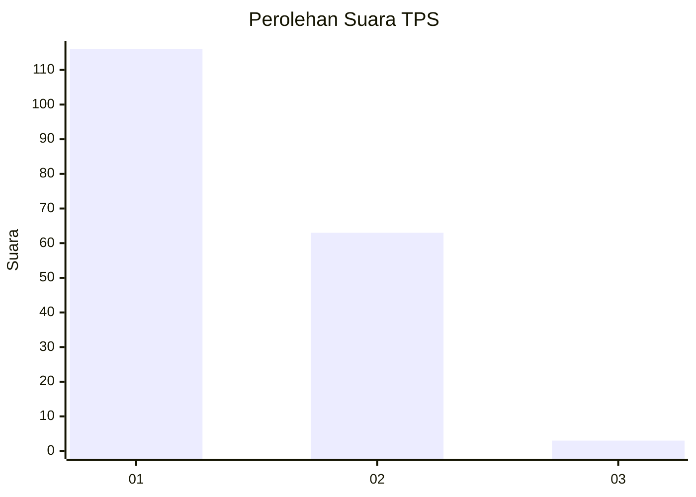
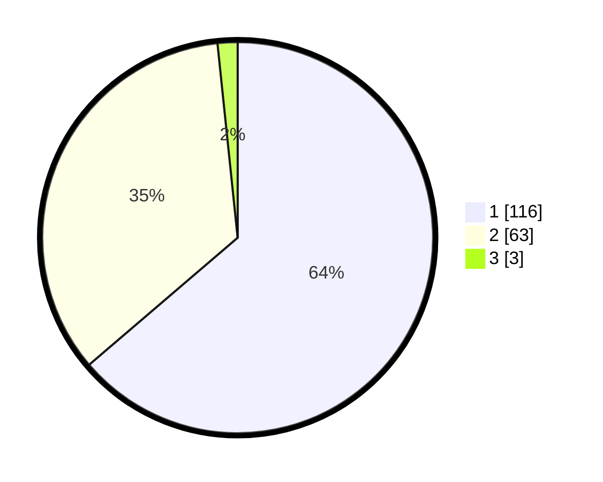

# Hasil

## Grafik

## Tabel

| No. | Nama Paslon    | Suara | Suara (raw) | Persentase |
|:--- |:-------------- | -----:| -----------:| ----------:|
| 1   | ANIES MUHAIMIN | 116   | [116][p-1]  | 63,74      |
| 2   | PRABOWO GIBRAN | 63    | [63][p-2]   | 34,62      |
| 3   | GANJAR MAHFUD  | 3     | [3][p-3]    | 1,65       |

[p-1]: https://github.com/gigit-pemilu/pemilu-2024-12-sumatera-utara/blob/main/pilpres/hitung-suara/sub/12-sumatera-utara/sub/05-langkat/sub/18-berandan-barat/sub/2006-perlis/sub/006-tps/sub/paslon-1.txt
[p-2]: https://github.com/gigit-pemilu/pemilu-2024-12-sumatera-utara/blob/main/pilpres/hitung-suara/sub/12-sumatera-utara/sub/05-langkat/sub/18-berandan-barat/sub/2006-perlis/sub/006-tps/sub/paslon-2.txt
[p-3]: https://github.com/gigit-pemilu/pemilu-2024-12-sumatera-utara/blob/main/pilpres/hitung-suara/sub/12-sumatera-utara/sub/05-langkat/sub/18-berandan-barat/sub/2006-perlis/sub/006-tps/sub/paslon-3.txt

## Foto C Plano

https://sirekap-obj-formc.kpu.go.id/787a/pemilu/ppwp/12/05/18/20/06/1205182006006-20240223-165818--501c7706-f3cb-4a88-91f1-417fdcbac687.jpg

https://sirekap-obj-formc.kpu.go.id/787a/pemilu/ppwp/12/05/18/20/06/1205182006006-20240223-170221--e18daa2e-7a92-479a-a010-110404750d83.jpg

https://sirekap-obj-formc.kpu.go.id/787a/pemilu/ppwp/12/05/18/20/06/1205182006006-20240223-163717--bdc7e5b9-c7f1-40da-84ca-23ace4916885.jpg

## Metadata

| Key        | Value               |
| ---------- | ------------------- |
| Time Stamp | 2024-02-24 22:31:28 |

