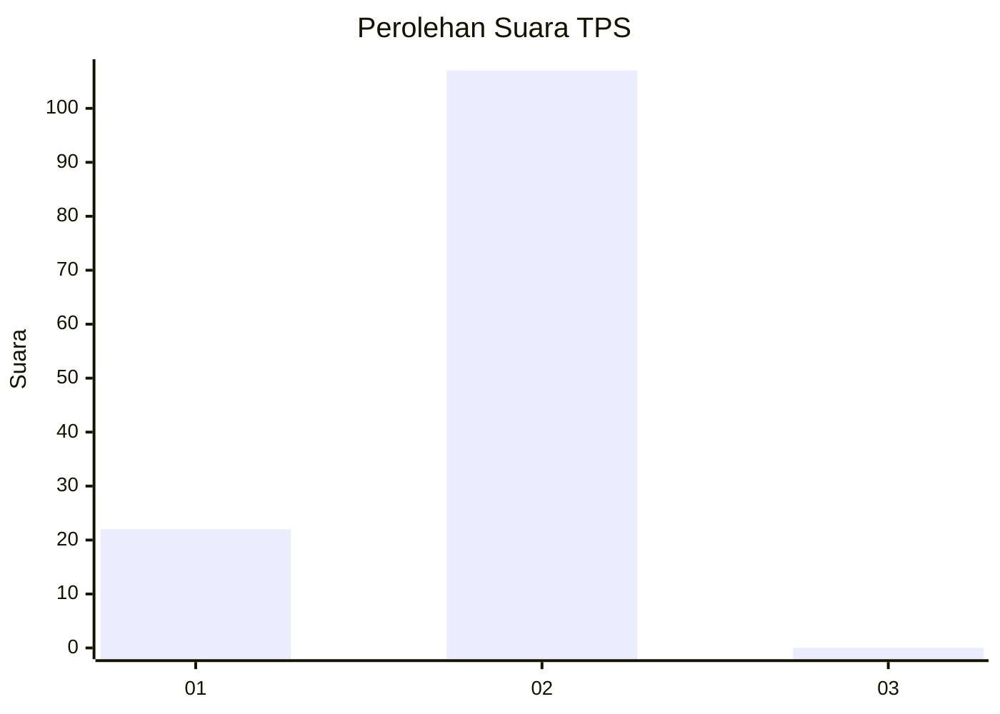
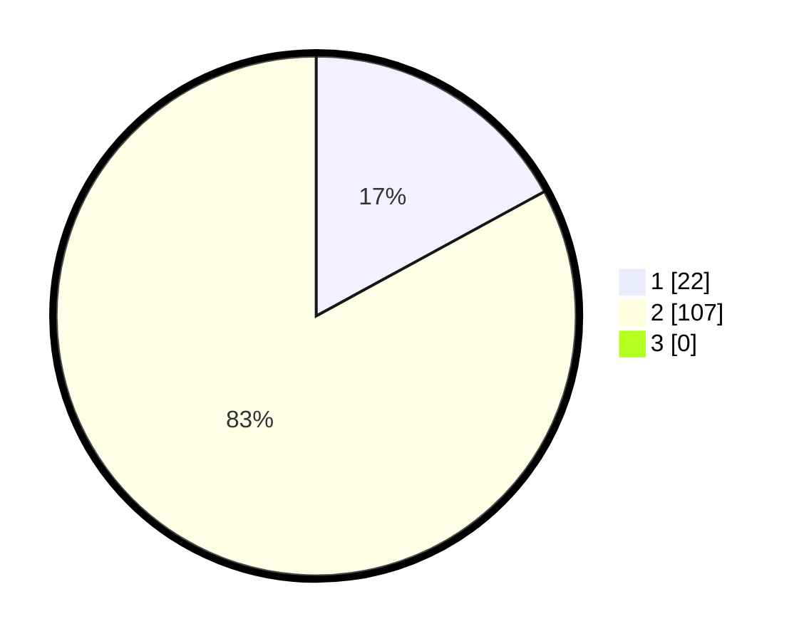

# Hasil

## Grafik

## Tabel

| No. | Nama Paslon    | Suara | Suara (raw) | Persentase |
|:--- |:-------------- | -----:| -----------:| ----------:|
| 1   | ANIES MUHAIMIN | 22    | [22][p-1]   | 17,05      |
| 2   | PRABOWO GIBRAN | 107   | [107][p-2]  | 82,95      |
| 3   | GANJAR MAHFUD  | 0     | [0][p-3]    | 0,00       |

[p-1]: https://github.com/gigit-pemilu/pemilu-2024/blob/main/pilpres/hitung-suara/sub/12-sumatera-utara/sub/05-langkat/sub/22-kutambaru/sub/2001-namotogan/sub/004-tps/sub/paslon-1.txt
[p-2]: https://github.com/gigit-pemilu/pemilu-2024/blob/main/pilpres/hitung-suara/sub/12-sumatera-utara/sub/05-langkat/sub/22-kutambaru/sub/2001-namotogan/sub/004-tps/sub/paslon-2.txt
[p-3]: https://github.com/gigit-pemilu/pemilu-2024/blob/main/pilpres/hitung-suara/sub/12-sumatera-utara/sub/05-langkat/sub/22-kutambaru/sub/2001-namotogan/sub/004-tps/sub/paslon-3.txt

## Foto C Plano

https://sirekap-obj-formc.kpu.go.id/7fc4/pemilu/ppwp/12/05/22/20/01/1205222001004-20240214-233238--5332cc84-1bdd-47c6-bbf1-b450e6a72eac.jpg

https://sirekap-obj-formc.kpu.go.id/7fc4/pemilu/ppwp/12/05/22/20/01/1205222001004-20240214-141245--e31dc56f-633c-40c6-91da-24b87ab3b350.jpg

https://sirekap-obj-formc.kpu.go.id/7fc4/pemilu/ppwp/12/05/22/20/01/1205222001004-20240214-141417--f144784d-12e7-4835-bbba-eb9369cd74c7.jpg

## Metadata

| Key        | Value               |
| ---------- | ------------------- |
| Time Stamp | 2024-02-15 00:41:44 |

