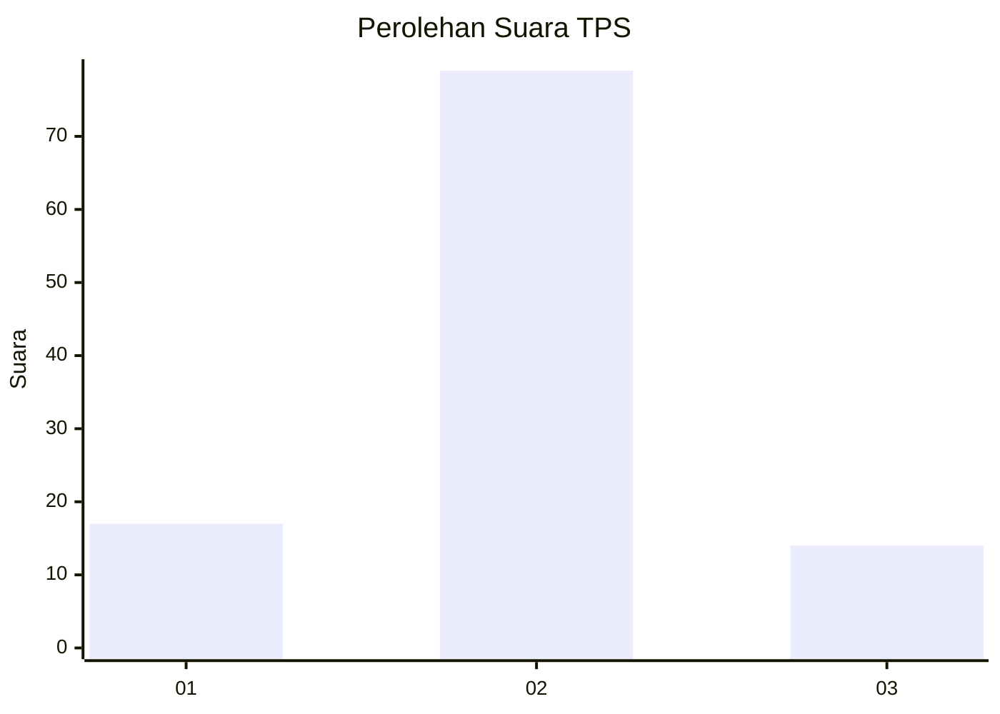
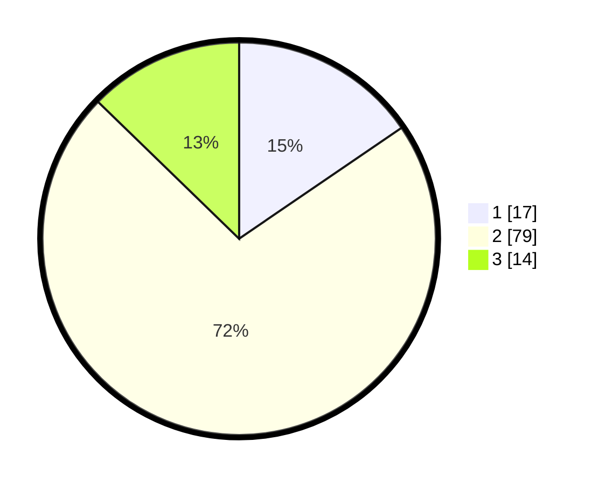

# Hasil

## Grafik

## Tabel

| No. | Nama Paslon    | Suara | Suara (raw) | Persentase |
|:--- |:-------------- | -----:| -----------:| ----------:|
| 1   | ANIES MUHAIMIN | 17    | [17][p-1]   | 15,45      |
| 2   | PRABOWO GIBRAN | 79    | [79][p-2]   | 71,82      |
| 3   | GANJAR MAHFUD  | 14    | [14][p-3]   | 12,73      |

[p-1]: https://github.com/gigit-pemilu/pemilu-2024/blob/main/pilpres/hitung-suara/sub/12-sumatera-utara/sub/05-langkat/sub/22-kutambaru/sub/2008-kutambaru/sub/010-tps/sub/paslon-1.txt
[p-2]: https://github.com/gigit-pemilu/pemilu-2024/blob/main/pilpres/hitung-suara/sub/12-sumatera-utara/sub/05-langkat/sub/22-kutambaru/sub/2008-kutambaru/sub/010-tps/sub/paslon-2.txt
[p-3]: https://github.com/gigit-pemilu/pemilu-2024/blob/main/pilpres/hitung-suara/sub/12-sumatera-utara/sub/05-langkat/sub/22-kutambaru/sub/2008-kutambaru/sub/010-tps/sub/paslon-3.txt

## Foto C Plano

https://sirekap-obj-formc.kpu.go.id/7964/pemilu/ppwp/12/05/22/20/08/1205222008010-20240223-113917--7470bb80-34c0-4eff-8b00-ad01f06aac1d.jpg

https://sirekap-obj-formc.kpu.go.id/7964/pemilu/ppwp/12/05/22/20/08/1205222008010-20240214-213939--466f97b1-fd0b-43f2-b540-5960903e4099.jpg

https://sirekap-obj-formc.kpu.go.id/7964/pemilu/ppwp/12/05/22/20/08/1205222008010-20240214-214126--48dbdfec-6447-4e8e-8e5f-b561928abdba.jpg

## Metadata

| Key        | Value               |
| ---------- | ------------------- |
| Time Stamp | 2024-02-24 22:31:28 |

