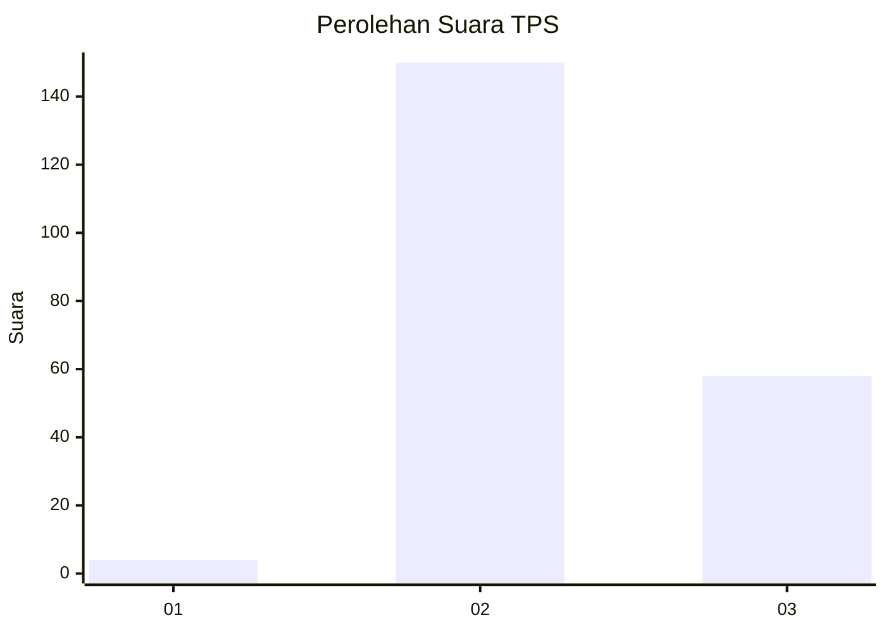
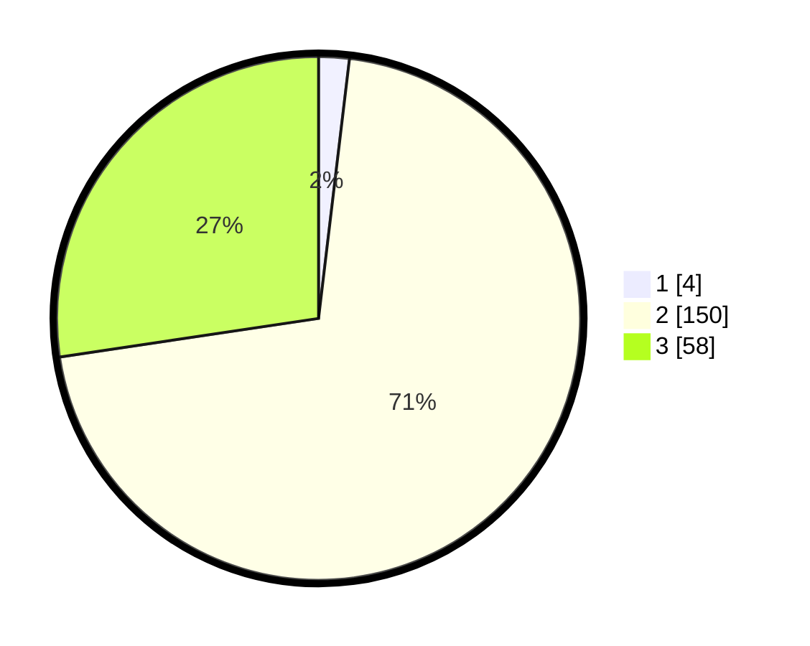

# Hasil

## Grafik

## Tabel

| No. | Nama Paslon    | Suara | Suara (raw) | Persentase |
|:--- |:-------------- | -----:| -----------:| ----------:|
| 1   | ANIES MUHAIMIN | 4     | [4][p-1]    | 1,89       |
| 2   | PRABOWO GIBRAN | 150   | [150][p-2]  | 70,75      |
| 3   | GANJAR MAHFUD  | 58    | [58][p-3]   | 27,36      |

[p-1]: https://github.com/gigit-pemilu/pemilu-2024/blob/main/pilpres/hitung-suara/sub/12-sumatera-utara/sub/06-karo/sub/01-kabanjahe/sub/1009-padang-mas/sub/012-tps/sub/paslon-1.txt
[p-2]: https://github.com/gigit-pemilu/pemilu-2024/blob/main/pilpres/hitung-suara/sub/12-sumatera-utara/sub/06-karo/sub/01-kabanjahe/sub/1009-padang-mas/sub/012-tps/sub/paslon-2.txt
[p-3]: https://github.com/gigit-pemilu/pemilu-2024/blob/main/pilpres/hitung-suara/sub/12-sumatera-utara/sub/06-karo/sub/01-kabanjahe/sub/1009-padang-mas/sub/012-tps/sub/paslon-3.txt

## Foto C Plano

https://sirekap-obj-formc.kpu.go.id/5363/pemilu/ppwp/12/06/01/10/09/1206011009012-20240215-000452--4c098dd9-9c1e-4470-9f93-d66462fb5623.jpg

https://sirekap-obj-formc.kpu.go.id/5363/pemilu/ppwp/12/06/01/10/09/1206011009012-20240215-000513--fb779b01-53f4-48cd-a8b5-3da7ff00b0d4.jpg

## Metadata

| Key        | Value               |
| ---------- | ------------------- |
| Time Stamp | 2024-02-15 15:00:29 |

