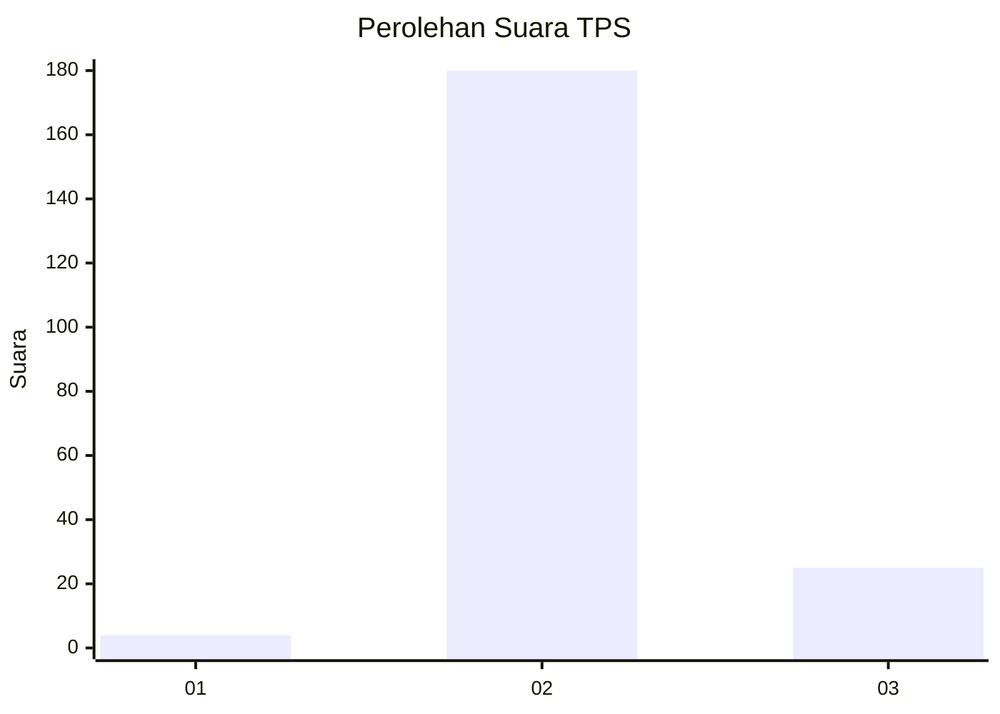
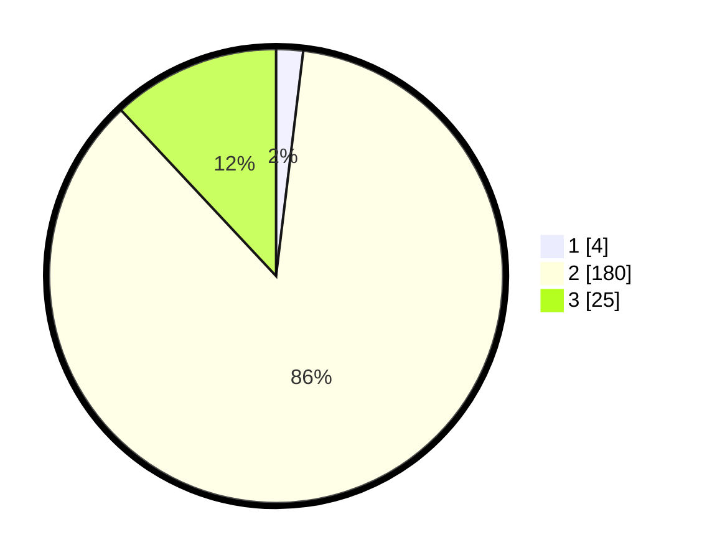

# Hasil

## Grafik

## Tabel

| No. | Nama Paslon    | Suara | Suara (raw) | Persentase |
|:--- |:-------------- | -----:| -----------:| ----------:|
| 1   | ANIES MUHAIMIN | 4     | [4][p-1]    | 1,91       |
| 2   | PRABOWO GIBRAN | 180   | [180][p-2]  | 86,12      |
| 3   | GANJAR MAHFUD  | 25    | [25][p-3]   | 11,96      |

[p-1]: https://github.com/gigit-pemilu/pemilu-2024-12-sumatera-utara/blob/main/pilpres/hitung-suara/sub/12-sumatera-utara/sub/06-karo/sub/01-kabanjahe/sub/1009-padang-mas/sub/013-tps/sub/paslon-1.txt
[p-2]: https://github.com/gigit-pemilu/pemilu-2024-12-sumatera-utara/blob/main/pilpres/hitung-suara/sub/12-sumatera-utara/sub/06-karo/sub/01-kabanjahe/sub/1009-padang-mas/sub/013-tps/sub/paslon-2.txt
[p-3]: https://github.com/gigit-pemilu/pemilu-2024-12-sumatera-utara/blob/main/pilpres/hitung-suara/sub/12-sumatera-utara/sub/06-karo/sub/01-kabanjahe/sub/1009-padang-mas/sub/013-tps/sub/paslon-3.txt

## Foto C Plano

https://sirekap-obj-formc.kpu.go.id/961c/pemilu/ppwp/12/06/01/10/09/1206011009013-20240214-224957--e0afc9c5-27f8-47e0-94d8-c941bc57be09.jpg

https://sirekap-obj-formc.kpu.go.id/961c/pemilu/ppwp/12/06/01/10/09/1206011009013-20240214-225035--240e060e-4328-4e51-9642-6214d2f6f638.jpg

https://sirekap-obj-formc.kpu.go.id/961c/pemilu/ppwp/12/06/01/10/09/1206011009013-20240214-225104--0a87dde2-9c19-4f00-aa69-deeac1815577.jpg

## Metadata

| Key        | Value               |
| ---------- | ------------------- |
| Time Stamp | 2024-02-15 15:00:29 |

