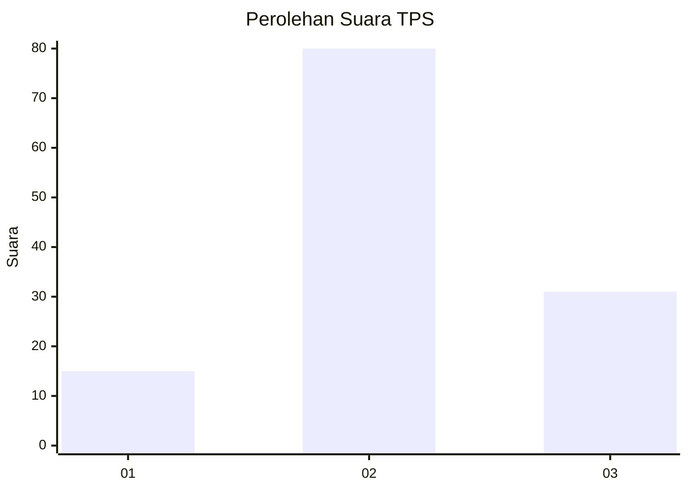
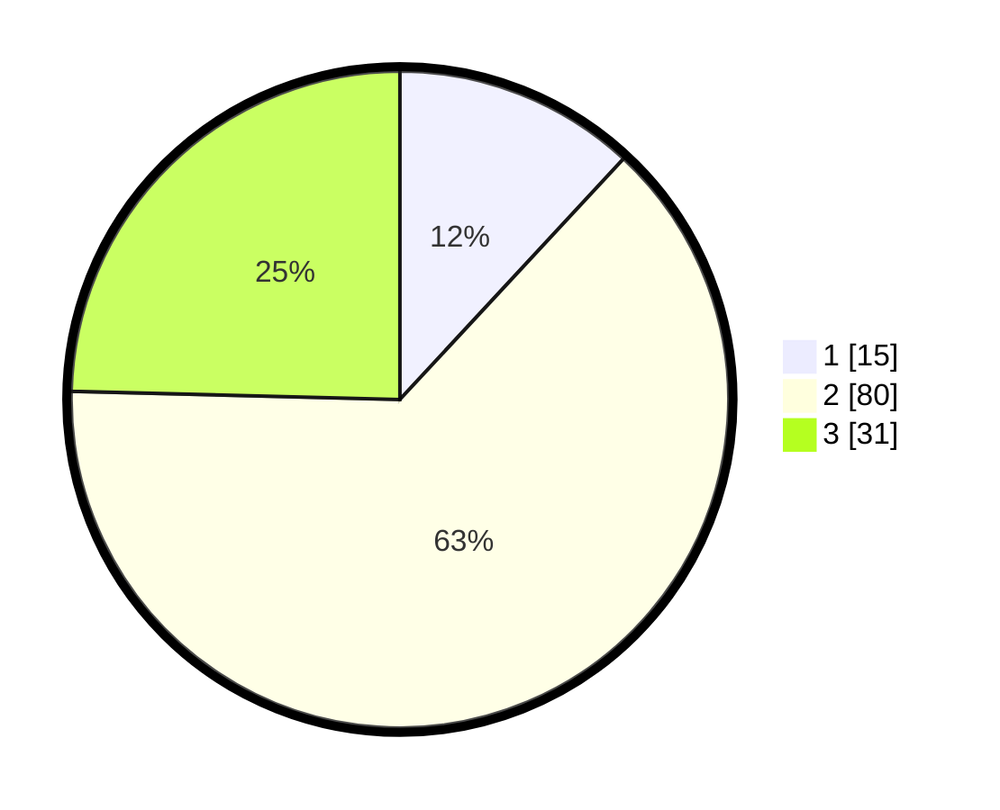

# Hasil

## Grafik

## Tabel

| No. | Nama Paslon    | Suara | Suara (raw) | Persentase |
|:--- |:-------------- | -----:| -----------:| ----------:|
| 1   | ANIES MUHAIMIN | 15    | [15][p-1]   | 11,90      |
| 2   | PRABOWO GIBRAN | 80    | [80][p-2]   | 63,49      |
| 3   | GANJAR MAHFUD  | 31    | [31][p-3]   | 24,60      |

[p-1]: https://github.com/gigit-pemilu/pemilu-2024/blob/main/pilpres/hitung-suara/sub/12-sumatera-utara/sub/06-karo/sub/01-kabanjahe/sub/1010-lau-cimba/sub/005-tps/sub/paslon-1.txt
[p-2]: https://github.com/gigit-pemilu/pemilu-2024/blob/main/pilpres/hitung-suara/sub/12-sumatera-utara/sub/06-karo/sub/01-kabanjahe/sub/1010-lau-cimba/sub/005-tps/sub/paslon-2.txt
[p-3]: https://github.com/gigit-pemilu/pemilu-2024/blob/main/pilpres/hitung-suara/sub/12-sumatera-utara/sub/06-karo/sub/01-kabanjahe/sub/1010-lau-cimba/sub/005-tps/sub/paslon-3.txt

## Foto C Plano

https://sirekap-obj-formc.kpu.go.id/4038/pemilu/ppwp/12/06/01/10/10/1206011010005-20240215-005531--161f611e-9b48-4c7a-bfa1-34a822c4c02e.jpg

https://sirekap-obj-formc.kpu.go.id/4038/pemilu/ppwp/12/06/01/10/10/1206011010005-20240215-005632--5d440b88-aa1c-4555-9b4a-4ab26227d46d.jpg

https://sirekap-obj-formc.kpu.go.id/4038/pemilu/ppwp/12/06/01/10/10/1206011010005-20240215-005804--7b86caf7-2f1a-4a3a-9825-f06a82bd81e3.jpg

## Metadata

| Key        | Value               |
| ---------- | ------------------- |
| Time Stamp | 2024-02-16 04:30:27 |

