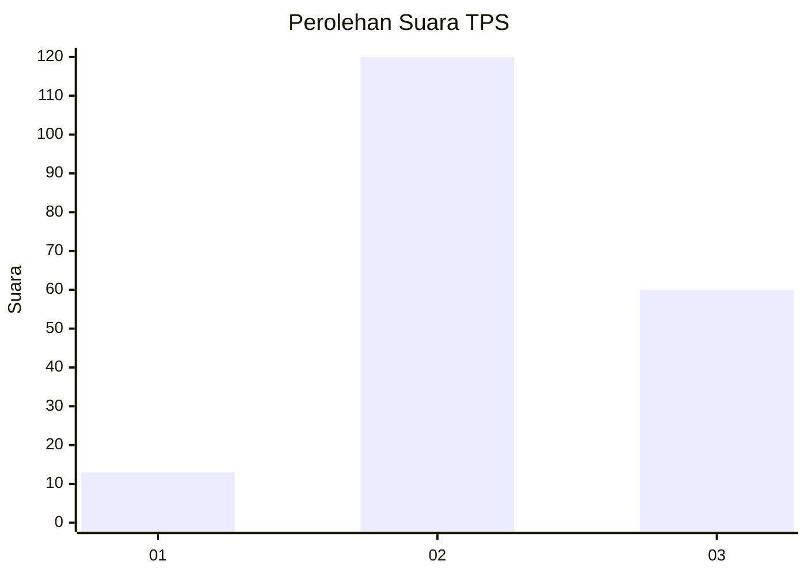
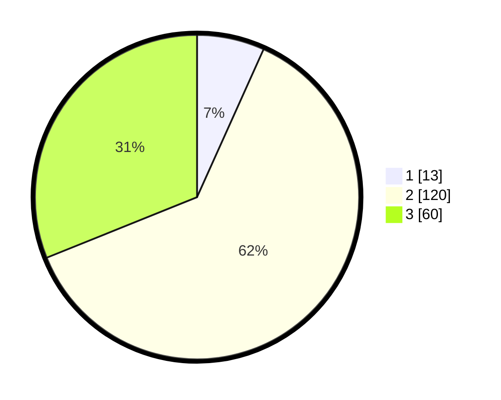

# Hasil

## Grafik

## Tabel

| No. | Nama Paslon    | Suara | Suara (raw) | Persentase |
|:--- |:-------------- | -----:| -----------:| ----------:|
| 1   | ANIES MUHAIMIN | 13    | [13][p-1]   | 6,74       |
| 2   | PRABOWO GIBRAN | 120   | [120][p-2]  | 62,18      |
| 3   | GANJAR MAHFUD  | 60    | [60][p-3]   | 31,09      |

[p-1]: https://github.com/gigit-pemilu/pemilu-2024/blob/main/pilpres/hitung-suara/sub/12-sumatera-utara/sub/06-karo/sub/01-kabanjahe/sub/2006-sumber-mufakat/sub/002-tps/sub/paslon-1.txt
[p-2]: https://github.com/gigit-pemilu/pemilu-2024/blob/main/pilpres/hitung-suara/sub/12-sumatera-utara/sub/06-karo/sub/01-kabanjahe/sub/2006-sumber-mufakat/sub/002-tps/sub/paslon-2.txt
[p-3]: https://github.com/gigit-pemilu/pemilu-2024/blob/main/pilpres/hitung-suara/sub/12-sumatera-utara/sub/06-karo/sub/01-kabanjahe/sub/2006-sumber-mufakat/sub/002-tps/sub/paslon-3.txt

## Foto C Plano

https://sirekap-obj-formc.kpu.go.id/1c57/pemilu/ppwp/12/06/01/20/06/1206012006002-20240214-223751--22aec961-6699-459d-932c-b5c5a26b6e9b.jpg

https://sirekap-obj-formc.kpu.go.id/1c57/pemilu/ppwp/12/06/01/20/06/1206012006002-20240214-223943--68f31bab-797e-481a-bb91-3cb871ebd5ff.jpg

https://sirekap-obj-formc.kpu.go.id/1c57/pemilu/ppwp/12/06/01/20/06/1206012006002-20240214-224201--dc90330a-2c42-4f36-bee3-384959cad406.jpg

## Metadata

| Key        | Value               |
| ---------- | ------------------- |
| Time Stamp | 2024-02-24 22:31:28 |

