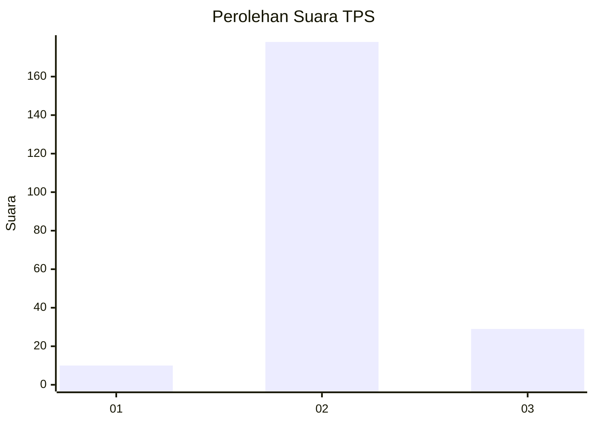
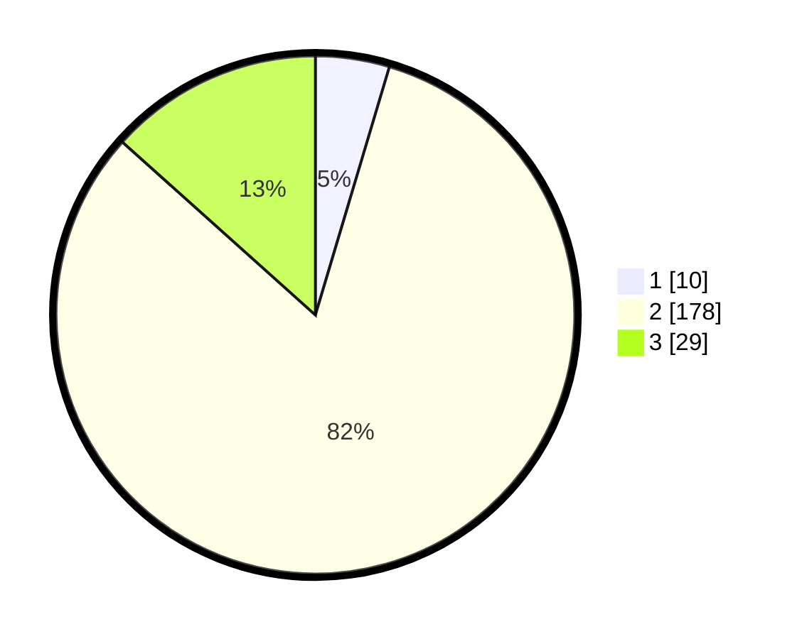

# Hasil

## Grafik

## Tabel

| No. | Nama Paslon    | Suara | Suara (raw) | Persentase |
|:--- |:-------------- | -----:| -----------:| ----------:|
| 1   | ANIES MUHAIMIN | 10    | [10][p-1]   | 4,61       |
| 2   | PRABOWO GIBRAN | 178   | [178][p-2]  | 82,03      |
| 3   | GANJAR MAHFUD  | 29    | [29][p-3]   | 13,36      |

[p-1]: https://github.com/gigit-pemilu/pemilu-2024/blob/main/pilpres/hitung-suara/sub/12-sumatera-utara/sub/06-karo/sub/01-kabanjahe/sub/2008-kacaribu/sub/003-tps/sub/paslon-1.txt
[p-2]: https://github.com/gigit-pemilu/pemilu-2024/blob/main/pilpres/hitung-suara/sub/12-sumatera-utara/sub/06-karo/sub/01-kabanjahe/sub/2008-kacaribu/sub/003-tps/sub/paslon-2.txt
[p-3]: https://github.com/gigit-pemilu/pemilu-2024/blob/main/pilpres/hitung-suara/sub/12-sumatera-utara/sub/06-karo/sub/01-kabanjahe/sub/2008-kacaribu/sub/003-tps/sub/paslon-3.txt

## Foto C Plano

https://sirekap-obj-formc.kpu.go.id/9a7f/pemilu/ppwp/12/06/01/20/08/1206012008003-20240215-022258--ea43369f-4cb5-45d1-89b1-21063bee3791.jpg

https://sirekap-obj-formc.kpu.go.id/9a7f/pemilu/ppwp/12/06/01/20/08/1206012008003-20240215-021108--79671e2f-67a5-406f-b5a8-1f130a023cf1.jpg

https://sirekap-obj-formc.kpu.go.id/9a7f/pemilu/ppwp/12/06/01/20/08/1206012008003-20240215-022648--553f9ec7-2f9c-48d6-9d18-97a34fa37686.jpg

## Metadata

| Key        | Value               |
| ---------- | ------------------- |
| Time Stamp | 2024-02-24 22:31:28 |

