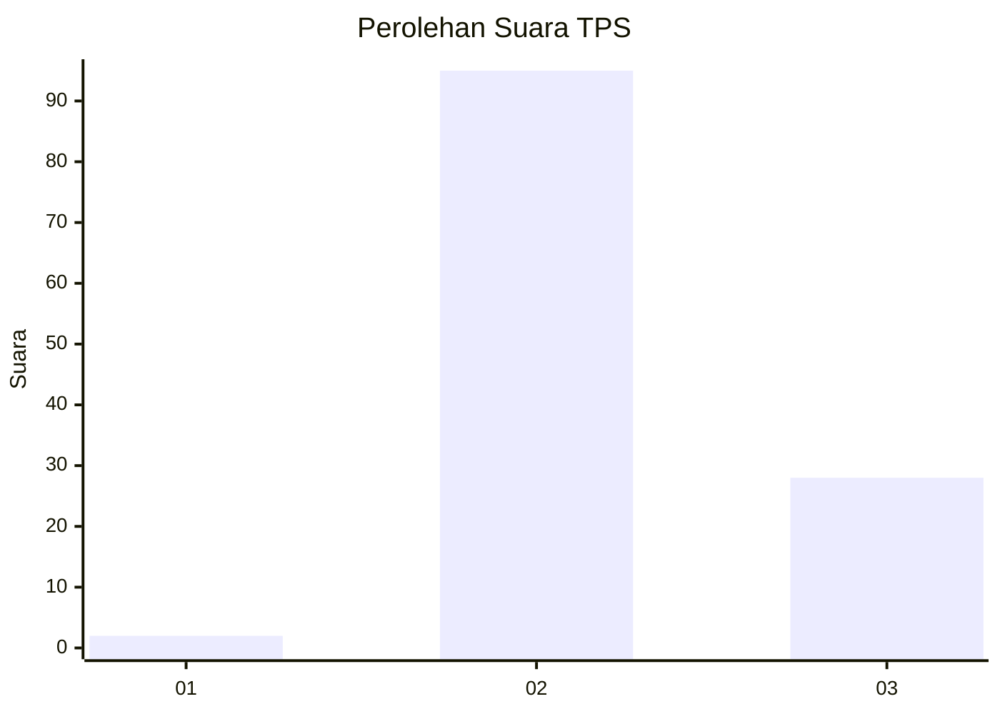
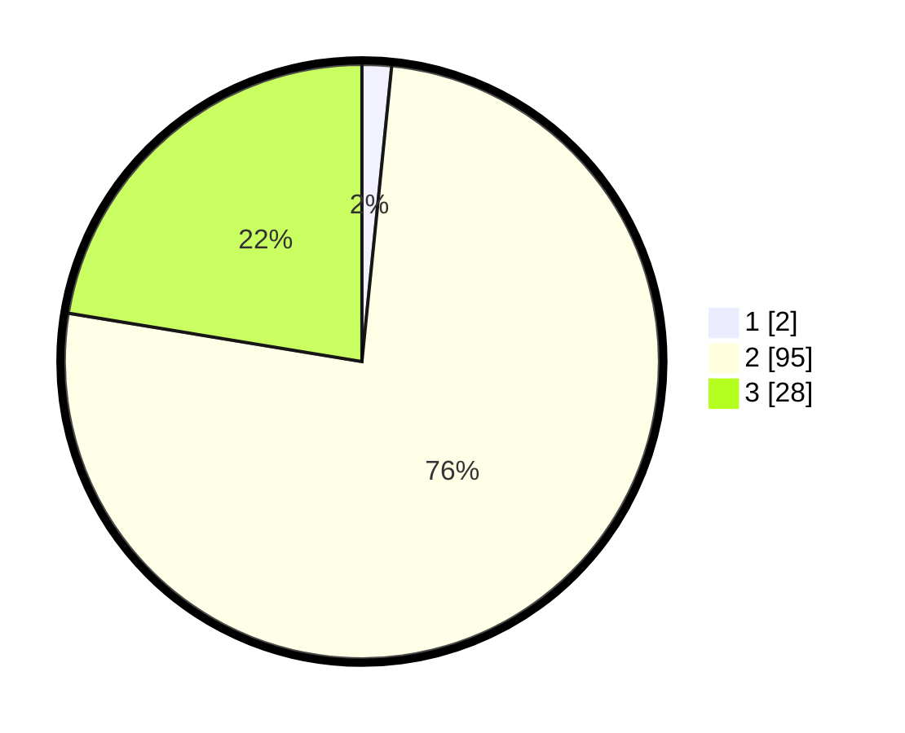

# Hasil

## Grafik

## Tabel

| No. | Nama Paslon    | Suara | Suara (raw) | Persentase |
|:--- |:-------------- | -----:| -----------:| ----------:|
| 1   | ANIES MUHAIMIN | 2     | [2][p-1]    | 1,60       |
| 2   | PRABOWO GIBRAN | 95    | [95][p-2]   | 76,00      |
| 3   | GANJAR MAHFUD  | 28    | [28][p-3]   | 22,40      |

[p-1]: https://github.com/gigit-pemilu/pemilu-2024/blob/main/pilpres/hitung-suara/sub/12-sumatera-utara/sub/06-karo/sub/02-berastagi/sub/1007-tambak-lau-mulgab-ii/sub/007-tps/sub/paslon-1.txt
[p-2]: https://github.com/gigit-pemilu/pemilu-2024/blob/main/pilpres/hitung-suara/sub/12-sumatera-utara/sub/06-karo/sub/02-berastagi/sub/1007-tambak-lau-mulgab-ii/sub/007-tps/sub/paslon-2.txt
[p-3]: https://github.com/gigit-pemilu/pemilu-2024/blob/main/pilpres/hitung-suara/sub/12-sumatera-utara/sub/06-karo/sub/02-berastagi/sub/1007-tambak-lau-mulgab-ii/sub/007-tps/sub/paslon-3.txt

## Foto C Plano

https://sirekap-obj-formc.kpu.go.id/5c65/pemilu/ppwp/12/06/02/10/07/1206021007007-20240216-182454--8fca5e82-c637-481d-acee-68b1c89b72a2.jpg

https://sirekap-obj-formc.kpu.go.id/5c65/pemilu/ppwp/12/06/02/10/07/1206021007007-20240216-182500--90b15bd9-e648-4f93-9b2b-697b652163f8.jpg

https://sirekap-obj-formc.kpu.go.id/5c65/pemilu/ppwp/12/06/02/10/07/1206021007007-20240216-182507--30aeba1e-850b-43aa-88f9-86137e53d8c7.jpg

## Metadata

| Key        | Value               |
| ---------- | ------------------- |
| Time Stamp | 2024-02-25 13:00:00 |

