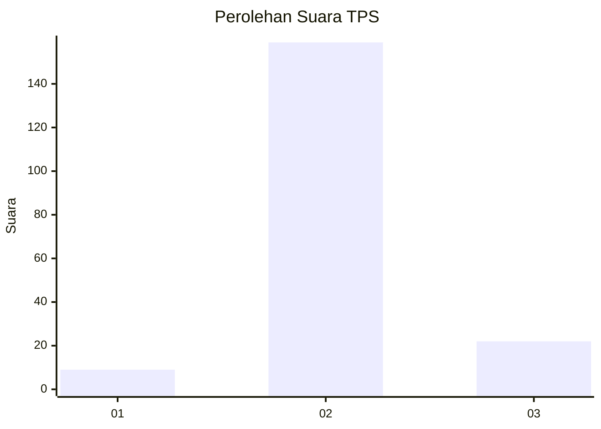
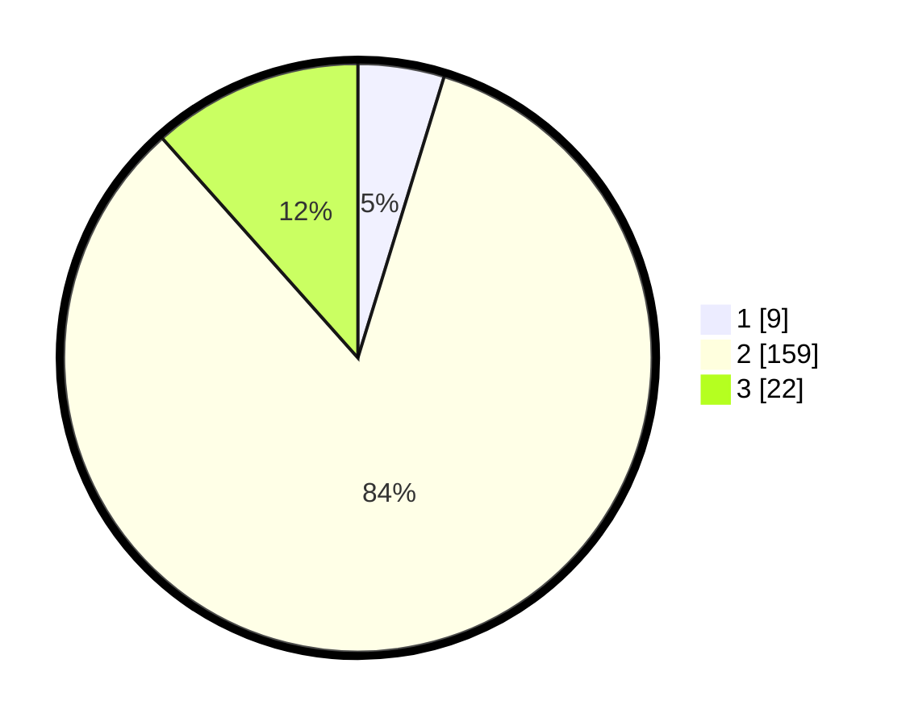

# Hasil

## Grafik

## Tabel

| No. | Nama Paslon    | Suara | Suara (raw) | Persentase |
|:--- |:-------------- | -----:| -----------:| ----------:|
| 1   | ANIES MUHAIMIN | 9     | [9][p-1]    | 4,74       |
| 2   | PRABOWO GIBRAN | 159   | [159][p-2]  | 83,68      |
| 3   | GANJAR MAHFUD  | 22    | [22][p-3]   | 11,58      |

[p-1]: https://github.com/gigit-pemilu/pemilu-2024/blob/main/pilpres/hitung-suara/sub/12-sumatera-utara/sub/06-karo/sub/02-berastagi/sub/2002-gurusinga/sub/005-tps/sub/paslon-1.txt
[p-2]: https://github.com/gigit-pemilu/pemilu-2024/blob/main/pilpres/hitung-suara/sub/12-sumatera-utara/sub/06-karo/sub/02-berastagi/sub/2002-gurusinga/sub/005-tps/sub/paslon-2.txt
[p-3]: https://github.com/gigit-pemilu/pemilu-2024/blob/main/pilpres/hitung-suara/sub/12-sumatera-utara/sub/06-karo/sub/02-berastagi/sub/2002-gurusinga/sub/005-tps/sub/paslon-3.txt

## Foto C Plano

https://sirekap-obj-formc.kpu.go.id/a962/pemilu/ppwp/12/06/02/20/02/1206022002005-20240215-000556--6e326a69-44dd-45e4-a533-ac7adf1397b3.jpg

https://sirekap-obj-formc.kpu.go.id/a962/pemilu/ppwp/12/06/02/20/02/1206022002005-20240215-013514--75426d83-f0ba-4448-bfd1-953104d16cbf.jpg

https://sirekap-obj-formc.kpu.go.id/a962/pemilu/ppwp/12/06/02/20/02/1206022002005-20240215-013806--d1e4e6df-0dcf-4ba6-9cea-a999dbba9947.jpg

## Metadata

| Key        | Value               |
| ---------- | ------------------- |
| Time Stamp | 2024-02-19 06:16:00 |

