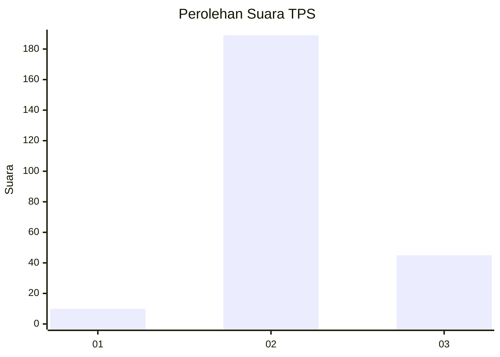

# Hasil

## Grafik

## Tabel

| No. | Nama Paslon    | Suara | Suara (raw) | Persentase |
|:--- |:-------------- | -----:| -----------:| ----------:|
| 1   | ANIES MUHAIMIN | 10    | [10][p-1]   | 4,10       |
| 2   | PRABOWO GIBRAN | 189   | [189][p-2]  | 77,46      |
| 3   | GANJAR MAHFUD  | 45    | [45][p-3]   | 18,44      |

[p-1]: https://github.com/gigit-pemilu/pemilu-2024/blob/main/pilpres/hitung-suara/sub/12-sumatera-utara/sub/06-karo/sub/03-barusjahe/sub/2008-barusjahe/sub/004-tps/sub/paslon-1.txt
[p-2]: https://github.com/gigit-pemilu/pemilu-2024/blob/main/pilpres/hitung-suara/sub/12-sumatera-utara/sub/06-karo/sub/03-barusjahe/sub/2008-barusjahe/sub/004-tps/sub/paslon-2.txt
[p-3]: https://github.com/gigit-pemilu/pemilu-2024/blob/main/pilpres/hitung-suara/sub/12-sumatera-utara/sub/06-karo/sub/03-barusjahe/sub/2008-barusjahe/sub/004-tps/sub/paslon-3.txt

## Foto C Plano

https://sirekap-obj-formc.kpu.go.id/f5d6/pemilu/ppwp/12/06/03/20/08/1206032008004-20240214-155252--3151da5b-9108-4b75-aaca-2571f5ffd9a3.jpg

https://sirekap-obj-formc.kpu.go.id/f5d6/pemilu/ppwp/12/06/03/20/08/1206032008004-20240214-155420--a399c0d2-1cdf-4c67-9ad9-3a1b9295b31f.jpg

https://sirekap-obj-formc.kpu.go.id/f5d6/pemilu/ppwp/12/06/03/20/08/1206032008004-20240214-155607--3a70c011-46ff-40f8-9b79-819997e5426e.jpg

## Metadata

| Key        | Value               |
| ---------- | ------------------- |
| Time Stamp | 2024-02-16 03:00:26 |

