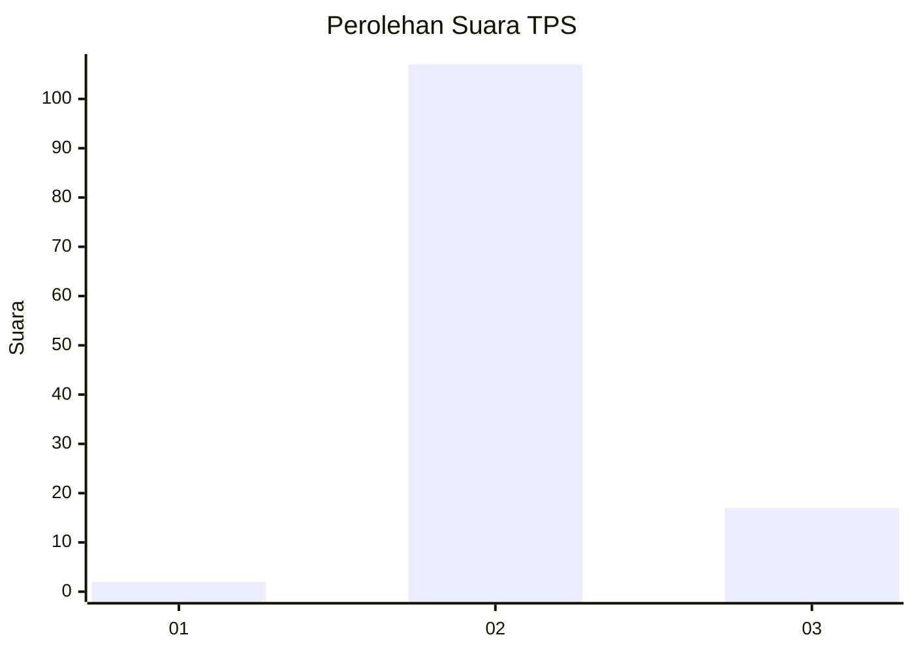
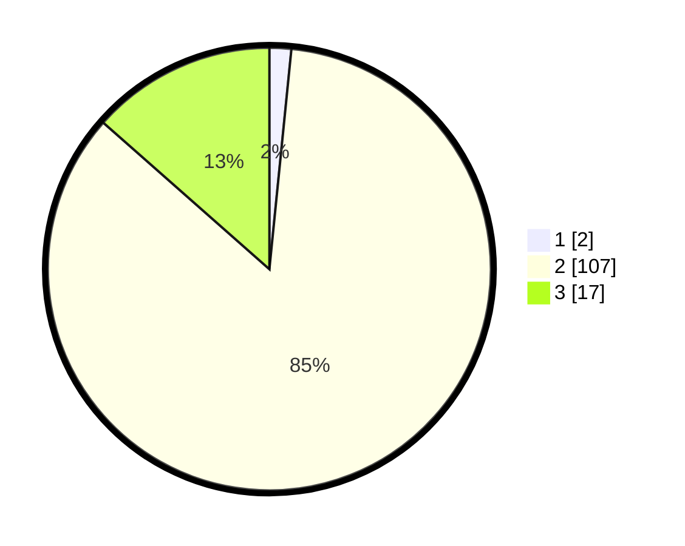

# Hasil

## Grafik

## Tabel

| No. | Nama Paslon    | Suara | Suara (raw) | Persentase |
|:--- |:-------------- | -----:| -----------:| ----------:|
| 1   | ANIES MUHAIMIN | 2     | [2][p-1]    | 1,59       |
| 2   | PRABOWO GIBRAN | 107   | [107][p-2]  | 84,92      |
| 3   | GANJAR MAHFUD  | 17    | [17][p-3]   | 13,49      |

[p-1]: https://github.com/gigit-pemilu/pemilu-2024-12-sumatera-utara/blob/main/pilpres/hitung-suara/sub/12-sumatera-utara/sub/06-karo/sub/03-barusjahe/sub/2013-persadanta/sub/002-tps/sub/paslon-1.txt
[p-2]: https://github.com/gigit-pemilu/pemilu-2024-12-sumatera-utara/blob/main/pilpres/hitung-suara/sub/12-sumatera-utara/sub/06-karo/sub/03-barusjahe/sub/2013-persadanta/sub/002-tps/sub/paslon-2.txt
[p-3]: https://github.com/gigit-pemilu/pemilu-2024-12-sumatera-utara/blob/main/pilpres/hitung-suara/sub/12-sumatera-utara/sub/06-karo/sub/03-barusjahe/sub/2013-persadanta/sub/002-tps/sub/paslon-3.txt

## Foto C Plano

https://sirekap-obj-formc.kpu.go.id/06a2/pemilu/ppwp/12/06/03/20/13/1206032013002-20240214-222659--ef65e9ee-4d26-4a68-bf64-a2501b4b5228.jpg

https://sirekap-obj-formc.kpu.go.id/06a2/pemilu/ppwp/12/06/03/20/13/1206032013002-20240214-222705--6c0606ee-58d7-4a3b-9d4e-6b296819068b.jpg

https://sirekap-obj-formc.kpu.go.id/06a2/pemilu/ppwp/12/06/03/20/13/1206032013002-20240214-222710--c073c3f9-7e92-47d0-b91b-e0671405fbda.jpg

## Metadata

| Key        | Value               |
| ---------- | ------------------- |
| Time Stamp | 2024-02-25 21:00:00 |

