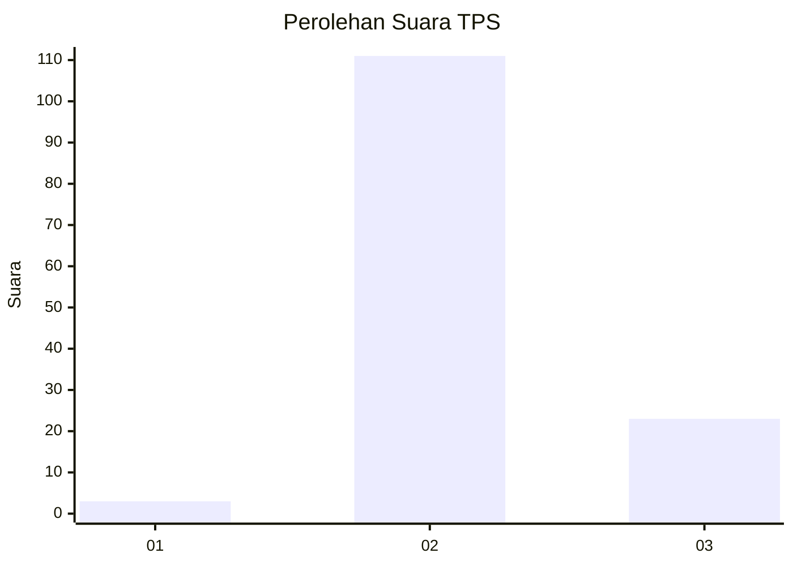
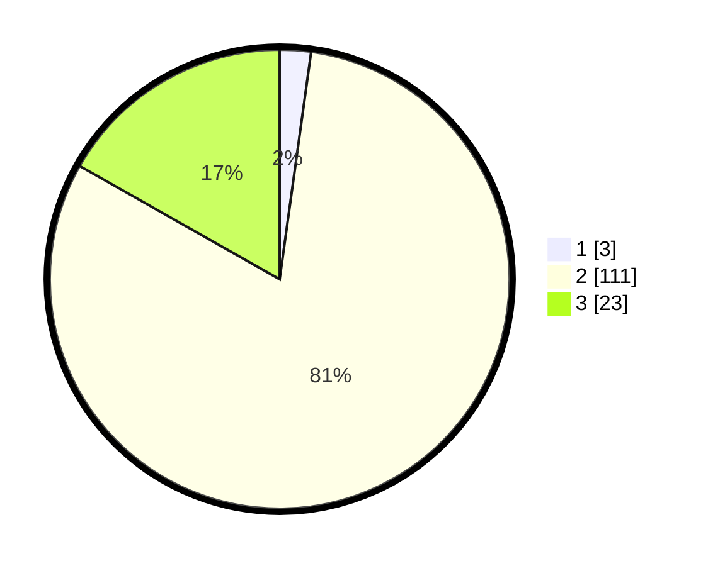

# Hasil

## Grafik

## Tabel

| No. | Nama Paslon    | Suara | Suara (raw) | Persentase |
|:--- |:-------------- | -----:| -----------:| ----------:|
| 1   | ANIES MUHAIMIN | 3     | [3][p-1]    | 2,19       |
| 2   | PRABOWO GIBRAN | 111   | [111][p-2]  | 81,02      |
| 3   | GANJAR MAHFUD  | 23    | [23][p-3]   | 16,79      |

[p-1]: https://github.com/gigit-pemilu/pemilu-2024/blob/main/pilpres/hitung-suara/sub/12-sumatera-utara/sub/06-karo/sub/03-barusjahe/sub/2018-sarimanis/sub/002-tps/sub/paslon-1.txt
[p-2]: https://github.com/gigit-pemilu/pemilu-2024/blob/main/pilpres/hitung-suara/sub/12-sumatera-utara/sub/06-karo/sub/03-barusjahe/sub/2018-sarimanis/sub/002-tps/sub/paslon-2.txt
[p-3]: https://github.com/gigit-pemilu/pemilu-2024/blob/main/pilpres/hitung-suara/sub/12-sumatera-utara/sub/06-karo/sub/03-barusjahe/sub/2018-sarimanis/sub/002-tps/sub/paslon-3.txt

## Foto C Plano

https://sirekap-obj-formc.kpu.go.id/3ced/pemilu/ppwp/12/06/03/20/18/1206032018002-20240214-232828--3d73b6fe-bae1-4e49-bb7e-e791e49ce415.jpg

https://sirekap-obj-formc.kpu.go.id/3ced/pemilu/ppwp/12/06/03/20/18/1206032018002-20240214-232940--b1cbf45f-eed6-473b-b087-ddd4d5124b55.jpg

https://sirekap-obj-formc.kpu.go.id/3ced/pemilu/ppwp/12/06/03/20/18/1206032018002-20240214-233122--c97e4d32-6764-4fb4-b88d-4194ecb0204c.jpg

## Metadata

| Key        | Value               |
| ---------- | ------------------- |
| Time Stamp | 2024-02-25 16:00:00 |

