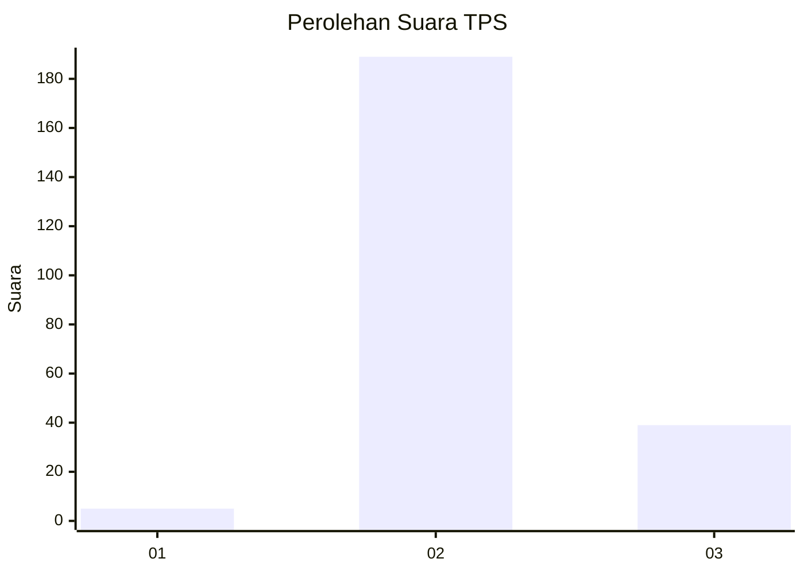
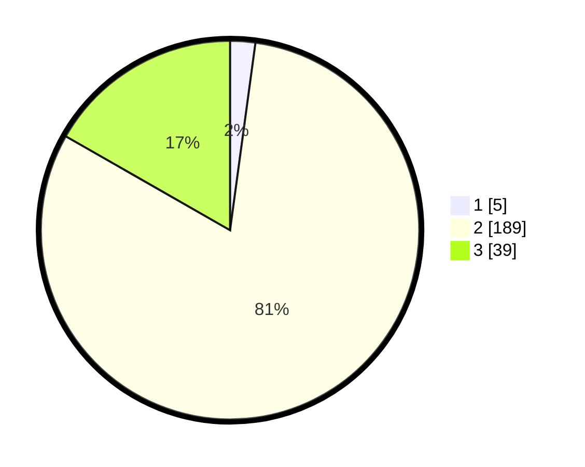

# Hasil

## Grafik

## Tabel

| No. | Nama Paslon    | Suara | Suara (raw) | Persentase |
|:--- |:-------------- | -----:| -----------:| ----------:|
| 1   | ANIES MUHAIMIN | 5     | [5][p-1]    | 2,15       |
| 2   | PRABOWO GIBRAN | 189   | [189][p-2]  | 81,12      |
| 3   | GANJAR MAHFUD  | 39    | [39][p-3]   | 16,74      |

[p-1]: https://github.com/gigit-pemilu/pemilu-2024/blob/main/pilpres/hitung-suara/sub/12-sumatera-utara/sub/06-karo/sub/04-tigapanah/sub/2008-bunuraya/sub/002-tps/sub/paslon-1.txt
[p-2]: https://github.com/gigit-pemilu/pemilu-2024/blob/main/pilpres/hitung-suara/sub/12-sumatera-utara/sub/06-karo/sub/04-tigapanah/sub/2008-bunuraya/sub/002-tps/sub/paslon-2.txt
[p-3]: https://github.com/gigit-pemilu/pemilu-2024/blob/main/pilpres/hitung-suara/sub/12-sumatera-utara/sub/06-karo/sub/04-tigapanah/sub/2008-bunuraya/sub/002-tps/sub/paslon-3.txt

## Foto C Plano

https://sirekap-obj-formc.kpu.go.id/643c/pemilu/ppwp/12/06/04/20/08/1206042008002-20240214-231404--89ab2304-6e8a-4787-88e3-1cd2f55de71e.jpg

https://sirekap-obj-formc.kpu.go.id/643c/pemilu/ppwp/12/06/04/20/08/1206042008002-20240214-231440--43cf9a9a-2eac-4e9c-a4d1-f89fe992b2ed.jpg

https://sirekap-obj-formc.kpu.go.id/643c/pemilu/ppwp/12/06/04/20/08/1206042008002-20240214-231529--8db7d8bc-503e-4936-96b3-ecc98c6b1571.jpg

## Metadata

| Key        | Value               |
| ---------- | ------------------- |
| Time Stamp | 2024-02-25 12:00:00 |

