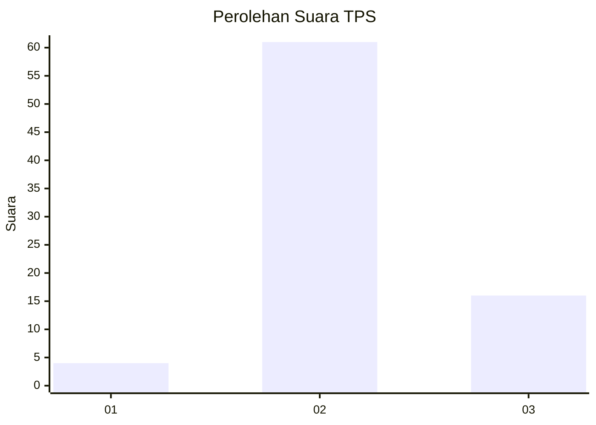
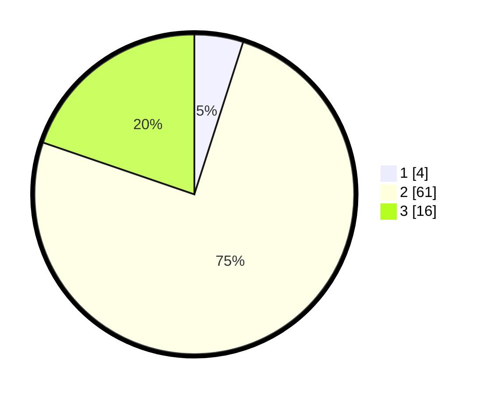

# Hasil

## Grafik

## Tabel

| No. | Nama Paslon    | Suara | Suara (raw) | Persentase |
|:--- |:-------------- | -----:| -----------:| ----------:|
| 1   | ANIES MUHAIMIN | 4     | [4][p-1]    | 4,94       |
| 2   | PRABOWO GIBRAN | 61    | [61][p-2]   | 75,31      |
| 3   | GANJAR MAHFUD  | 16    | [16][p-3]   | 19,75      |

[p-1]: https://github.com/gigit-pemilu/pemilu-2024-12-sumatera-utara/blob/main/pilpres/hitung-suara/sub/12-sumatera-utara/sub/06-karo/sub/04-tigapanah/sub/2015-kutajulu/sub/001-tps/sub/paslon-1.txt
[p-2]: https://github.com/gigit-pemilu/pemilu-2024-12-sumatera-utara/blob/main/pilpres/hitung-suara/sub/12-sumatera-utara/sub/06-karo/sub/04-tigapanah/sub/2015-kutajulu/sub/001-tps/sub/paslon-2.txt
[p-3]: https://github.com/gigit-pemilu/pemilu-2024-12-sumatera-utara/blob/main/pilpres/hitung-suara/sub/12-sumatera-utara/sub/06-karo/sub/04-tigapanah/sub/2015-kutajulu/sub/001-tps/sub/paslon-3.txt

## Foto C Plano

https://sirekap-obj-formc.kpu.go.id/d1ef/pemilu/ppwp/12/06/04/20/15/1206042015001-20240214-141858--66082a21-6335-4d9f-ae21-dac2258ecc34.jpg

https://sirekap-obj-formc.kpu.go.id/d1ef/pemilu/ppwp/12/06/04/20/15/1206042015001-20240214-155739--32ae72ef-f035-4b47-bf3f-ec634a15a2d7.jpg

https://sirekap-obj-formc.kpu.go.id/d1ef/pemilu/ppwp/12/06/04/20/15/1206042015001-20240214-155803--cce7cb98-740c-4b8f-baef-0bd4a50d19ed.jpg

## Metadata

| Key        | Value               |
| ---------- | ------------------- |
| Time Stamp | 2024-02-25 17:00:00 |

