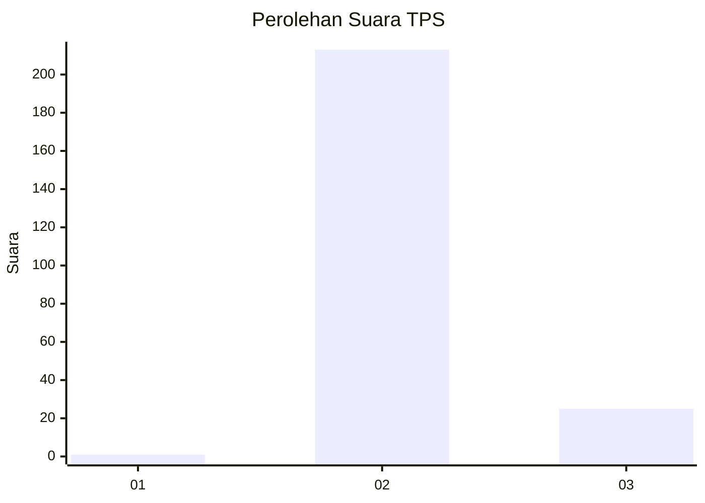
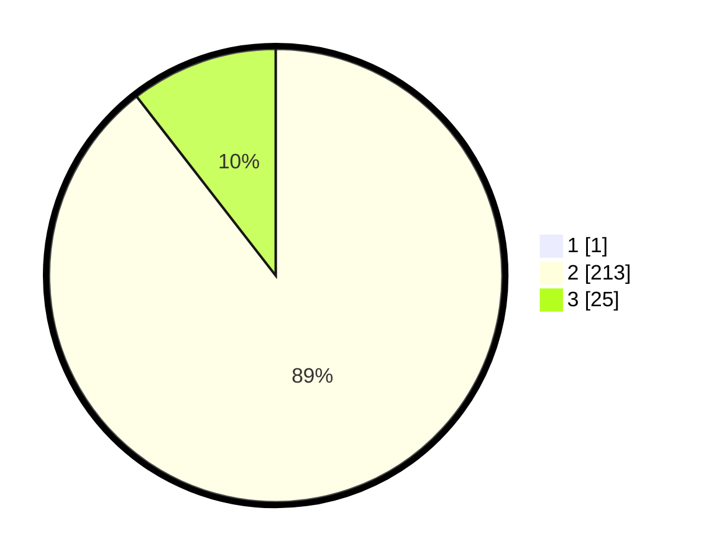

# Hasil

## Grafik

## Tabel

| No. | Nama Paslon    | Suara | Suara (raw) | Persentase |
|:--- |:-------------- | -----:| -----------:| ----------:|
| 1   | ANIES MUHAIMIN | 1     | [1][p-1]    | 0,42       |
| 2   | PRABOWO GIBRAN | 213   | [213][p-2]  | 89,12      |
| 3   | GANJAR MAHFUD  | 25    | [25][p-3]   | 10,46      |

[p-1]: https://github.com/gigit-pemilu/pemilu-2024-12-sumatera-utara/blob/main/pilpres/hitung-suara/sub/12-sumatera-utara/sub/06-karo/sub/04-tigapanah/sub/2018-lauriman/sub/001-tps/sub/paslon-1.txt
[p-2]: https://github.com/gigit-pemilu/pemilu-2024-12-sumatera-utara/blob/main/pilpres/hitung-suara/sub/12-sumatera-utara/sub/06-karo/sub/04-tigapanah/sub/2018-lauriman/sub/001-tps/sub/paslon-2.txt
[p-3]: https://github.com/gigit-pemilu/pemilu-2024-12-sumatera-utara/blob/main/pilpres/hitung-suara/sub/12-sumatera-utara/sub/06-karo/sub/04-tigapanah/sub/2018-lauriman/sub/001-tps/sub/paslon-3.txt

## Foto C Plano

https://sirekap-obj-formc.kpu.go.id/d682/pemilu/ppwp/12/06/04/20/18/1206042018001-20240217-190237--4cb1b236-b96c-4ebf-be14-4049889830cc.jpg

https://sirekap-obj-formc.kpu.go.id/d682/pemilu/ppwp/12/06/04/20/18/1206042018001-20240217-184905--a186fae8-990a-4637-ac62-312d5c188c8c.jpg

https://sirekap-obj-formc.kpu.go.id/d682/pemilu/ppwp/12/06/04/20/18/1206042018001-20240217-185020--1ff0fd76-cd63-4ac1-b96a-f5ba69096116.jpg

## Metadata

| Key        | Value               |
| ---------- | ------------------- |
| Time Stamp | 2024-02-24 22:31:28 |

