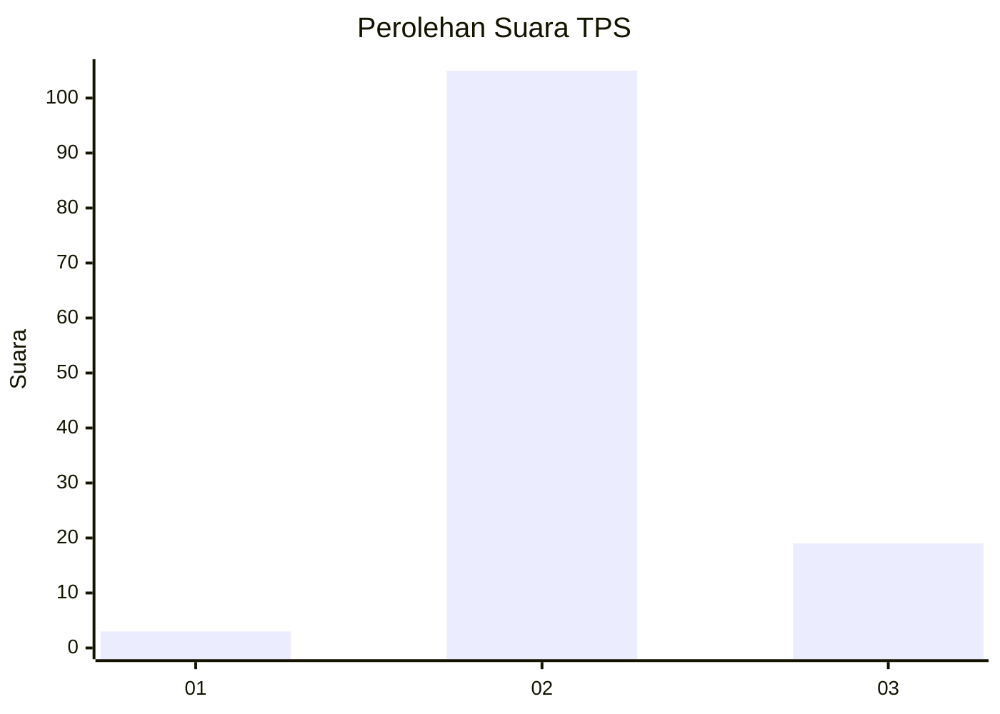
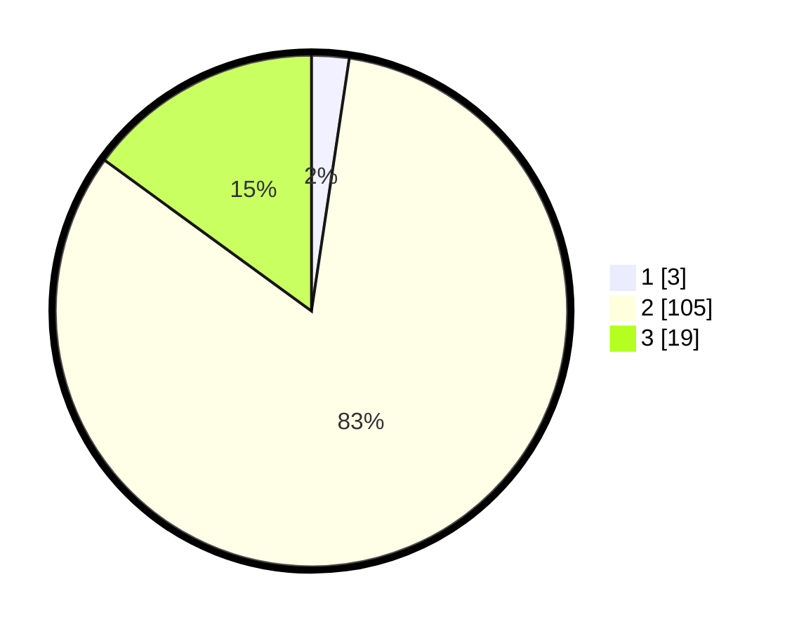

# Hasil

## Grafik

## Tabel

| No. | Nama Paslon    | Suara | Suara (raw) | Persentase |
|:--- |:-------------- | -----:| -----------:| ----------:|
| 1   | ANIES MUHAIMIN | 3     | [3][p-1]    | 2,36       |
| 2   | PRABOWO GIBRAN | 105   | [105][p-2]  | 82,68      |
| 3   | GANJAR MAHFUD  | 19    | [19][p-3]   | 14,96      |

[p-1]: https://github.com/gigit-pemilu/pemilu-2024-12-sumatera-utara/blob/main/pilpres/hitung-suara/sub/12-sumatera-utara/sub/06-karo/sub/04-tigapanah/sub/2025-kutabale/sub/001-tps/sub/paslon-1.txt
[p-2]: https://github.com/gigit-pemilu/pemilu-2024-12-sumatera-utara/blob/main/pilpres/hitung-suara/sub/12-sumatera-utara/sub/06-karo/sub/04-tigapanah/sub/2025-kutabale/sub/001-tps/sub/paslon-2.txt
[p-3]: https://github.com/gigit-pemilu/pemilu-2024-12-sumatera-utara/blob/main/pilpres/hitung-suara/sub/12-sumatera-utara/sub/06-karo/sub/04-tigapanah/sub/2025-kutabale/sub/001-tps/sub/paslon-3.txt

## Foto C Plano

https://sirekap-obj-formc.kpu.go.id/600b/pemilu/ppwp/12/06/04/20/25/1206042025001-20240214-210229--aeaa8b3b-da88-4965-9cec-c28349446022.jpg

https://sirekap-obj-formc.kpu.go.id/600b/pemilu/ppwp/12/06/04/20/25/1206042025001-20240214-210430--d96d4d4d-8cb2-44a0-bdaa-f6cb3d5983e5.jpg

https://sirekap-obj-formc.kpu.go.id/600b/pemilu/ppwp/12/06/04/20/25/1206042025001-20240214-210644--6d0f2dea-e006-48c2-80da-871e01bd2a9d.jpg

## Metadata

| Key        | Value               |
| ---------- | ------------------- |
| Time Stamp | 2024-02-15 15:30:25 |

