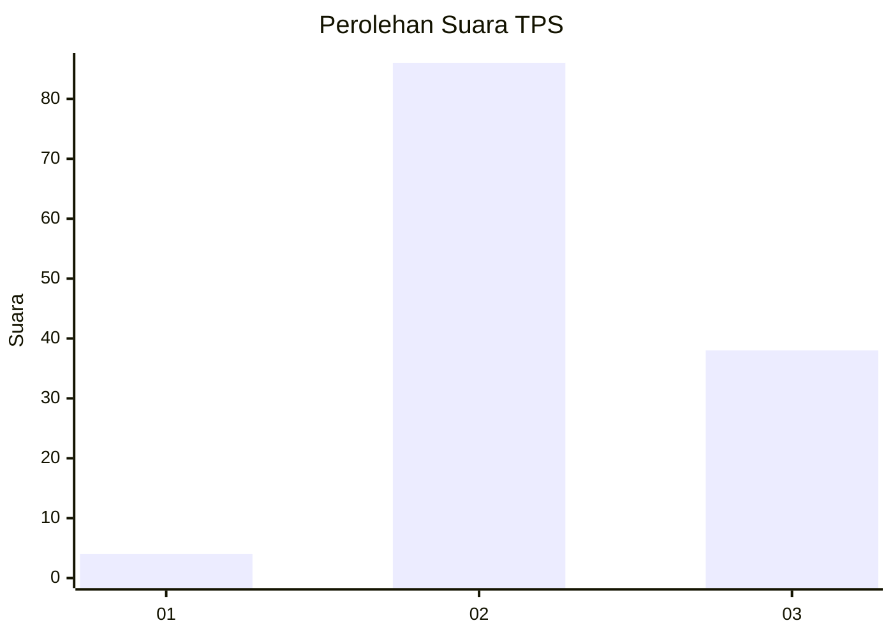
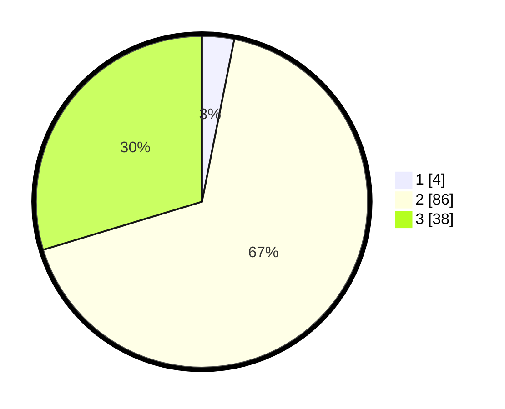

# Hasil

## Grafik

## Tabel

| No. | Nama Paslon    | Suara | Suara (raw) | Persentase |
|:--- |:-------------- | -----:| -----------:| ----------:|
| 1   | ANIES MUHAIMIN | 4     | [4][p-1]    | 3,13       |
| 2   | PRABOWO GIBRAN | 86    | [86][p-2]   | 67,19      |
| 3   | GANJAR MAHFUD  | 38    | [38][p-3]   | 29,69      |

[p-1]: https://github.com/gigit-pemilu/pemilu-2024-12-sumatera-utara/blob/main/pilpres/hitung-suara/sub/12-sumatera-utara/sub/06-karo/sub/05-merek/sub/2004-dokan/sub/001-tps/sub/paslon-1.txt
[p-2]: https://github.com/gigit-pemilu/pemilu-2024-12-sumatera-utara/blob/main/pilpres/hitung-suara/sub/12-sumatera-utara/sub/06-karo/sub/05-merek/sub/2004-dokan/sub/001-tps/sub/paslon-2.txt
[p-3]: https://github.com/gigit-pemilu/pemilu-2024-12-sumatera-utara/blob/main/pilpres/hitung-suara/sub/12-sumatera-utara/sub/06-karo/sub/05-merek/sub/2004-dokan/sub/001-tps/sub/paslon-3.txt

## Foto C Plano

https://sirekap-obj-formc.kpu.go.id/7884/pemilu/ppwp/12/06/05/20/04/1206052004001-20240215-035254--3fbc0c35-d2eb-49c5-8d50-c2906ed574df.jpg

https://sirekap-obj-formc.kpu.go.id/7884/pemilu/ppwp/12/06/05/20/04/1206052004001-20240215-035308--defaddd9-1ab6-404e-b075-419ff4bcf561.jpg

https://sirekap-obj-formc.kpu.go.id/7884/pemilu/ppwp/12/06/05/20/04/1206052004001-20240215-035647--34fa8b91-7b3b-41ec-9e64-0e27de7fc608.jpg

## Metadata

| Key        | Value               |
| ---------- | ------------------- |
| Time Stamp | 2024-02-15 21:01:18 |

