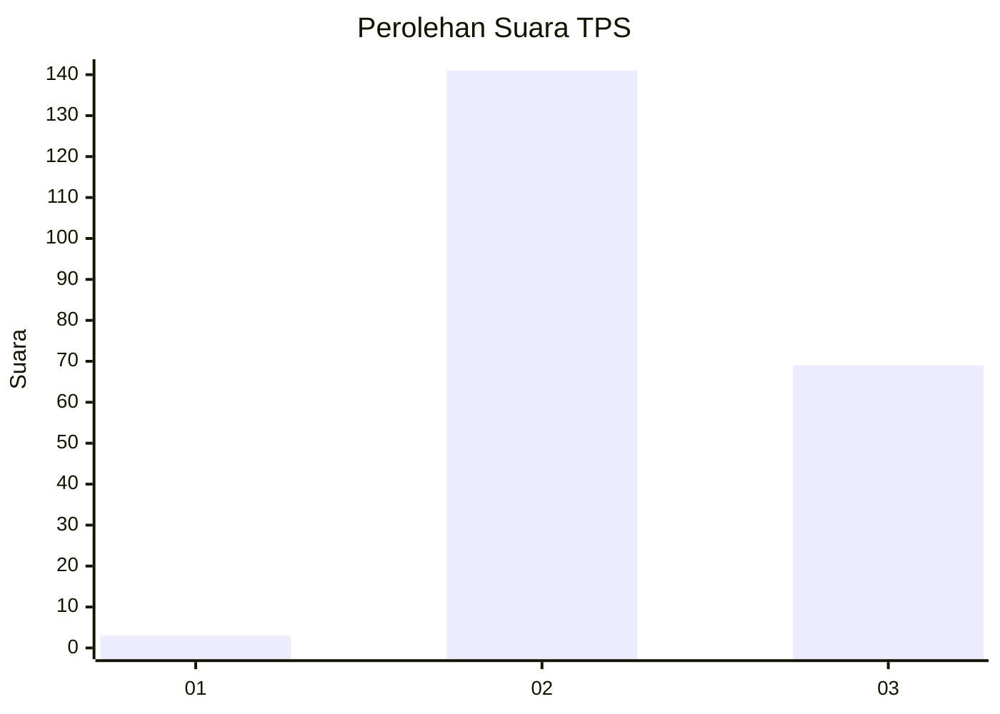
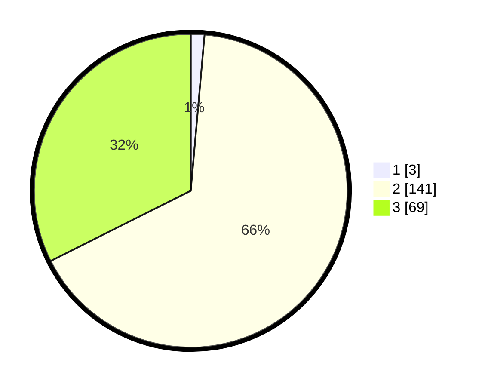

# Hasil

## Grafik

## Tabel

| No. | Nama Paslon    | Suara | Suara (raw) | Persentase |
|:--- |:-------------- | -----:| -----------:| ----------:|
| 1   | ANIES MUHAIMIN | 3     | [3][p-1]    | 1,41       |
| 2   | PRABOWO GIBRAN | 141   | [141][p-2]  | 66,20      |
| 3   | GANJAR MAHFUD  | 69    | [69][p-3]   | 32,39      |

[p-1]: https://github.com/gigit-pemilu/pemilu-2024-12-sumatera-utara/blob/main/pilpres/hitung-suara/sub/12-sumatera-utara/sub/06-karo/sub/05-merek/sub/2004-dokan/sub/004-tps/sub/paslon-1.txt
[p-2]: https://github.com/gigit-pemilu/pemilu-2024-12-sumatera-utara/blob/main/pilpres/hitung-suara/sub/12-sumatera-utara/sub/06-karo/sub/05-merek/sub/2004-dokan/sub/004-tps/sub/paslon-2.txt
[p-3]: https://github.com/gigit-pemilu/pemilu-2024-12-sumatera-utara/blob/main/pilpres/hitung-suara/sub/12-sumatera-utara/sub/06-karo/sub/05-merek/sub/2004-dokan/sub/004-tps/sub/paslon-3.txt

## Foto C Plano

https://sirekap-obj-formc.kpu.go.id/c895/pemilu/ppwp/12/06/05/20/04/1206052004004-20240214-213915--347c52f3-a3b3-4688-9489-fb3a83bf22b1.jpg

https://sirekap-obj-formc.kpu.go.id/c895/pemilu/ppwp/12/06/05/20/04/1206052004004-20240214-213935--c6ed9b65-31f8-47c9-8acb-9f6c06c4c9ab.jpg

https://sirekap-obj-formc.kpu.go.id/c895/pemilu/ppwp/12/06/05/20/04/1206052004004-20240214-213955--998994a1-385e-41fd-9f8e-0abb3c23466d.jpg

## Metadata

| Key        | Value               |
| ---------- | ------------------- |
| Time Stamp | 2024-02-15 21:01:18 |

