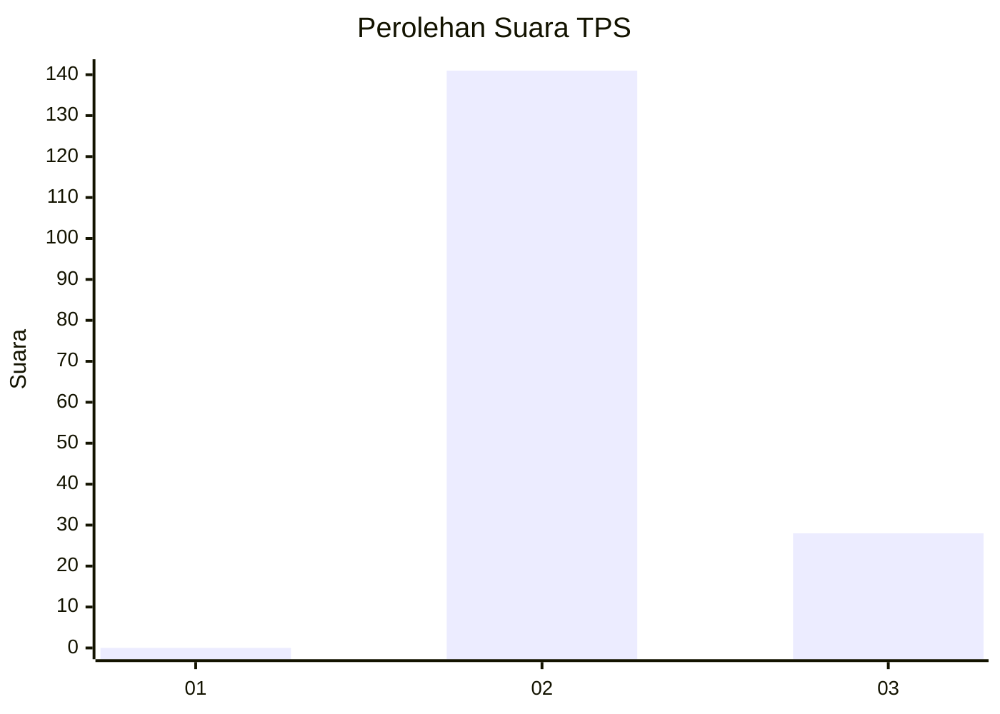
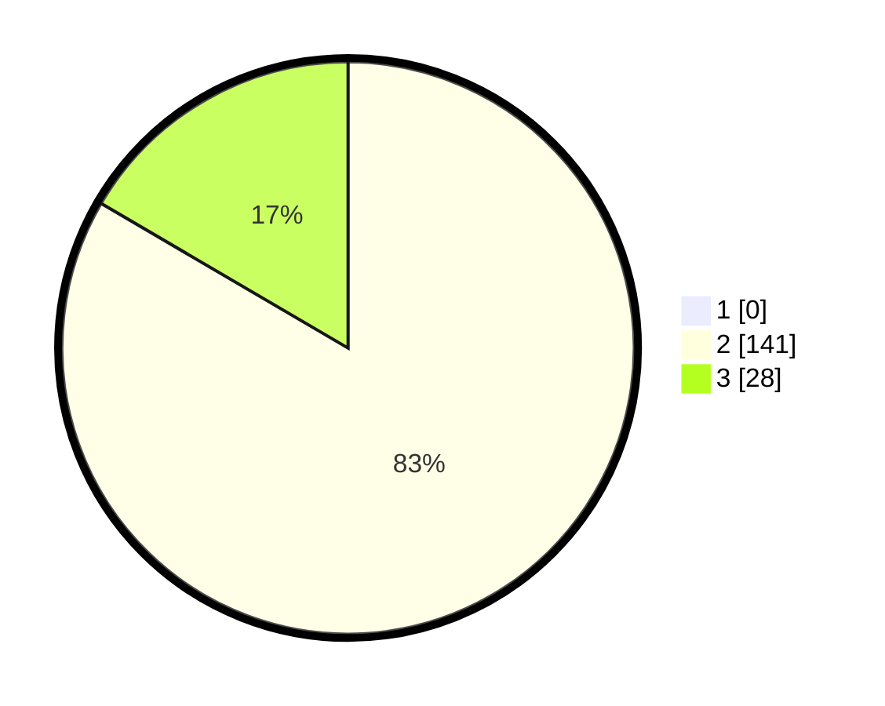

# Hasil

## Grafik

## Tabel

| No. | Nama Paslon    | Suara | Suara (raw) | Persentase |
|:--- |:-------------- | -----:| -----------:| ----------:|
| 1   | ANIES MUHAIMIN | 0     | [0][p-1]    | 0,00       |
| 2   | PRABOWO GIBRAN | 141   | [141][p-2]  | 83,43      |
| 3   | GANJAR MAHFUD  | 28    | [28][p-3]   | 16,57      |

[p-1]: https://github.com/gigit-pemilu/pemilu-2024/blob/main/pilpres/hitung-suara/sub/12-sumatera-utara/sub/06-karo/sub/05-merek/sub/2007-sukamandi/sub/002-tps/sub/paslon-1.txt
[p-2]: https://github.com/gigit-pemilu/pemilu-2024/blob/main/pilpres/hitung-suara/sub/12-sumatera-utara/sub/06-karo/sub/05-merek/sub/2007-sukamandi/sub/002-tps/sub/paslon-2.txt
[p-3]: https://github.com/gigit-pemilu/pemilu-2024/blob/main/pilpres/hitung-suara/sub/12-sumatera-utara/sub/06-karo/sub/05-merek/sub/2007-sukamandi/sub/002-tps/sub/paslon-3.txt

## Foto C Plano

https://sirekap-obj-formc.kpu.go.id/a6f5/pemilu/ppwp/12/06/05/20/07/1206052007002-20240214-232935--4483329f-2ff4-4bfc-ade6-ed320e8e6242.jpg

https://sirekap-obj-formc.kpu.go.id/a6f5/pemilu/ppwp/12/06/05/20/07/1206052007002-20240214-233138--e17820ef-8ef4-4f5b-836c-450a929f9b91.jpg

https://sirekap-obj-formc.kpu.go.id/a6f5/pemilu/ppwp/12/06/05/20/07/1206052007002-20240214-233421--d75e7574-85a0-4872-8676-8fc1b3c13c6d.jpg

## Metadata

| Key        | Value               |
| ---------- | ------------------- |
| Time Stamp | 2024-02-15 21:01:18 |

