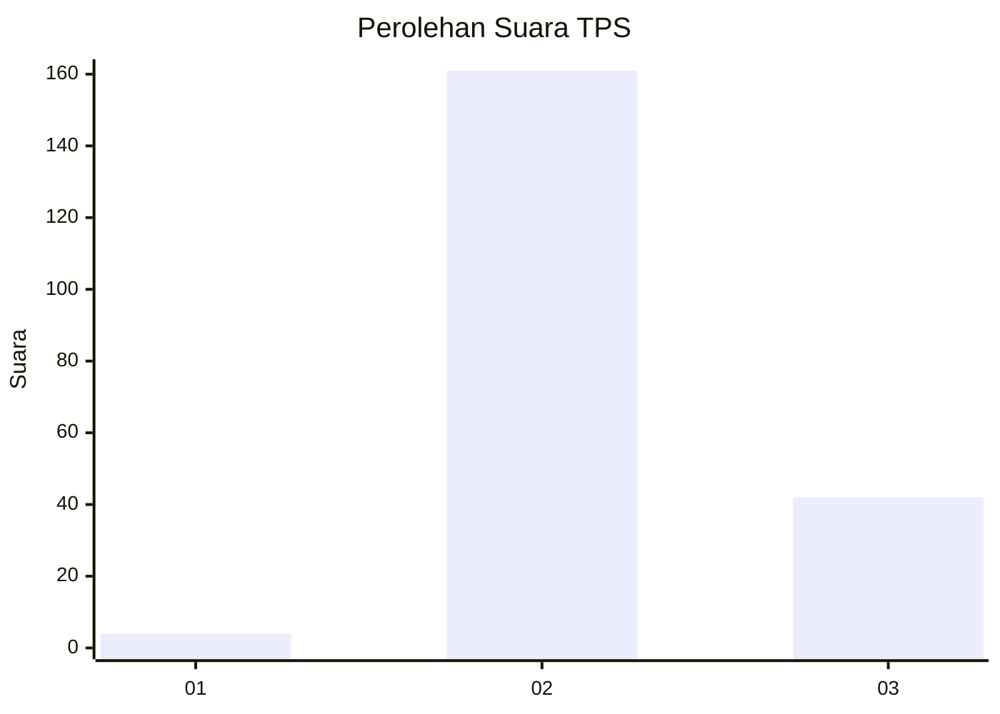

# Hasil

## Grafik

## Tabel

| No. | Nama Paslon    | Suara | Suara (raw) | Persentase |
|:--- |:-------------- | -----:| -----------:| ----------:|
| 1   | ANIES MUHAIMIN | 4     | [4][p-1]    | 1,93       |
| 2   | PRABOWO GIBRAN | 161   | [161][p-2]  | 77,78      |
| 3   | GANJAR MAHFUD  | 42    | [42][p-3]   | 20,29      |

[p-1]: https://github.com/gigit-pemilu/pemilu-2024/blob/main/pilpres/hitung-suara/sub/12-sumatera-utara/sub/06-karo/sub/05-merek/sub/2009-pangambatan/sub/001-tps/sub/paslon-1.txt
[p-2]: https://github.com/gigit-pemilu/pemilu-2024/blob/main/pilpres/hitung-suara/sub/12-sumatera-utara/sub/06-karo/sub/05-merek/sub/2009-pangambatan/sub/001-tps/sub/paslon-2.txt
[p-3]: https://github.com/gigit-pemilu/pemilu-2024/blob/main/pilpres/hitung-suara/sub/12-sumatera-utara/sub/06-karo/sub/05-merek/sub/2009-pangambatan/sub/001-tps/sub/paslon-3.txt

## Foto C Plano

https://sirekap-obj-formc.kpu.go.id/20b3/pemilu/ppwp/12/06/05/20/09/1206052009001-20240214-222628--aa83d977-f0f7-45c6-adbd-227adbb3fadc.jpg

https://sirekap-obj-formc.kpu.go.id/20b3/pemilu/ppwp/12/06/05/20/09/1206052009001-20240214-223504--2a99fab1-58c8-4399-b099-d5fc625e9b11.jpg

https://sirekap-obj-formc.kpu.go.id/20b3/pemilu/ppwp/12/06/05/20/09/1206052009001-20240214-223611--a0f697dc-daf6-4409-853d-fbdba0dc4d5b.jpg

## Metadata

| Key        | Value               |
| ---------- | ------------------- |
| Time Stamp | 2024-02-15 17:00:25 |

