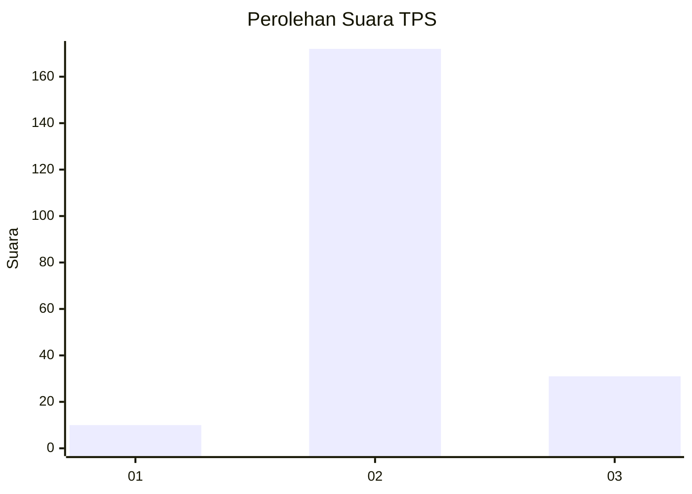

# Hasil

## Grafik

## Tabel

| No. | Nama Paslon    | Suara | Suara (raw) | Persentase |
|:--- |:-------------- | -----:| -----------:| ----------:|
| 1   | ANIES MUHAIMIN | 10    | [10][p-1]   | 4,69       |
| 2   | PRABOWO GIBRAN | 172   | [172][p-2]  | 80,75      |
| 3   | GANJAR MAHFUD  | 31    | [31][p-3]   | 14,55      |

[p-1]: https://github.com/gigit-pemilu/pemilu-2024/blob/main/pilpres/hitung-suara/sub/12-sumatera-utara/sub/06-karo/sub/05-merek/sub/2017-bandar-tongging/sub/001-tps/sub/paslon-1.txt
[p-2]: https://github.com/gigit-pemilu/pemilu-2024/blob/main/pilpres/hitung-suara/sub/12-sumatera-utara/sub/06-karo/sub/05-merek/sub/2017-bandar-tongging/sub/001-tps/sub/paslon-2.txt
[p-3]: https://github.com/gigit-pemilu/pemilu-2024/blob/main/pilpres/hitung-suara/sub/12-sumatera-utara/sub/06-karo/sub/05-merek/sub/2017-bandar-tongging/sub/001-tps/sub/paslon-3.txt

## Foto C Plano

https://sirekap-obj-formc.kpu.go.id/c1f7/pemilu/ppwp/12/06/05/20/17/1206052017001-20240214-231204--64d2a316-2b3d-4673-980d-eb9f8007aa16.jpg

https://sirekap-obj-formc.kpu.go.id/c1f7/pemilu/ppwp/12/06/05/20/17/1206052017001-20240214-231444--90435a79-1a55-44da-ba6a-3f7250476717.jpg

https://sirekap-obj-formc.kpu.go.id/c1f7/pemilu/ppwp/12/06/05/20/17/1206052017001-20240214-231606--4a74ece1-3e0b-47b3-bac2-77237f506893.jpg

## Metadata

| Key        | Value               |
| ---------- | ------------------- |
| Time Stamp | 2024-02-15 22:00:27 |

