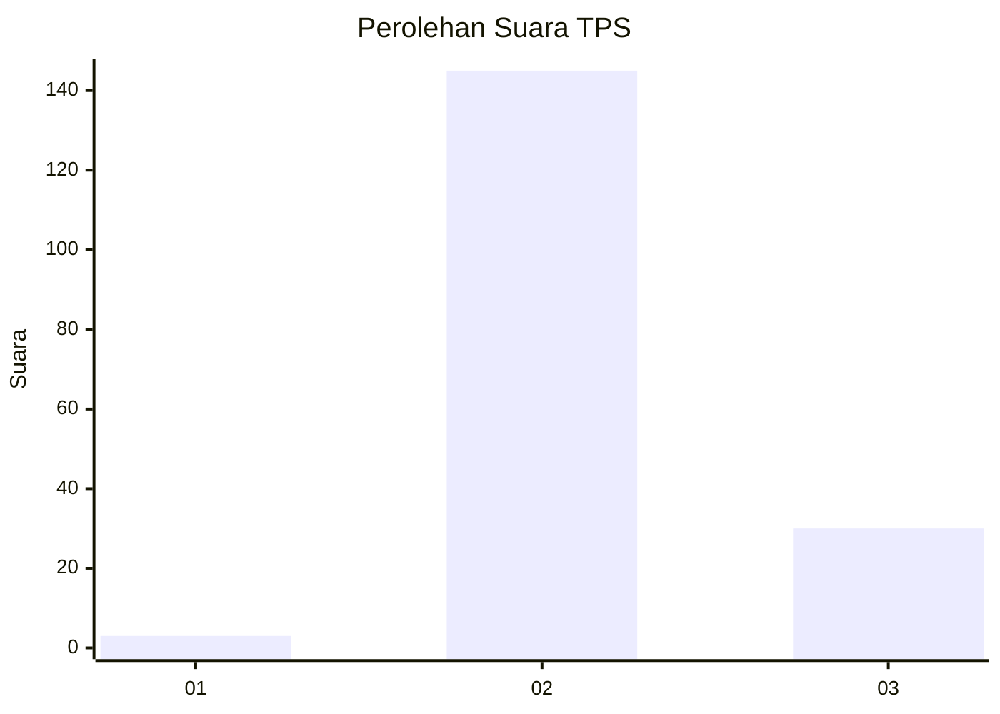
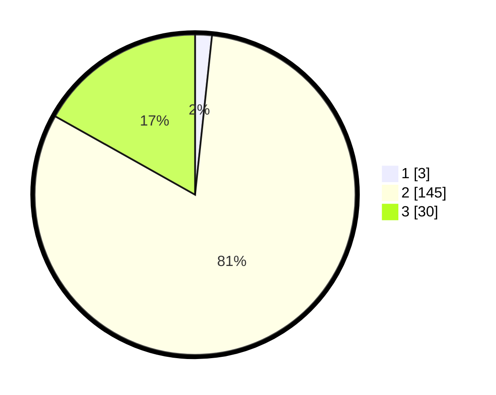

# Hasil

## Grafik

## Tabel

| No. | Nama Paslon    | Suara | Suara (raw) | Persentase |
|:--- |:-------------- | -----:| -----------:| ----------:|
| 1   | ANIES MUHAIMIN | 3     | [3][p-1]    | 1,69       |
| 2   | PRABOWO GIBRAN | 145   | [145][p-2]  | 81,46      |
| 3   | GANJAR MAHFUD  | 30    | [30][p-3]   | 16,85      |

[p-1]: https://github.com/gigit-pemilu/pemilu-2024/blob/main/pilpres/hitung-suara/sub/12-sumatera-utara/sub/06-karo/sub/05-merek/sub/2018-pancur-batu/sub/002-tps/sub/paslon-1.txt
[p-2]: https://github.com/gigit-pemilu/pemilu-2024/blob/main/pilpres/hitung-suara/sub/12-sumatera-utara/sub/06-karo/sub/05-merek/sub/2018-pancur-batu/sub/002-tps/sub/paslon-2.txt
[p-3]: https://github.com/gigit-pemilu/pemilu-2024/blob/main/pilpres/hitung-suara/sub/12-sumatera-utara/sub/06-karo/sub/05-merek/sub/2018-pancur-batu/sub/002-tps/sub/paslon-3.txt

## Foto C Plano

https://sirekap-obj-formc.kpu.go.id/dd74/pemilu/ppwp/12/06/05/20/18/1206052018002-20240214-214507--d515d3a3-2b31-47bf-a272-0269c64b0410.jpg

https://sirekap-obj-formc.kpu.go.id/dd74/pemilu/ppwp/12/06/05/20/18/1206052018002-20240214-214526--3d189b1a-1ff3-459d-b9ba-8d3c333e59d5.jpg

https://sirekap-obj-formc.kpu.go.id/dd74/pemilu/ppwp/12/06/05/20/18/1206052018002-20240214-214546--f9b9519a-5cd0-4a97-8ca1-75093ea8acd5.jpg

## Metadata

| Key        | Value               |
| ---------- | ------------------- |
| Time Stamp | 2024-02-15 22:00:27 |

